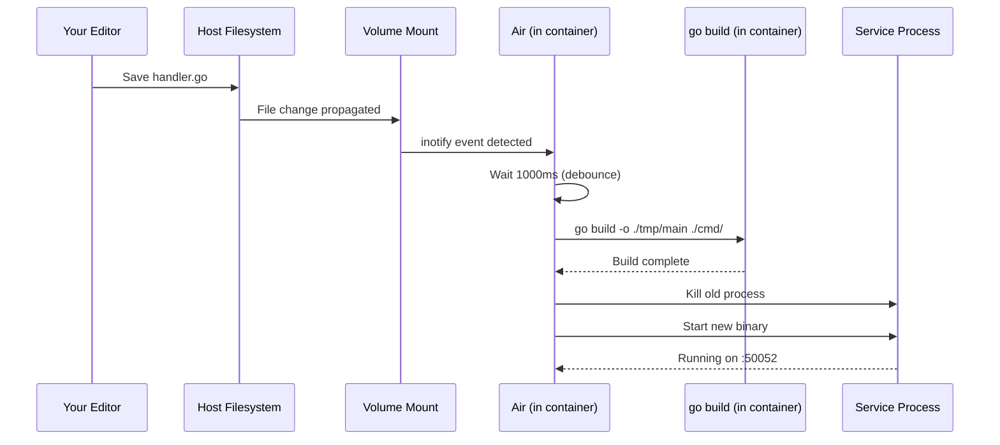

# 3.4 Development Workflow

The production Compose stack from the previous section builds optimized images and runs compiled binaries. That is correct for deployment, but painful for development: every code change requires rebuilding the Docker image and restarting the container. In this section, we set up a development workflow where code changes are automatically detected and rebuilt inside the running container.

---

## The Dev Override File Pattern

Docker Compose supports **file merging**. When you pass multiple `-f` flags, Compose deep-merges the YAML files in order. The second file overrides matching keys from the first:

```bash
docker compose -f docker-compose.yml -f docker-compose.dev.yml up --build
```

This lets you keep the production Compose file clean and layer development-specific changes on top. You don't duplicate the entire service definition -- you only specify what changes.

Here is `deploy/docker-compose.dev.yml`:

```yaml
services:
  catalog:
    build:
      context: ../..
      dockerfile: services/catalog/Dockerfile.dev
    volumes:
      - ../../services/catalog:/app/services/catalog
      - ../../gen:/app/gen

  gateway:
    build:
      context: ../..
      dockerfile: services/gateway/Dockerfile.dev
    volumes:
      - ../../services/gateway:/app/services/gateway
```

This override changes two things per service:

1. **`dockerfile`** -- switches from the production Dockerfile to a development variant (e.g., `Dockerfile.dev`)
2. **`volumes`** -- mounts your local source directory into the container

Everything else (environment variables, ports, networks, depends_on, healthchecks) is inherited from the base `docker-compose.yml`. You don't repeat it.

---

## Air for Hot-Reload

Go compiles to a static binary. Unlike Python or Node.js, where the runtime reads source files directly, changing a `.go` file does nothing until you recompile. **Air** is a live-reload tool for Go that watches for file changes, rebuilds the binary, and restarts the process automatically.

### How Air Works

1. Air watches the directory for changes to files matching configured extensions (`.go` in our case)
2. When a change is detected, it waits for a configurable delay (to batch rapid saves)
3. It runs `go build` to compile the binary
4. It kills the old process and starts the new binary
5. Repeat

### The `.air.toml` Configuration

Both services use the same Air configuration. Here is `services/catalog/.air.toml`:

```toml
root = "."
tmp_dir = "tmp"

[build]
  cmd = "go build -o ./tmp/main ./cmd/"
  bin = "./tmp/main"
  delay = 1000
  exclude_dir = ["tmp", "vendor"]
  include_ext = ["go"]
  kill_delay = "0s"

[log]
  time = false

[misc]
  clean_on_exit = true
```

Key settings:

- **`cmd`** -- the build command. Same as what you would run manually: `go build -o ./tmp/main ./cmd/`.
- **`bin`** -- path to the compiled binary that Air should execute.
- **`delay`** -- milliseconds to wait after detecting a change before rebuilding. 1000ms debounces rapid multi-file saves.
- **`include_ext`** -- only watch `.go` files. Changes to `.md`, `.toml`, or other files are ignored.
- **`exclude_dir`** -- ignore the `tmp` directory (where the binary is written) and `vendor` to avoid infinite rebuild loops.
- **`clean_on_exit`** -- delete the `tmp` directory when Air stops.

### The Dev Dockerfile

Here is `services/catalog/Dockerfile.dev`:

```dockerfile
FROM golang:1.26-alpine

RUN go install github.com/air-verse/air@latest

WORKDIR /app

# Disable workspace mode — same reason as production
ENV GOWORK=off

# Copy shared modules and service source
COPY gen/ ./gen/
COPY services/catalog/ ./services/catalog/

WORKDIR /app/services/catalog
RUN go mod download

CMD ["air", "-c", ".air.toml"]
```

Key differences from the production Dockerfile:

- **No multi-stage build.** We need the Go toolchain at runtime because Air calls `go build` on every change.
- **Air is installed** with `go install`. This adds the `air` binary to the Go toolchain's bin directory.
- **`CMD` instead of `ENTRYPOINT`.** `CMD` is easier to override if you want to debug something (e.g., `docker compose exec catalog sh`).
- **No `CGO_ENABLED=0`.** The development build doesn't need to be fully static since the container already has the necessary libraries.

The Gateway's `Dockerfile.dev` follows the same pattern, minus the `GOWORK=off` and `gen/` copy:

```dockerfile
FROM golang:1.26-alpine

RUN go install github.com/air-verse/air@latest

WORKDIR /app
COPY services/gateway/ ./services/gateway/

WORKDIR /app/services/gateway
RUN go mod download

CMD ["air", "-c", ".air.toml"]
```

---

## Volume Mounts and How They Enable Hot-Reload

The magic is in the volume mounts from `docker-compose.dev.yml`:

```yaml
volumes:
  - ../../services/catalog:/app/services/catalog
  - ../../gen:/app/gen
```

A **bind mount** maps a host directory to a container directory. The container sees your local filesystem in real time -- when you save a file on your host, the change is immediately visible inside the container. Air detects the change and triggers a rebuild.

Without the volume mount, the container would only have the source code that was `COPY`ed during the image build. Changes on your host would not be reflected.



---

## The Full Dev Command

From the `deploy/` directory:

```bash
docker compose -f docker-compose.yml -f docker-compose.dev.yml up --build
```

This:
1. Merges the base and dev Compose files
2. Builds dev images (with Air installed)
3. Starts PostgreSQL (with healthcheck)
4. Waits for PostgreSQL to be healthy
5. Starts catalog and gateway with volume mounts and Air

You will see Air's output in the logs:

```
catalog-1  | running...
catalog-1  | watching .
catalog-1  | building...
catalog-1  | running ./tmp/main
```

When you edit a `.go` file in `services/catalog/`, Air detects it and rebuilds automatically.

---

## Debugging Tips

### Viewing Logs

```bash
# All services
docker compose -f docker-compose.yml -f docker-compose.dev.yml logs -f

# Specific service
docker compose -f docker-compose.yml -f docker-compose.dev.yml logs -f catalog
```

The `-f` flag follows the log stream (like `tail -f`). Without it, you see a snapshot.

### Executing Commands in a Running Container

```bash
# Open a shell in the catalog container
docker compose -f docker-compose.yml -f docker-compose.dev.yml exec catalog sh

# Run a one-off command
docker compose -f docker-compose.yml -f docker-compose.dev.yml exec postgres-catalog psql -U postgres -d catalog
```

`exec` runs a command in an already-running container. This is useful for:
- Inspecting the filesystem inside the container
- Running database queries directly
- Checking environment variables (`env | grep DATABASE`)
- Testing network connectivity (`ping postgres-catalog`)

### Inspecting Networks

```bash
# List networks
docker network ls

# Inspect the bridge network
docker network inspect deploy_library-net
```

The network name is prefixed with the Compose project name (derived from the directory name, `deploy`). The inspect command shows all connected containers and their IP addresses.

### Port Conflicts

If you see "port is already allocated," another process on your host is using the same port. Common culprits:

- A local PostgreSQL installation on port 5433
- A previous Compose stack that wasn't fully stopped
- Another development server on port 8080

Solutions:
1. Change the port in `deploy/.env` (e.g., `GATEWAY_PORT=8081`)
2. Stop the conflicting process
3. Run `docker compose down` to clean up stale containers

### When to Rebuild vs. Restart

| Situation | Action |
|---|---|
| Changed Go source code | Nothing -- Air handles it |
| Changed `go.mod` (new dependency) | `docker compose up --build` (rebuild the image) |
| Changed `Dockerfile.dev` | `docker compose up --build` |
| Changed `docker-compose.yml` or `.dev.yml` | `docker compose up` (re-reads config) |
| Changed `.air.toml` | `docker compose restart catalog` (Air re-reads config on start) |
| Database needs resetting | `docker compose down -v && docker compose up --build` |

The key insight: volume-mounted source changes are instant (Air catches them). But dependency or configuration changes require rebuilding or restarting because they affect the image or container setup, not just the mounted files.

---

## Exercise: Watch Air in Action

1. Start the dev stack:
   ```bash
   cd deploy
   docker compose -f docker-compose.yml -f docker-compose.dev.yml up --build
   ```

2. Wait for all services to start. You should see Air's "running" messages for both catalog and gateway.

3. In your editor, open `services/gateway/cmd/main.go` (or whichever file contains an HTTP handler). Add a new endpoint or modify the response of an existing one -- for example, change the health check response body.

4. Watch the terminal. Within ~2 seconds, you should see Air detect the change, rebuild, and restart the service.

5. Test the modified endpoint with `curl` to confirm the change is live:
   ```bash
   curl http://localhost:8080/health
   ```

6. Try editing `services/catalog/` source code and observe Air rebuild that service independently.

<details>
<summary>Solution</summary>

After saving the file, the Compose logs show something like:

```
gateway-1  | services/gateway/cmd/main.go has changed
gateway-1  | building...
gateway-1  | running ./tmp/main
```

The rebuild typically takes 1-3 seconds for a small service. The curl request to `localhost:8080/health` returns the modified response immediately.

If you don't see Air detecting the change:
- Verify the volume mount is working: `docker compose exec gateway ls /app/services/gateway/cmd/` -- the file should show your latest modification timestamp.
- Check that the file extension is `.go` -- Air only watches extensions listed in `include_ext`.
- On some systems (notably Docker Desktop with WSL2), file change notification can be delayed. Try saving twice or waiting a few seconds.

If the build fails (you introduced a syntax error), Air reports the error in the logs and keeps running. Fix the error, save again, and Air retries the build.

</details>

---

## Summary

- The dev override pattern layers development-specific configuration (dev Dockerfiles, volume mounts) on top of the production Compose file, avoiding duplication.
- Air watches for Go source file changes and automatically rebuilds and restarts the service binary.
- Bind mounts map your host filesystem into the container, enabling real-time code synchronization.
- Use `docker compose logs -f` and `docker compose exec` for debugging.
- Source code changes are handled by Air automatically. Dependency, Dockerfile, or Compose config changes require a rebuild or restart.

---

## References

[^1]: [Air -- Live reload for Go apps](https://github.com/air-verse/air) -- Air's GitHub repository with configuration documentation.
[^2]: [Docker Compose file merging](https://docs.docker.com/compose/how-tos/multiple-compose-files/merge/) -- how multiple Compose files are merged.
[^3]: [Bind mounts](https://docs.docker.com/engine/storage/bind-mounts/) -- Docker documentation on host-to-container file mounting.
[^4]: [Docker Compose CLI reference](https://docs.docker.com/reference/cli/docker/compose/) -- complete command reference for `docker compose`.
