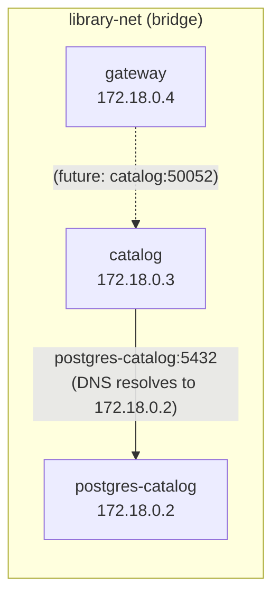

# 3.3 Docker Compose

Running one container manually is manageable. Running three containers -- each with specific environment variables, network connections, port mappings, and startup dependencies -- gets tedious fast. Docker Compose solves this by defining the entire stack in a single YAML file.

---

## What Compose Solves

Without Compose, starting the Catalog stack requires:

```bash
# Create a network
docker network create library-net

# Start PostgreSQL
docker run -d --name postgres-catalog \
  --network library-net \
  -e POSTGRES_USER=postgres \
  -e POSTGRES_PASSWORD=postgres \
  -e POSTGRES_DB=catalog \
  -v catalog-data:/var/lib/postgresql/data \
  -p 5433:5432 \
  postgres:16-alpine

# Wait for PostgreSQL to be ready...
# Start the catalog service
docker run -d --name catalog \
  --network library-net \
  -e DATABASE_URL="host=postgres-catalog port=5432 ..." \
  -p 50052:50052 \
  catalog:latest

# Start the gateway
docker run -d --name gateway \
  --network library-net \
  -p 8080:8080 \
  gateway:latest
```

That is six commands, error-prone, and doesn't handle startup ordering. With Compose:

```bash
docker compose -f deploy/docker-compose.yml up --build
```

One command. Compose reads the YAML, creates the network, builds the images, starts the containers in dependency order, and streams all logs to your terminal.

---

## The `docker-compose.yml` Structure

Here is `deploy/docker-compose.yml` in full:

```yaml
services:
  postgres-catalog:
    image: postgres:16-alpine
    environment:
      POSTGRES_USER: ${POSTGRES_CATALOG_USER:-postgres}
      POSTGRES_PASSWORD: ${POSTGRES_CATALOG_PASSWORD:-postgres}
      POSTGRES_DB: ${POSTGRES_CATALOG_DB:-catalog}
    ports:
      - "${POSTGRES_CATALOG_PORT:-5433}:5432"
    volumes:
      - catalog-data:/var/lib/postgresql/data
    healthcheck:
      test: ["CMD-SHELL", "pg_isready -U postgres"]
      interval: 5s
      timeout: 5s
      retries: 5
    networks:
      - library-net

  catalog:
    build:
      context: ../..
      dockerfile: services/catalog/Dockerfile
    environment:
      DATABASE_URL: "host=postgres-catalog port=5432 user=${POSTGRES_CATALOG_USER:-postgres} password=${POSTGRES_CATALOG_PASSWORD:-postgres} dbname=${POSTGRES_CATALOG_DB:-catalog} sslmode=disable"
      GRPC_PORT: "50052"
    ports:
      - "${CATALOG_GRPC_PORT:-50052}:50052"
    depends_on:
      postgres-catalog:
        condition: service_healthy
    networks:
      - library-net

  gateway:
    build:
      context: ../..
      dockerfile: services/gateway/Dockerfile
    environment:
      PORT: "8080"
    ports:
      - "${GATEWAY_PORT:-8080}:8080"
    networks:
      - library-net

volumes:
  catalog-data:

networks:
  library-net:
    driver: bridge
```

Let's walk through each section.

---

## Service Definitions

### PostgreSQL

```yaml
postgres-catalog:
  image: postgres:16-alpine
```

This service uses a pre-built image from Docker Hub rather than building from a Dockerfile. `postgres:16-alpine` is the official PostgreSQL 16 image on Alpine Linux -- small and production-tested.

### Environment Variables and Defaults

```yaml
environment:
  POSTGRES_USER: ${POSTGRES_CATALOG_USER:-postgres}
  POSTGRES_PASSWORD: ${POSTGRES_CATALOG_PASSWORD:-postgres}
  POSTGRES_DB: ${POSTGRES_CATALOG_DB:-catalog}
```

The `${VAR:-default}` syntax is shell parameter expansion, and Compose supports it natively. If `POSTGRES_CATALOG_USER` is set in the environment (or in a `.env` file), its value is used. Otherwise, the default (`postgres`) applies.

The `.env` file at `deploy/.env` provides these values:

```
POSTGRES_CATALOG_PORT=5433
POSTGRES_CATALOG_USER=postgres
POSTGRES_CATALOG_PASSWORD=postgres
POSTGRES_CATALOG_DB=catalog

GATEWAY_PORT=8080
CATALOG_GRPC_PORT=50052
```

Compose automatically loads `.env` from the same directory as the Compose file. You never need to `source` it -- Compose reads it directly. This separation keeps credentials out of `docker-compose.yml` (which is committed) and in `.env` (which is gitignored in production, though our learning project commits it for convenience).

### Healthchecks and `depends_on`

```yaml
healthcheck:
  test: ["CMD-SHELL", "pg_isready -U postgres"]
  interval: 5s
  timeout: 5s
  retries: 5
```

This tells Docker to run `pg_isready` every 5 seconds. If it succeeds, the container is marked "healthy." If it fails 5 times in a row, it is marked "unhealthy."

```yaml
catalog:
  depends_on:
    postgres-catalog:
      condition: service_healthy
```

Without `condition: service_healthy`, Compose would start the Catalog service as soon as PostgreSQL's *container* is running -- which is not the same as PostgreSQL being *ready to accept connections*. PostgreSQL needs a few seconds to initialize, especially on first run when it creates the database. The `service_healthy` condition makes Compose wait until the healthcheck passes.

This is a common source of startup failures. If your service crashes with "connection refused" on startup, the database probably wasn't ready. Always use healthchecks for database dependencies.

### Build Configuration

```yaml
catalog:
  build:
    context: ../..
    dockerfile: services/catalog/Dockerfile
```

`context: ../..` sets the build context to the repository root (two levels up from `deploy/`). This is the same as running `docker build .` from the repo root. `dockerfile` specifies which Dockerfile to use within that context.

---

## Networking

```yaml
networks:
  library-net:
    driver: bridge
```

A bridge network creates an isolated virtual network. All services attached to `library-net` can reach each other by **service name** as a DNS hostname. The Catalog service connects to PostgreSQL using `host=postgres-catalog` -- that hostname resolves to the PostgreSQL container's IP address on the bridge network.

This is container DNS at work. You never hardcode IP addresses. When Compose creates the network, it also runs an embedded DNS server that maps service names to container IPs. If a container is restarted and gets a new IP, the DNS updates automatically.



Services that are *not* on the same network cannot reach each other. This provides isolation -- in a larger system, you might put frontend services on one network and backend services on another.

### Port Mapping

```yaml
ports:
  - "${POSTGRES_CATALOG_PORT:-5433}:5432"
```

The format is `host_port:container_port`. PostgreSQL listens on 5432 inside the container (its default). We map it to 5433 on the host. Why not 5432? Because you might have a local PostgreSQL installation already using that port. Using 5433 avoids the conflict.

The Catalog service's `DATABASE_URL` uses `port=5432` (not 5433) because it connects to PostgreSQL over the bridge network, where the container's internal port applies. Port mapping only affects access from the host machine.

---

## Volumes

```yaml
volumes:
  catalog-data:

# Referenced in the postgres service:
volumes:
  - catalog-data:/var/lib/postgresql/data
```

A **named volume** (`catalog-data`) persists data across container restarts. Without it, stopping and removing the PostgreSQL container would delete all your data. The volume maps to `/var/lib/postgresql/data` inside the container -- this is where PostgreSQL stores its data files.

Named volumes are managed by Docker and stored in Docker's internal storage area. You can inspect them with `docker volume ls` and `docker volume inspect catalog-data`.

To completely reset the database (useful during development):

```bash
docker compose -f deploy/docker-compose.yml down -v
```

The `-v` flag removes named volumes. Without it, `down` only stops and removes containers and networks -- the data survives.

---

## Starting and Stopping the Stack

```bash
# Start everything (build images if needed, run in foreground)
docker compose -f deploy/docker-compose.yml up --build

# Start in detached mode (background)
docker compose -f deploy/docker-compose.yml up --build -d

# View logs when running detached
docker compose -f deploy/docker-compose.yml logs -f

# Stop everything (preserve volumes)
docker compose -f deploy/docker-compose.yml down

# Stop everything and delete volumes (full reset)
docker compose -f deploy/docker-compose.yml down -v
```

The `--build` flag ensures images are rebuilt if Dockerfiles or source code have changed. Without it, Compose reuses existing images, which can lead to confusion when your latest code changes aren't reflected.

---

## Exercise: Start the Stack and Create a Book

1. Start the production stack:
   ```bash
   cd deploy
   docker compose up --build
   ```

2. Wait for all services to report healthy. You should see PostgreSQL's healthcheck pass and the Catalog service connect to the database.

3. In a separate terminal, use `grpcurl` to create a book:
   ```bash
   grpcurl -plaintext -d '{
     "title": "The Go Programming Language",
     "author": "Donovan & Kernighan",
     "isbn": "978-0134190440",
     "genre": "Programming",
     "description": "A comprehensive guide to Go",
     "published_year": 2015,
     "total_copies": 5,
     "available_copies": 5
   }' localhost:50052 catalog.v1.CatalogService/CreateBook
   ```

4. List books to confirm persistence:
   ```bash
   grpcurl -plaintext localhost:50052 catalog.v1.CatalogService/ListBooks
   ```

5. Stop the stack with `Ctrl+C`, then start it again. List books again -- the data should still be there because of the named volume.

6. Now stop with `docker compose down -v` and start again. List books -- the data is gone.

<details>
<summary>Solution</summary>

After step 3, `grpcurl` returns the created book with a generated `id`, `created_at`, and `updated_at` timestamp.

After step 5 (restart without `-v`), `ListBooks` still returns the book. The `catalog-data` volume preserved PostgreSQL's data directory.

After step 6 (restart with `-v`), `ListBooks` returns an empty list. The `-v` flag deleted the `catalog-data` volume, and PostgreSQL re-initialized an empty database.

This demonstrates the difference between `down` (preserves data) and `down -v` (full reset). In development, you will use `down -v` when you want to start fresh (e.g., after changing migrations). In production, you would never use `-v`.

If `grpcurl` is not installed, install it with:
```bash
go install github.com/fullstorydev/grpcurl/cmd/grpcurl@latest
```

If you see "connection refused" on port 50052, the Catalog service may not have started yet. Check `docker compose logs catalog` for errors.

</details>

---

## Summary

- Docker Compose defines multi-container stacks in a single YAML file, handling networks, volumes, build contexts, and startup ordering.
- The `${VAR:-default}` syntax enables environment-driven configuration with sensible defaults.
- Healthchecks with `condition: service_healthy` prevent services from starting before their dependencies are ready.
- Bridge networks provide DNS-based service discovery -- services reference each other by name, not IP.
- Port mapping (`host:container`) is for host access; inter-container communication uses internal ports.
- Named volumes persist data across container restarts; `down -v` removes them for a full reset.

---

## References

[^1]: [Docker Compose overview](https://docs.docker.com/compose/) -- official Compose documentation and specification.
[^2]: [Compose file reference](https://docs.docker.com/reference/compose-file/) -- complete reference for all Compose YAML options.
[^3]: [Networking in Compose](https://docs.docker.com/compose/how-tos/networking/) -- how Compose handles networks and DNS.
[^4]: [Environment variables in Compose](https://docs.docker.com/compose/how-tos/environment-variables/) -- `.env` files, variable substitution, and precedence rules.
