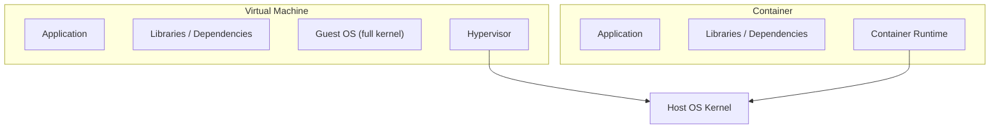
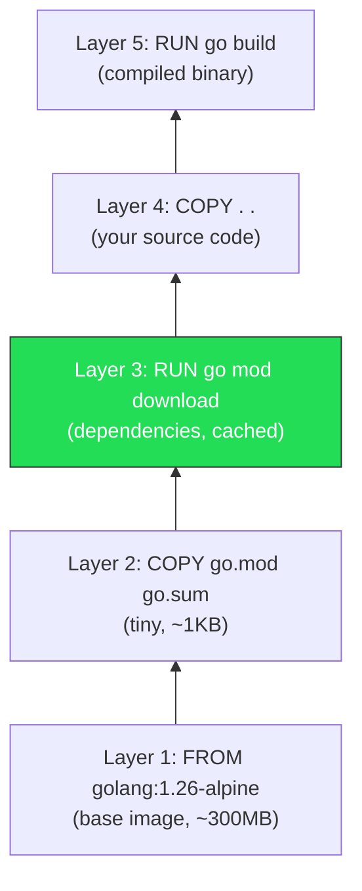

# 3.1 Docker Fundamentals

Before writing any Dockerfiles, you need a solid mental model of what containers actually are and how Docker builds images. This section covers the foundational concepts. If you already have Docker experience, skim through and make sure the multi-stage build section is clear -- it is central to the Dockerfiles we write in the next section.

---

## What Are Containers?

If you are coming from Java, think of a container as a standardized JVM runtime -- but for any language. A JVM gives your Java bytecode a consistent execution environment regardless of the host OS: it handles memory management, provides standard libraries, and isolates your application from low-level platform details. Containers do the same thing, but at the OS level rather than the language level.

A container is a **process** (or group of processes) running on the host kernel with restricted visibility. It sees its own filesystem, its own network interfaces, its own process tree -- but it shares the host's kernel. This is fundamentally different from a virtual machine, which runs its own kernel inside a hypervisor.



The practical consequence: containers start in milliseconds (no kernel boot), consume less memory (no guest OS overhead), and are more portable (they package only the application and its dependencies, not an entire operating system).

### The JVM Analogy, Extended

| Concept | JVM | Container |
|---|---|---|
| Unit of deployment | JAR / WAR file | Container image |
| Runtime environment | JVM (java binary) | Container runtime (Docker, containerd) |
| Isolation | Class loaders, security manager | Linux namespaces, cgroups |
| Configuration | JVM flags, system properties | Environment variables, mounted configs |
| Dependency bundling | Fat JAR with libs | Image layers with OS packages + app binary |
| Startup time | Seconds (JVM warm-up) | Milliseconds (no kernel boot) |

The key difference: the JVM abstracts the CPU architecture and OS API. Containers do not abstract the CPU architecture (an x86 container won't run on ARM without emulation), but they *do* abstract the OS distribution and installed packages. Your Go binary built on Alpine Linux 3.19 will run on any host with a Linux kernel, regardless of what the host has installed.

---

## Images vs. Containers

This distinction trips up many newcomers. An **image** is a read-only template -- a blueprint. A **container** is a running instance of that image.

To use object-oriented terms you already know: an image is a class; a container is an object. You can create multiple containers from the same image, each with its own writable layer and its own state.

```bash
# Build an image (compile the class)
docker build -t catalog:latest .

# Run a container (instantiate the object)
docker run --name catalog-1 catalog:latest
docker run --name catalog-2 catalog:latest   # second instance, same image
```

Images are stored locally and can be pushed to registries (Docker Hub, GitHub Container Registry, AWS ECR) for sharing. When you `docker pull postgres:16-alpine`, you are downloading an image. When you `docker run` it, you create a container.

---

## Layers and Caching

Docker images are built from a series of **layers**. Each instruction in a Dockerfile (`FROM`, `COPY`, `RUN`, etc.) creates a new layer. Layers are content-addressed and cached -- if a layer hasn't changed, Docker reuses the cached version instead of rebuilding it.

This has a critical implication: **instruction order in your Dockerfile determines cache efficiency.**

Consider this naive Dockerfile:

```dockerfile
FROM golang:1.26-alpine
WORKDIR /app
COPY . .
RUN go mod download
RUN go build -o /bin/server ./cmd/
```

Every time you change *any* source file, the `COPY . .` layer is invalidated. That invalidates every subsequent layer, including `go mod download` -- which re-downloads all dependencies even if `go.mod` hasn't changed. On a project with many dependencies, this adds minutes to every build.

Now consider the optimized version:

```dockerfile
FROM golang:1.26-alpine
WORKDIR /app
COPY go.mod go.sum ./
RUN go mod download
COPY . .
RUN go build -o /bin/server ./cmd/
```

Here, `go.mod` and `go.sum` are copied first and dependencies are downloaded. This layer is cached as long as your dependencies don't change. When you edit source code, only the `COPY . .` and `go build` layers are invalidated. This is the two-phase COPY pattern, and we use it in all our Dockerfiles.

### Layer Visualization



The green layer is the key -- it is expensive (network + disk I/O) but cached across most builds.

---

## Multi-Stage Builds

A naive Dockerfile produces an image that contains the Go toolchain (~300MB), all source code, all downloaded modules, *and* the compiled binary. For a Go service that compiles to a ~15MB static binary, this is wasteful and creates a larger attack surface.

Multi-stage builds solve this. You use one stage (the "builder") to compile your code and a second stage (the "runtime") that contains only the final binary:

```dockerfile
# Stage 1: Build
FROM golang:1.26-alpine AS builder
WORKDIR /app
COPY go.mod go.sum ./
RUN go mod download
COPY . .
RUN CGO_ENABLED=0 go build -o /bin/server ./cmd/

# Stage 2: Runtime
FROM alpine:3.19
COPY --from=builder /bin/server /usr/local/bin/server
ENTRYPOINT ["/usr/local/bin/server"]
```

The `COPY --from=builder` instruction reaches into the builder stage and extracts only the compiled binary. The final image is based on `alpine:3.19` (~5MB), not `golang:1.26-alpine` (~300MB). The total image size ends up around 15-20MB instead of 300+MB.

`CGO_ENABLED=0` deserves explanation. Go can link against C libraries via cgo. Setting `CGO_ENABLED=0` disables this and produces a fully static binary with no runtime dependencies on libc. This is what lets us run the binary on a minimal Alpine image (or even `scratch` -- an empty image). Since we are not using any C libraries (GORM's PostgreSQL driver uses pure Go), there is no downside.

### Why This Matters

| Metric | Single-stage | Multi-stage |
|---|---|---|
| Image size | ~350MB | ~20MB |
| Attack surface | Go toolchain, source code, build tools | Binary + Alpine base |
| Pull time (deploy) | Slow | Fast |
| Layer cache reuse | Poor (source changes invalidate everything) | Good (dependency layer is stable) |

In production, smaller images mean faster deploys, less bandwidth, and fewer CVEs in vulnerability scans (fewer packages = fewer things to patch).

---

## Why Containerize Go?

Go produces static binaries. You *could* just `scp` the binary to a server and run it. Why bother with Docker?

1. **Dependency isolation.** Your service needs PostgreSQL connection strings, TLS certificates, and specific environment variables. A container bundles the runtime configuration expectations alongside the binary. The `Dockerfile` documents what the service needs to run.

2. **Consistency across environments.** "It works on my machine" stops being a problem when the container *is* the machine. Development, CI, staging, and production all run the same image.

3. **Deployment uniformity.** Whether you deploy to Kubernetes, AWS ECS, or a single Docker host, the deployment unit is always a container image. Operations teams don't need to know whether your service is Go, Java, or Python -- they pull and run an image.

4. **Matching production locally.** In the next section, we will run PostgreSQL in a container alongside the Catalog service. You don't need to install PostgreSQL on your host machine, manage different versions for different projects, or worry about port conflicts with other databases.

5. **Orchestration compatibility.** Kubernetes -- which we cover in a later chapter -- only speaks containers. Containerizing now means the transition to Kubernetes is about writing manifests, not rearchitecting your deployment.

---

## Summary

- Containers are isolated processes sharing the host kernel -- not virtual machines. Think of them as a universal, OS-level equivalent of the JVM.
- An image is a read-only blueprint; a container is a running instance.
- Dockerfile instructions create layers. Layer caching is the primary tool for fast builds -- copy dependency manifests before source code.
- Multi-stage builds separate the build environment from the runtime, producing small, secure images.
- Containerizing Go services provides consistency, isolation, and compatibility with orchestration platforms -- even though Go binaries are already self-contained.

---

## References

[^1]: [Docker overview](https://docs.docker.com/get-started/overview/) -- official Docker documentation covering architecture and concepts.
[^2]: [Dockerfile best practices](https://docs.docker.com/build/building/best-practices/) -- Docker's guide to writing efficient Dockerfiles.
[^3]: [Multi-stage builds](https://docs.docker.com/build/building/multi-stage/) -- official documentation on multi-stage build patterns.
[^4]: [Why containers?](https://cloud.google.com/containers) -- Google Cloud's overview of container benefits in production environments.
