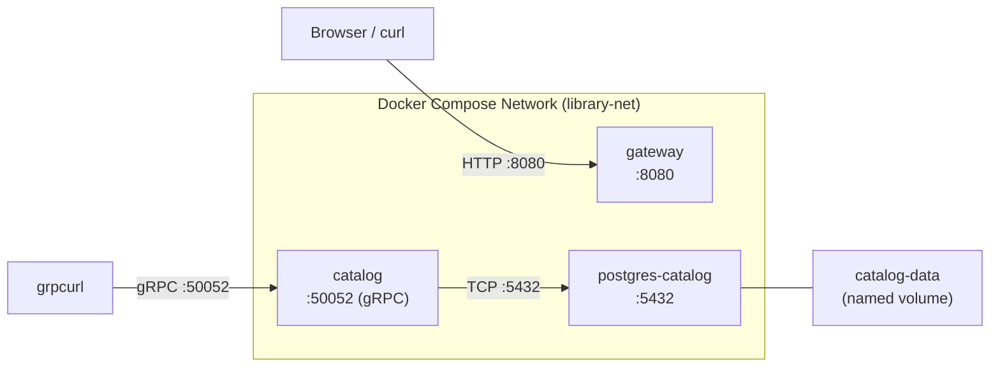

# Chapter 3: Containerization

In this chapter, we package the services from Chapters 1 and 2 into Docker containers and orchestrate them with Docker Compose. By the end, you will have a single command that brings up PostgreSQL, the Catalog service, and the API Gateway—plus a development mode with hot-reload.

## What You'll Learn

- Docker fundamentals: images, containers, layers, and multi-stage builds
- Writing production Dockerfiles for Go services
- Orchestrating multiple containers with Docker Compose
- Setting up a development workflow with live-reload using Air

## Prerequisites

- Docker Desktop (or Docker Engine + Docker Compose plugin) installed and running
- Chapters 1 and 2 completed—the Catalog and Gateway services must compile successfully
- Basic terminal proficiency

## What You'll Build

By the end of this chapter, you will have:

1. **Production Dockerfiles** for the Catalog and Gateway services using multi-stage builds
2. **A Compose stack** that wires PostgreSQL, Catalog, and Gateway together with networking, healthchecks, and volume persistence
3. **A development override** that mounts your source code into containers and uses Air for automatic rebuilds on file changes

## Architecture Overview

The container architecture looks like this:

The Gateway listens on HTTP port 8080. The Catalog service exposes gRPC on port 50052 and connects to PostgreSQL over the bridge network. PostgreSQL data persists in a named Docker volume, so it survives container restarts.

All three containers share a single bridge network (`library-net`), which gives them DNS-based service discovery—the Catalog service connects to `postgres-catalog` by hostname, not by IP address.

## Sections

1. **[Docker Fundamentals](./docker-fundamentals.md)**—What containers are, how images and layers work, why multi-stage builds matter
2. **[Writing Dockerfiles](./writing-dockerfiles.md)**—Line-by-line walkthrough of the Catalog and Gateway Dockerfiles
3. **[Docker Compose](./docker-compose.md)**—Orchestrating the full stack with networking, healthchecks, and volumes
4. **[Development Workflow](./dev-workflow.md)**—Hot-reload with Air, Compose overrides, and debugging tips
