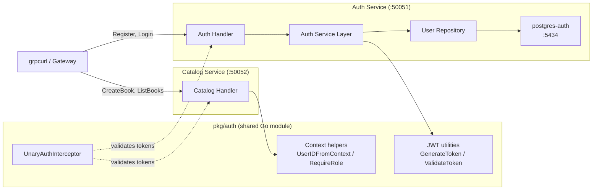

# Chapter 4: Authentication

In this chapter, we build an authentication service from scratch. By the end, your library system will support user registration with bcrypt-hashed passwords, stateless JWT-based sessions, and OAuth2 login with Google. A shared interceptor will protect both the Auth and Catalog services.

## Architecture Overview

The `pkg/auth` module is the linchpin—it lives outside both services so any microservice can import it. The interceptor validates JWTs on every request (unless the method is in the skip list), and the context helpers let handlers extract the authenticated user's ID and role.

## What You'll Learn

- Why bcrypt is the right choice for password hashing and how it works
- How JWTs provide stateless authentication for microservices
- Building a complete gRPC auth service with registration, login, and token validation
- Implementing OAuth2 authorization code flow with Google
- Writing gRPC interceptors—the middleware pattern for gRPC
- Role-based access control across multiple services

## Prerequisites

- Chapters 1--3 completed (the Catalog service and Docker Compose stack build and run cleanly)
- Docker Desktop (or Docker Engine + Compose plugin) running
- Basic understanding of gRPC and Protocol Buffers from Chapter 2

## What You'll Build

1. **A shared `pkg/auth` library** with JWT generation/validation, context helpers, and a reusable auth interceptor
2. **An Auth service** with six gRPC RPCs: Register, Login, ValidateToken, GetUser, InitOAuth2, CompleteOAuth2
3. **OAuth2 integration with Google** using the authorization code flow
4. **Protected Catalog endpoints** where only admins can create, update, or delete books

## Sections

1. **[Authentication Fundamentals](./auth-fundamentals.md)**—Password hashing, JWTs, and when to use each authentication strategy
2. **[The Auth Service](./auth-service.md)**—Proto definition, migrations, repository, service, handler, and DI wiring
3. **[OAuth2 with Google](./oauth2.md)**—Authorization code flow, state parameters, and the find-or-create pattern
4. **[Protecting Services with Interceptors](./interceptors.md)**—gRPC middleware, the shared auth library, and role-based authorization
