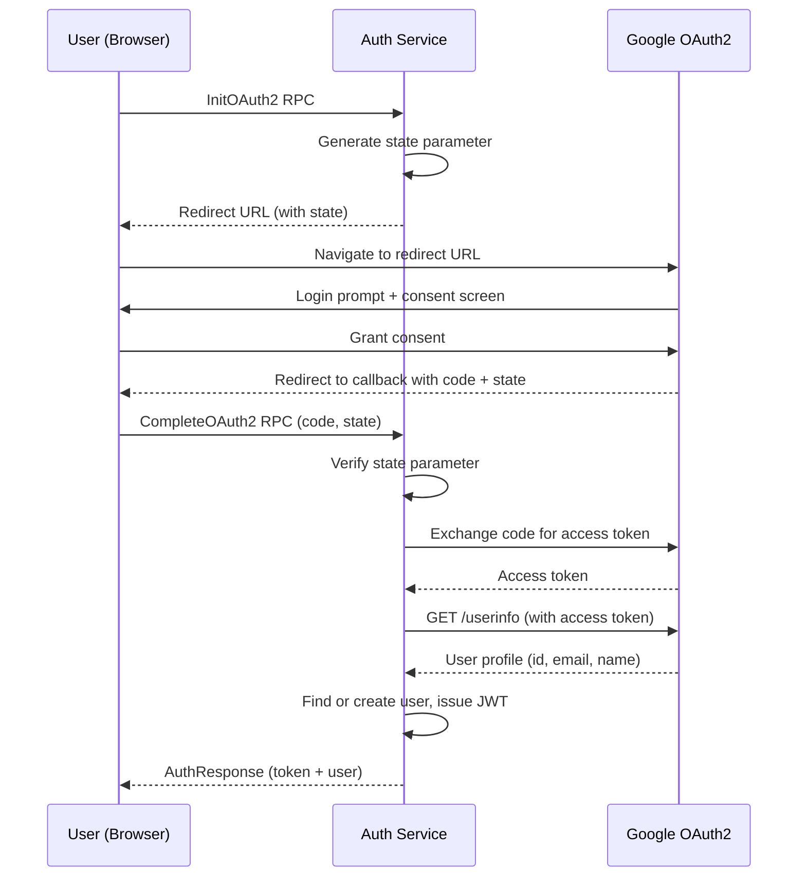

# 4.3 OAuth2 with Google

The Auth service supports email/password registration, but modern applications also offer "Sign in with Google" (or GitHub, or Apple). This section explains the OAuth2 authorization code flow, how we implement it with two gRPC RPCs, and the security considerations around state parameters. If you have worked with SAML in Java enterprise applications, OAuth2 is conceptually similar—a trusted third party asserts the user's identity—but the protocol is simpler and HTTP-based rather than XML-based.

---

## The Authorization Code Flow

OAuth2 defines several flows (called "grant types"). The **authorization code flow** is the standard for server-side applications. It involves three parties:

1. **Client**—your application (the Auth service)
2. **Authorization Server**—Google's OAuth2 endpoint
3. **Resource Server**—Google's user info API

Here is the sequence:



The flow has two phases. In the first phase (`InitOAuth2`), the server generates a URL that sends the user to Google's consent screen. In the second phase (`CompleteOAuth2`), Google redirects back with an authorization code, which the server exchanges for an access token, then uses to fetch the user's profile.

### Why Two RPCs?

In a traditional web application, these would be two HTTP endpoints: one to initiate the redirect, one to handle the callback. Since we use gRPC (not HTTP), the client application (a frontend or gateway) calls `InitOAuth2` to get the redirect URL, sends the user to Google, and then calls `CompleteOAuth2` with the code and state that Google returns.

---

## Google Cloud Console Setup

To use Google OAuth2, you need credentials from the Google Cloud Console:

1. Go to [console.cloud.google.com](https://console.cloud.google.com/)
2. Create a project (or select an existing one)
3. Navigate to **APIs & Services > Credentials**
4. Click **Create Credentials > OAuth 2.0 Client ID**
5. Set the application type to **Web application**
6. Add your redirect URI (e.g., `http://localhost:8080/auth/callback`)
7. Copy the Client ID and Client Secret

Set these as environment variables:

```bash
GOOGLE_CLIENT_ID=your-client-id.apps.googleusercontent.com
GOOGLE_CLIENT_SECRET=your-secret
GOOGLE_REDIRECT_URL=http://localhost:8080/auth/callback
```

**You can skip this step.** The Auth service gracefully handles missing credentials. If `GOOGLE_CLIENT_ID` is empty, the OAuth2 config is not initialized, and the `InitOAuth2` and `CompleteOAuth2` RPCs return `Unavailable: OAuth2 not configured`. The rest of the service (registration, login, token validation) works normally.

```go
func NewAuthHandlerWithOAuth(svc *service.AuthService, clientID, clientSecret, redirectURL string) *AuthHandler {
    h := NewAuthHandler(svc)
    if clientID != "" {
        h.oauthConfig = &oauth2.Config{
            ClientID:     clientID,
            ClientSecret: clientSecret,
            RedirectURL:  redirectURL,
            Scopes:       []string{"openid", "email", "profile"},
            Endpoint:     google.Endpoint,
        }
    }
    return h
}
```

The `oauth2.Config` struct is from `golang.org/x/oauth2`, and `google.Endpoint` (from `golang.org/x/oauth2/google`) provides Google's authorization and token URLs. The import block for this file includes both packages — the listing above omits it for brevity. The scopes request the user's OpenID identity, email address, and profile name.

---

## The State Parameter

The state parameter is critical for security. Without it, an attacker can perform a **cross-site request forgery (CSRF) attack** on the OAuth2 callback:

1. Attacker initiates an OAuth2 flow with their own Google account
2. Attacker gets the callback URL with their authorization code
3. Attacker tricks the victim into visiting that callback URL
4. The victim's browser sends the attacker's code to your server
5. Your server creates a session for the attacker's Google account, but in the victim's browser

With a state parameter, the server generates a random value, stores it, and includes it in the redirect URL. When the callback comes back, the server verifies the state matches. The attacker cannot forge a valid state because they cannot predict what the server generated.

Our implementation generates 16 random bytes and stores them with a five-minute TTL:

```go
func (h *AuthHandler) InitOAuth2(ctx context.Context, req *authv1.InitOAuth2Request) (*authv1.InitOAuth2Response, error) {
    if h.oauthConfig == nil {
        return nil, status.Error(codes.Unavailable, "OAuth2 not configured")
    }

    // Generate cryptographically random state
    stateBytes := make([]byte, 16)
    if _, err := rand.Read(stateBytes); err != nil {
        return nil, status.Error(codes.Internal, "failed to generate state")
    }
    state := hex.EncodeToString(stateBytes)

    // Store state with expiry
    h.mu.Lock()
    h.states[state] = time.Now().Add(5 * time.Minute)
    // Clean up expired states while we hold the lock
    now := time.Now()
    for k, v := range h.states {
        if now.After(v) {
            delete(h.states, k)
        }
    }
    h.mu.Unlock()

    url := h.oauthConfig.AuthCodeURL(state)
    return &authv1.InitOAuth2Response{RedirectUrl: url}, nil
}
```

The `sync.Mutex` protects the `states` map because gRPC handlers run concurrently—multiple users could call `InitOAuth2` at the same time. The cleanup loop on each call is an ad hoc garbage-collection strategy: every time someone initiates a flow, we purge expired states. This prevents the map from growing without bound if users start flows but never complete them.

---

## Completing the Flow

When `CompleteOAuth2` is called, the handler verifies the state, exchanges the code for an access token, fetches the user's profile from Google, and creates or finds the user:

```go
func (h *AuthHandler) CompleteOAuth2(ctx context.Context, req *authv1.CompleteOAuth2Request) (*authv1.AuthResponse, error) {
    // Verify and consume the state parameter
    h.mu.Lock()
    expiry, ok := h.states[req.GetState()]
    if ok {
        delete(h.states, req.GetState())
    }
    h.mu.Unlock()

    if !ok || time.Now().After(expiry) {
        return nil, status.Error(codes.InvalidArgument, "invalid or expired state")
    }

    // Exchange authorization code for access token
    oauthToken, err := h.oauthConfig.Exchange(ctx, req.GetCode())
    if err != nil {
        return nil, status.Error(codes.Internal, fmt.Sprintf("failed to exchange code: %v", err))
    }

    // Fetch user profile from Google
    client := h.oauthConfig.Client(ctx, oauthToken)
    resp, err := client.Get("https://www.googleapis.com/oauth2/v2/userinfo")
    // ... decode JSON response

    // Find existing user or create new one
    token, user, err := h.svc.FindOrCreateOAuthUser(ctx, "google", googleUser.ID, googleUser.Email, googleUser.Name)
    // ...
}
```

The state is consumed on use (`delete(h.states, ...)`), so each state value can only be used once. This prevents replay attacks.

> Google's documentation now favors the OpenID Connect endpoint (`https://openidconnect.googleapis.com/v1/userinfo`), but the v2 endpoint used here remains functional.

### Google's Userinfo Response

The `googleapis.com/oauth2/v2/userinfo` endpoint returns a JSON object:

```json
{
    "id": "1234567890",
    "email": "alice@gmail.com",
    "name": "Alice Smith",
    "picture": "https://lh3.googleusercontent.com/..."
}
```

We decode only the fields we need (`id`, `email`, `name`) into an anonymous struct:

```go
var googleUser struct {
    ID    string `json:"id"`
    Email string `json:"email"`
    Name  string `json:"name"`
}
if err := json.NewDecoder(resp.Body).Decode(&googleUser); err != nil {
    return nil, status.Error(codes.Internal, "failed to parse user info")
}
```

### Find-or-Create Pattern

The service layer's `FindOrCreateOAuthUser` first looks up the user by provider + OAuth ID. If found, it issues a new JWT. If not found, it creates a new user with no password:

```go
func (s *AuthService) FindOrCreateOAuthUser(ctx context.Context, provider, oauthID, email, name string) (string, *model.User, error) {
    user, err := s.repo.GetByOAuthID(ctx, provider, oauthID)
    if err == nil {
        // Existing user — issue token
        token, err := pkgauth.GenerateToken(user.ID, user.Role, s.jwtSecret, s.jwtExpiry)
        return token, user, err
    }

    // Create new OAuth user (no password)
    user = &model.User{
        Email: email, Name: name, Role: "user",
        OAuthProvider: &provider, OAuthID: &oauthID,
    }
    created, err := s.repo.Create(ctx, user)
    // ... issue token for new user
}
```

The `PasswordHash` field is `nil` for OAuth users. If they later try to call the `Login` RPC with a password, the service returns `ErrInvalidCredentials`—they must authenticate through Google.

---

## Limitations

Our implementation has two significant limitations worth understanding:

**In-memory state storage.** The `states` map lives in the handler's memory. If the Auth service restarts between `InitOAuth2` and `CompleteOAuth2`, the state is lost and the flow fails. With a single replica, this is rare (the window is at most five minutes). With multiple replicas behind a load balancer, it breaks entirely—the request might hit a different replica that doesn't have the state.

Production alternatives:
- **Signed state tokens.** Instead of storing state server-side, sign it as a JWT. The state parameter becomes `jwt.Sign({nonce: random, exp: 5min}, secret)`. On callback, validate the signature and expiry. No storage needed. This is often the most elegant solution.
- **Redis.** Store states in Redis with a TTL. All replicas can verify any state. Simple but adds an infrastructure dependency.
- **Database.** Store states in PostgreSQL. Works but adds a database round-trip on a hot path.

**No account linking.** If a user registers with `alice@gmail.com` via email/password and later signs in with Google (which also returns `alice@gmail.com`), we create two separate accounts. A production system would detect the matching email and either merge accounts automatically or prompt the user to link them.

These limitations are deliberate trade-offs for a learning project. The patterns shown here are correct and production-ready—only the state storage backend needs upgrading for a multi-replica deployment.

---

## Summary

- OAuth2 authorization code flow uses two exchanges: redirect the user to Google, then exchange the callback code for a token
- The state parameter prevents CSRF attacks on the callback—always use one
- `crypto/rand` generates cryptographically secure random bytes for the state
- `sync.Mutex` protects shared state in concurrent gRPC handlers
- Find-or-create pattern enables seamless first-time OAuth logins
- In-memory state storage works for single-replica development but needs Redis or signed tokens in production

---

## References

[^1]: [OAuth 2.0 RFC 6749](https://datatracker.ietf.org/doc/html/rfc6749)—the OAuth 2.0 authorization framework specification.
[^2]: [Google OAuth2 documentation](https://developers.google.com/identity/protocols/oauth2)—Google's guide to implementing OAuth2.
[^3]: [golang.org/x/oauth2 package](https://pkg.go.dev/golang.org/x/oauth2)—the Go OAuth2 client library used in this project.
[^4]: [CSRF and OAuth2](https://datatracker.ietf.org/doc/html/rfc6749#section-10.12)—RFC 6749 section on cross-site request forgery protection with the state parameter.
[^5]: [Google userinfo API](https://developers.google.com/identity/protocols/oauth2/openid-connect#obtaininguserprofileinformation)—documentation on fetching user profile information from Google.
