# Chapter 5: Gateway & Frontend

Until now, the only way to interact with the library system has been through `grpcurl` or a gRPC client library. That works for service-to-service communication, but end users need a browser-friendly interface. In this chapter, we build a **Gateway Service**—an HTTP server that renders HTML pages and delegates all business logic to the Auth and Catalog gRPC services behind it. This is the Backend-for-Frontend (BFF) pattern: a thin, presentation-focused layer tailored to a single client type (the browser).

## Architecture Overview

```mermaid
graph LR
    Browser["Browser<br/>(HTTP)"]

    subgraph "Gateway (:8080)"
        MW["Middleware<br/>Logging + Auth"]
        H["Handlers<br/>Login, Catalog, Admin"]
        T["HTML Templates<br/>+ HTMX"]
    end

    subgraph "Auth Service (:50051)"
        AG["gRPC Handler"]
        APG["postgres-auth<br/>:5434"]
    end

    subgraph "Catalog Service (:50052)"
        CG["gRPC Handler"]
        CPG["postgres-catalog<br/>:5433"]
    end

    Browser -->|"HTTP requests"| MW --> H
    H -->|"gRPC"| AG --> APG
    H -->|"gRPC"| CG --> CPG
    H --> T -->|"HTML responses"| Browser
```

The gateway has no database and holds no business state; it is a translation layer between HTTP/HTML and gRPC. Authentication state lives in a JWT cookie that the gateway validates on every request using the same `pkg/auth` library the backend services use.

## What You'll Learn

- The Backend-for-Frontend pattern and why it suits microservices frontends
- Go's `net/http` stdlib router with Go 1.22+ method-based patterns
- Go's `html/template` package and the clone-per-page pattern for layouts
- HTMX for progressive enhancement without a JavaScript framework
- Cookie-based session management with JWTs
- OAuth2 flow orchestration from the browser's perspective
- Role-based access control in HTTP handlers
- Form handling, POST-redirect-GET, and gRPC-to-HTTP error mapping

## Prerequisites

- Chapters 1–4 completed (Auth and Catalog services running via Docker Compose)
- Familiarity with HTTP, cookies, and basic HTML forms

## Sections

1. **[The BFF Pattern](./bff-pattern.md)**—What a BFF is, the Server struct, stdlib routing, and middleware, the Server struct, stdlib routing, and middleware
2. **[Templates & HTMX](./templates-htmx.md)**—Go templates, the clone-per-page pattern, and HTMX-powered filtering
3. **[Session Management](./session-management.md)**—JWT cookies, login/logout flows, OAuth2 orchestration, and flash messages
4. **[Admin CRUD](./admin-crud.md)**—Role guards, form handling, gRPC error mapping, and the Docker build
