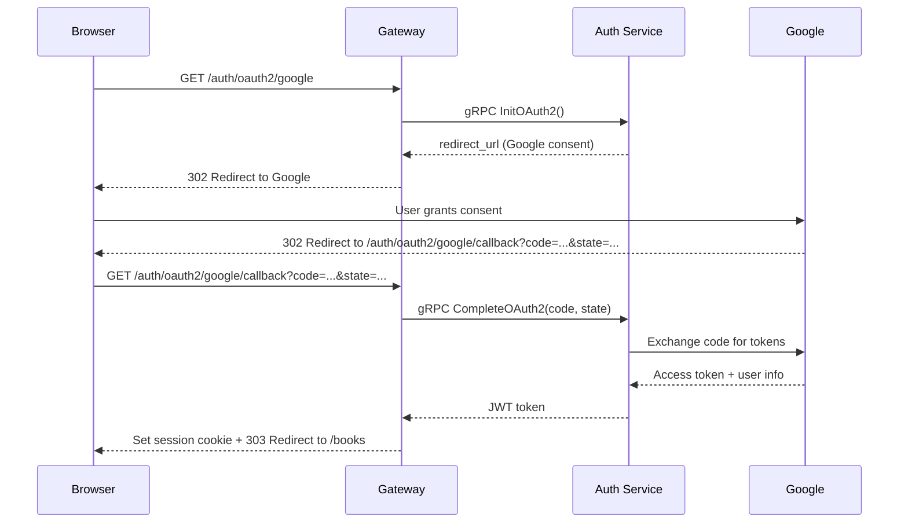

# 5.3 Session Management

The gateway needs to know who the current user is on every request. In Chapter 4, we built JWT-based authentication for gRPC services using metadata headers. For the browser, we use the same JWTs -- but stored in cookies instead of gRPC metadata.

---

## JWT in Cookies vs. localStorage

There are two common places to store a JWT in the browser:

| Storage | XSS protection | CSRF protection | Sent automatically |
|---|---|---|---|
| **`localStorage`** | Vulnerable -- any JavaScript can read it | Not vulnerable | No -- you must add an `Authorization` header manually |
| **HttpOnly cookie** | Protected -- JavaScript cannot access the cookie | Needs `SameSite` attribute | Yes -- the browser sends it on every request |

We use HttpOnly cookies. The tradeoff is clear: `localStorage` is vulnerable to XSS (if an attacker injects JavaScript into your page, they can steal the token), while HttpOnly cookies are invisible to JavaScript entirely. The CSRF risk from cookies is mitigated by the `SameSite` attribute, which prevents the browser from sending the cookie on cross-origin requests.

If you have worked with Spring Security, this is the same tradeoff between `JwtAuthenticationFilter` (reading from `Authorization` header, typically used by SPAs storing tokens in `localStorage`) and cookie-based session management.

---

## Cookie Attributes

The `setSessionCookie` function writes the JWT to a cookie with specific security attributes:

```go
// services/gateway/internal/handler/auth.go

func setSessionCookie(w http.ResponseWriter, token string) {
    http.SetCookie(w, &http.Cookie{
        Name:     "session",
        Value:    token,
        Path:     "/",
        HttpOnly: true,
        SameSite: http.SameSiteLaxMode,
        MaxAge:   86400,
    })
}
```

Each attribute matters:

- **`HttpOnly: true`** -- The cookie is invisible to JavaScript. `document.cookie` will not include it. This is your primary defense against XSS token theft.
- **`SameSite: Lax`** -- The cookie is sent on same-site requests and top-level navigations (clicking a link) but not on cross-site sub-requests (embedded images, iframes, AJAX from another domain). This prevents most CSRF attacks. `Strict` would also block the cookie on top-level navigations from other sites, which breaks OAuth2 callbacks.
- **`MaxAge: 86400`** -- The cookie expires in 24 hours (matching the JWT expiration from Chapter 4). `MaxAge` is preferred over `Expires` because it is relative, not absolute -- no clock skew issues.
- **`Path: "/"`** -- The cookie is sent for all paths. Without this, the cookie would only apply to the path that set it.
- **`Secure`** is omitted because we are running on `localhost` over HTTP during development. In production, you must add `Secure: true` so the cookie is only sent over HTTPS.

Clearing the cookie on logout sets `MaxAge: -1`, which tells the browser to delete it immediately:

```go
func clearSessionCookie(w http.ResponseWriter) {
    http.SetCookie(w, &http.Cookie{
        Name:   "session",
        Path:   "/",
        MaxAge: -1,
    })
}
```

---

## Login Flow: POST-Redirect-GET

The login flow follows the POST-Redirect-GET (PRG) pattern, which prevents the browser from resubmitting the form on refresh:

1. User fills in the login form and clicks Submit.
2. Browser sends `POST /login` with form data.
3. Gateway calls the Auth service via gRPC.
4. On success: set the session cookie, set a flash message, redirect to `/books` with `303 See Other`.
5. On failure: re-render the login page with an error message (no redirect).

```go
// services/gateway/internal/handler/auth.go

func (s *Server) LoginSubmit(w http.ResponseWriter, r *http.Request) {
    email := r.FormValue("email")
    password := r.FormValue("password")
    if email == "" || password == "" {
        s.render(w, r, "login.html", map[string]any{"Error": "Email and password are required"})
        return
    }
    resp, err := s.auth.Login(r.Context(), &authv1.LoginRequest{Email: email, Password: password})
    if err != nil {
        s.render(w, r, "login.html", map[string]any{"Error": "Invalid email or password", "Email": email})
        return
    }
    setSessionCookie(w, resp.Token)
    setFlash(w, "Welcome back!")
    http.Redirect(w, r, "/books", http.StatusSeeOther)
}
```

Notice the error handling: when login fails, we re-render the form with the email pre-filled (`"Email": email`) so the user does not have to re-type it. We do not pre-fill the password for security reasons.

The `http.StatusSeeOther` (303) status code tells the browser to follow the redirect with a GET request, even though the original request was a POST. This is the "redirect" in PRG -- the browser's address bar now shows `/books`, and refreshing the page sends a harmless GET instead of re-posting the login form.

---

## Auth Middleware

The auth middleware runs on every request. It reads the session cookie, validates the JWT, and injects the user's identity into the request context. If validation fails (expired token, tampered token, no cookie), the request continues as anonymous -- the middleware does not block it.

```go
// services/gateway/internal/middleware/auth.go

func Auth(next http.Handler, jwtSecret string) http.Handler {
    return http.HandlerFunc(func(w http.ResponseWriter, r *http.Request) {
        cookie, err := r.Cookie("session")
        if err != nil || cookie.Value == "" {
            next.ServeHTTP(w, r)
            return
        }
        claims, err := pkgauth.ValidateToken(cookie.Value, jwtSecret)
        if err != nil {
            // Invalid/expired token — continue as anonymous
            next.ServeHTTP(w, r)
            return
        }
        ctx := pkgauth.ContextWithUser(r.Context(), claims.UserID, claims.Role)
        next.ServeHTTP(w, r.WithContext(ctx))
    })
}
```

This is a "soft" auth middleware -- it enriches the context when a valid token is present but never rejects a request. Individual handlers decide whether to require authentication (by checking `userFromContext`). This design means public pages like the catalog work for anonymous users, while protected pages like admin CRUD can redirect to login.

Compare this to Spring Security's filter chain: in Spring, you configure URL patterns in `SecurityFilterChain` to require authentication. In our gateway, the middleware always runs and handlers opt-in to requiring auth. Both approaches work -- the Go version is more explicit about the decision point.

---

## OAuth2 Flow Through the Gateway

In Chapter 4, we implemented OAuth2 on the Auth service's gRPC API. The gateway orchestrates this flow for the browser:



The gateway acts as a redirect orchestrator. It does not handle OAuth2 tokens directly -- it passes the authorization code and state parameter to the Auth service, which exchanges them for user information and returns a JWT.

```go
// services/gateway/internal/handler/auth.go

func (s *Server) OAuth2Start(w http.ResponseWriter, r *http.Request) {
    resp, err := s.auth.InitOAuth2(r.Context(), &authv1.InitOAuth2Request{})
    if err != nil {
        s.renderError(w, r, http.StatusInternalServerError, "Failed to initiate OAuth2 login")
        return
    }
    http.Redirect(w, r, resp.RedirectUrl, http.StatusFound)
}

func (s *Server) OAuth2Callback(w http.ResponseWriter, r *http.Request) {
    code := r.URL.Query().Get("code")
    state := r.URL.Query().Get("state")
    resp, err := s.auth.CompleteOAuth2(r.Context(), &authv1.CompleteOAuth2Request{
        Code:  code,
        State: state,
    })
    if err != nil {
        s.renderError(w, r, http.StatusUnauthorized, "OAuth2 login failed")
        return
    }
    setSessionCookie(w, resp.Token)
    setFlash(w, "Welcome!")
    http.Redirect(w, r, "/books", http.StatusSeeOther)
}
```

`OAuth2Start` uses `302 Found` (not 303) because we want the browser to follow the redirect with the same method -- standard for OAuth2 authorization redirects. `OAuth2Callback` uses `303 See Other` after setting the cookie, following the PRG pattern.

---

## Flash Messages

Flash messages are one-time notifications displayed after a redirect -- "Book created", "Welcome back!", etc. In Spring, you would use `RedirectAttributes.addFlashAttribute()` backed by the session store. We use a simpler approach: a short-lived cookie.

```go
// services/gateway/internal/handler/render.go

func setFlash(w http.ResponseWriter, message string) {
    http.SetCookie(w, &http.Cookie{
        Name:     "flash",
        Value:    message,
        Path:     "/",
        MaxAge:   10,
        HttpOnly: true,
    })
}

func consumeFlash(w http.ResponseWriter, r *http.Request) string {
    c, err := r.Cookie("flash")
    if err != nil {
        return ""
    }
    http.SetCookie(w, &http.Cookie{
        Name:   "flash",
        Path:   "/",
        MaxAge: -1,
    })
    return c.Value
}
```

The pattern:

1. Before a redirect, `setFlash` writes a cookie with `MaxAge: 10` (10 seconds -- enough time for the redirect to complete).
2. The `render` function calls `consumeFlash`, which reads the cookie value and immediately deletes it by setting `MaxAge: -1`.
3. The template displays the flash message if it exists.

This is stateless -- no server-side session store needed. The tradeoff is that flash messages are limited to what fits in a cookie (about 4KB) and are not encrypted. For user-facing messages like "Book created", this is fine.

---

## Logout

Logout is straightforward -- clear the session cookie and redirect:

```go
func (s *Server) Logout(w http.ResponseWriter, r *http.Request) {
    clearSessionCookie(w)
    http.Redirect(w, r, "/", http.StatusSeeOther)
}
```

The JWT itself is not invalidated -- it is still valid until its `exp` claim. But without the cookie, the browser will not send it, and the user is effectively logged out. As discussed in section 4.1, true JWT revocation requires a blocklist or token versioning, which we intentionally omit for simplicity.

The logout route is `POST /logout`, not `GET /logout`. This is important: GET requests should not have side effects. A malicious page could embed `` and log users out. Using POST with a form submission prevents this.

---

## References

[^1]: [OWASP Session Management Cheat Sheet](https://cheatsheetseries.owasp.org/cheatsheets/Session_Management_Cheat_Sheet.html) -- Best practices for session management in web applications.
[^2]: [MDN -- Using HTTP cookies](https://developer.mozilla.org/en-US/docs/Web/HTTP/Cookies) -- Comprehensive reference on cookie attributes (HttpOnly, SameSite, Secure, etc.).
[^3]: [RFC 6265 -- HTTP State Management Mechanism](https://datatracker.ietf.org/doc/html/rfc6265) -- The cookie specification.
[^4]: [Post/Redirect/Get pattern](https://en.wikipedia.org/wiki/Post/Redirect/Get) -- Wikipedia article on the PRG pattern.
[^5]: [OWASP Cross-Site Request Forgery Prevention](https://cheatsheetseries.owasp.org/cheatsheets/Cross-Site_Request_Forgery_Prevention_Cheat_Sheet.html) -- CSRF prevention techniques including SameSite cookies.
