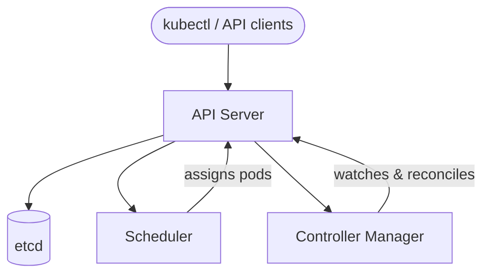
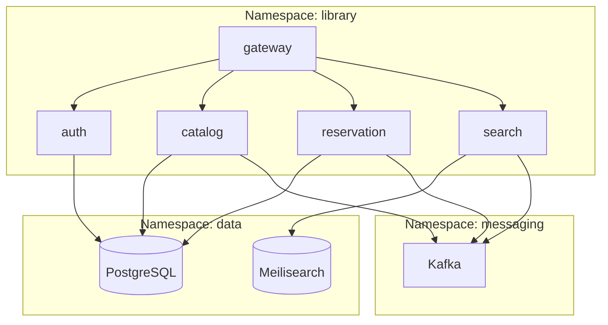

# Chapter 12: Kubernetes

Chapter 3 got all five services running locally with Docker Compose: a single `docker compose up` starts PostgreSQL, Kafka, Meilisearch, and every application container. For development and demonstration that is the right tool. But Docker Compose is a single-machine orchestrator. If the machine running it goes down, every service goes with it. If the Catalog Service crashes, nothing restarts it automatically. If traffic doubles overnight, there is no mechanism to add replicas. Deploying a new image means a gap in service while the old container stops and the new one starts.

Kubernetes addresses all of those problems. It is a platform for running containerized workloads across a cluster of machines, with built-in self-healing, rolling updates, service discovery, autoscaling, and declarative configuration management. The same mental model you developed in Chapter 3 carries forward — containers, images, environment variables, volume mounts — but Kubernetes layers a control plane on top that continuously reconciles what is running against what you declared you want.

This chapter introduces that control plane, maps the Docker Compose concepts you already know to their Kubernetes equivalents, and lays the groundwork for the sections that follow, where you will write real manifests and deploy the library system to a local cluster.

---

## From Compose to Kubernetes

The most practical entry point into Kubernetes is a direct comparison with what you already know. Every Docker Compose concept has a Kubernetes counterpart. The semantics differ in important ways, but the mapping makes the unfamiliar familiar.

| Docker Compose | Kubernetes | Purpose |
|----------------|------------|---------|
| `container` | Pod | Smallest deployable unit |
| `services:` block | Deployment | Manages replica sets and rolling updates |
| `ports:` | Service (ClusterIP/NodePort) | Internal service discovery and load balancing |
| `depends_on` | Readiness probes | Health-based dependency management |
| `volumes:` | PersistentVolumeClaim | Persistent storage |
| `docker-compose.yml` | Manifests (YAML) | Declarative desired state |
| Port mapping to host | Ingress | External traffic routing |

`depends_on` in Compose controls startup order — service B won't start until service A's container exists. Kubernetes has no startup ordering. Instead, it has **readiness probes**: a container signals that it is ready to receive traffic by passing a health check (an HTTP endpoint, a TCP connection, or an exec command). Kubernetes only routes traffic to a pod once its readiness probe passes. The implication is that your services must tolerate dependencies being temporarily unavailable and retry — a property called **graceful degradation** that is good practice in any distributed system.

`ports:` in Compose binds a container port to a host port, making the service reachable at `localhost:8080`. Kubernetes decouples this into two steps: a **Service** object provides stable DNS and load balancing inside the cluster (no host port needed), and an **Ingress** object handles traffic arriving from outside the cluster.

PersistentVolumeClaims are heavier than Compose volumes. A Compose volume is just a directory on the Docker host. A PVC is a request for storage from the cluster's storage subsystem — it can be fulfilled by a local disk, an NFS share, a cloud block device, or any storage provider that implements the Container Storage Interface (CSI). The application does not know or care which; it sees a mounted filesystem either way.

---

## The control plane

A Kubernetes cluster has two kinds of machines: **control plane nodes** that manage the cluster, and **worker nodes** that run your workloads. In a production cluster there are typically three control plane nodes for high availability. In a local development cluster (which you will set up in section 12.1), a single node plays both roles.

The control plane runs four core components:

**API server** is the front door to the cluster. Every interaction — from `kubectl` on your laptop to a controller inside the cluster — goes through the API server. It validates requests, persists state to etcd, and notifies components that care about changes. It exposes a RESTful HTTP API; `kubectl` is just a command-line client for that API.

**etcd** is a distributed key-value store that holds all cluster state: every resource you have created, every status the system has observed, every configuration change. It is the single source of truth. If etcd is lost without a backup, the cluster's desired state is gone.

**Scheduler** watches for pods that have been created but not yet assigned to a node. It evaluates each unscheduled pod against the available nodes — considering resource requests, node selectors, affinity rules, taints and tolerations — and writes a node assignment back to the API server. It does not start pods; it just decides where they go.

**Controller Manager** runs a collection of control loops, each watching a specific resource type and reconciling the cluster's actual state toward the desired state. The Deployment controller, for example, watches Deployment objects and ensures the correct number of pod replicas are running at all times. When a pod crashes, the controller notices the discrepancy and creates a replacement.



Everything flows through the API server. No component talks directly to another — they all read and write through the central API. This design makes the system auditable, extensible, and resilient to component restarts.

---

## Node components

On every worker node, two components handle the actual work of running containers.

**kubelet** is an agent that runs on each node. It watches the API server for pods assigned to its node, instructs the container runtime (typically containerd) to pull images and start containers, monitors their health, and reports status back to the API server. If a container's liveness probe fails, the kubelet restarts it. The kubelet is how the control plane's intent reaches the physical machine.

**kube-proxy** manages the network rules that implement Kubernetes Services. When you create a Service pointing to three catalog pods, kube-proxy ensures that traffic arriving at the Service's virtual IP is load-balanced across those three pods. On Linux it does this using iptables or IPVS rules. It is transparent to your application — your code connects to the Service name, and the network layer handles the rest.

---

## The declarative model

The most important conceptual shift from Compose to Kubernetes is the move from **imperative** to **declarative** operations.

Docker Compose is imperative: you run `docker compose up`, and Compose starts the containers you described. If a container crashes later, nothing brings it back unless you run the command again. If you want three copies of catalog, you decide when to start the second and third.

Kubernetes is declarative: you write a manifest that says "I want three replicas of the Catalog Service running, using image `library/catalog:v1.2.0`, with 256 MiB of memory and 100m of CPU (0.1 CPU cores)." You apply that manifest once. Kubernetes stores it as the desired state and then continuously reconciles. If a pod crashes, the controller creates a replacement — not because you asked it to, but because the actual state (two running replicas) diverged from the desired state (three). If a node goes down, the pods on it are rescheduled to healthy nodes automatically.

This reconciliation loop runs forever. It is not a one-time action but an ongoing process. The practical consequence is that Kubernetes manifests are **idempotent**: applying the same manifest twice has the same effect as applying it once. If nothing has changed, nothing happens. If the image tag changed, Kubernetes performs a rolling update.

For a system built to run continuously and recover from failure, this model is far more reliable than issuing imperative commands. You describe the outcome; Kubernetes figures out how to achieve and maintain it.

---

## Key resource types

Kubernetes organizes everything around **resources** — typed objects stored in etcd and managed by controllers. The following are the resource types you will use in this chapter.

**Pod** is the smallest deployable unit in Kubernetes. A pod contains one or more containers that share a network namespace and can share volumes. All containers in a pod are scheduled on the same node and started together. In practice, most pods contain a single application container; multi-container patterns (such as the sidecar pattern) are used for cross-cutting concerns like log collection or service mesh proxies. You will rarely create pods directly — you use Deployments or StatefulSets, which manage pods on your behalf.

**Deployment** is the standard way to run stateless application services. It manages a ReplicaSet (a group of identical pods) and handles rolling updates: when you change the image tag, it starts new pods with the new image before terminating old ones, ensuring continuous availability. It also handles rollback: if the new version fails its health checks, you can revert to the previous version with a single command. Every stateless service in the library system — gateway, auth, catalog, reservation, search — will run as a Deployment.

**Service** gives a stable network identity to a dynamic set of pods. Pods are ephemeral: created and destroyed as replicas scale, each assigned a fresh IP at start. A Service selects pods using label selectors and provides a stable virtual IP and DNS name that other services can use regardless of which pods are currently running. The default type, ClusterIP, is reachable only inside the cluster. NodePort exposes the service on a port on each node. LoadBalancer provisions an external load balancer in cloud environments.

**StatefulSet** is like a Deployment but designed for stateful workloads — databases, message brokers, anything that needs stable network identities, ordered startup and shutdown, and persistent storage. Each pod in a StatefulSet gets a predictable name (`postgres-0`, `postgres-1`) and its own PersistentVolumeClaim. Kafka and PostgreSQL will run as StatefulSets.

**ConfigMap** holds non-sensitive configuration data as key-value pairs or entire files. You mount ConfigMaps into pods as environment variables or as files in the filesystem. They decouple configuration from the container image, allowing the same image to run in development, staging, and production with different settings.

**Secret** is structurally identical to a ConfigMap but intended for sensitive data: passwords, API keys, TLS certificates, OAuth credentials. Secrets are base64-encoded and, by default, stored unencrypted at rest (etcd encryption can be enabled separately) and treated with additional care by the API server — they are not included in API responses unless explicitly requested.

**Ingress** manages external HTTP and HTTPS traffic into the cluster. An Ingress resource defines routing rules: requests to `library.example.com/api` go to the Gateway Service; requests to `library.example.com/auth` go to the Auth Service. An Ingress Controller (a reverse proxy like nginx or Traefik that runs inside the cluster) reads these rules and configures itself accordingly. Ingress is what replaces the `ports:` host binding from Docker Compose for production deployments.

**PersistentVolumeClaim** is a request for storage. A PVC specifies the size, access mode (ReadWriteOnce for a single writer, ReadWriteMany for shared access), and optionally a StorageClass. The cluster satisfies the PVC by binding it to a PersistentVolume — the actual storage backend. Applications mount the PVC as a directory; they do not know whether the storage is a local disk, an NFS share, or a cloud volume.

---

## kubectl basics

`kubectl` is the command-line client for the Kubernetes API. Every operation you perform on a cluster goes through it. The commands you will use most often are:

**Apply** submits a manifest to the API server. Kubernetes creates the resource if it does not exist, or updates it if it does. This is the primary way to deploy changes.

```bash
kubectl apply -f catalog-deployment.yaml
kubectl apply -f k8s/
```

**Get** lists resources. The output shows name, status, age, and a few key fields depending on the resource type.

```bash
kubectl get pods
kubectl get pods -n library
kubectl get deployments,services -n library
```

**Describe** shows detailed information about a resource, including its events — the most useful first stop when debugging why a pod won't start.

```bash
kubectl describe pod catalog-7d9f4b-xvz2k -n library
kubectl describe deployment catalog -n library
```

**Logs** streams or prints container logs. For a pod with multiple containers, use `-c` to specify which container.

```bash
kubectl logs catalog-7d9f4b-xvz2k -n library
kubectl logs -f catalog-7d9f4b-xvz2k -n library
kubectl logs deployment/catalog -n library
```

**Port-forward** creates a tunnel from a local port to a port on a pod or service. Useful for accessing services without an Ingress during development.

```bash
kubectl port-forward svc/catalog 50051:50051 -n library
kubectl port-forward pod/postgres-0 5432:5432 -n data
```

**Delete** removes a resource. For Deployments, this also removes the pods it manages.

```bash
kubectl delete -f catalog-deployment.yaml
kubectl delete pod catalog-7d9f4b-xvz2k -n library
```

One concept that runs through all of these commands: **namespaces**. Namespaces partition a cluster's resources into isolated groups. The `-n` flag specifies which namespace to operate in. Without it, `kubectl` defaults to the `default` namespace. Most production clusters use namespaces to separate environments, teams, or application tiers.

---

## What we are building

The library system will be deployed across three namespaces, each grouping logically related services:

- **library** — the five application services: gateway, auth, catalog, reservation, search
- **data** — the data stores: PostgreSQL and Meilisearch
- **messaging** — the message broker: Kafka (running in KRaft mode, no ZooKeeper needed)

This separation is more than organizational. Namespaces give you a unit of isolation for network policies, resource quotas, and RBAC (role-based access control). In a real multi-team environment, you might give different teams ownership over different namespaces. Here, the separation keeps infrastructure concerns out of the application namespace and makes it easy to reason about what belongs where.



Traffic enters the cluster through an Ingress controller that routes to the gateway. The gateway calls the other application services over gRPC. The application services reach their data stores and Kafka across namespace boundaries — Kubernetes DNS makes this straightforward, as a service in `data` is reachable at `postgres.data.svc.cluster.local` from any namespace.

---

## Chapter roadmap

The remaining sections build the Kubernetes deployment of the library system step by step:

**12.1 — Local Cluster with kind** sets up a local Kubernetes cluster using kind (Kubernetes in Docker). You will install kind and kubectl, create a cluster, load locally-built images, and verify that the cluster is healthy. kind runs a full Kubernetes control plane inside Docker containers on your laptop, making it the fastest path to a real cluster without a cloud account.

**12.2 — Preparing Services for Kubernetes** revisits the five application services and makes them Kubernetes-ready: health check endpoints (for liveness and readiness probes), graceful shutdown handling, and configuration via environment variables rather than hardcoded values.

**12.3 — Application Manifests** writes the Deployment, Service, ConfigMap, and Secret manifests for the five application services. You will apply them to the cluster and verify each service starts correctly.

**12.4 — Infrastructure Manifests** writes StatefulSet and PersistentVolumeClaim manifests for PostgreSQL, Kafka, and Meilisearch — the workloads that require stable storage and identity.

**12.5 — Kustomize Environments** introduces Kustomize, Kubernetes' built-in configuration management tool. You will create a base configuration and two overlays — local and production — so that the same manifests can be applied with environment-specific adjustments without duplication.

**12.6 — Deploying and Verifying** ties everything together: applying all manifests in the correct order, verifying health, exercising the system through the Ingress, and walking through the debugging workflow when something goes wrong.

---

By the end of the chapter, every service you have built will be running in a real Kubernetes cluster — self-healing, namespace-isolated, and configured exactly as they would be in a production cloud deployment. The Docker Compose file will still exist for local development. Kubernetes is not a replacement for that workflow—it is the production target that all your work has been building toward.

---

[^1]: Kubernetes Documentation: https://kubernetes.io/docs/home/
[^2]: Kubernetes Components: https://kubernetes.io/docs/concepts/overview/components/
[^3]: kubectl Cheat Sheet: https://kubernetes.io/docs/reference/kubectl/cheatsheet/
