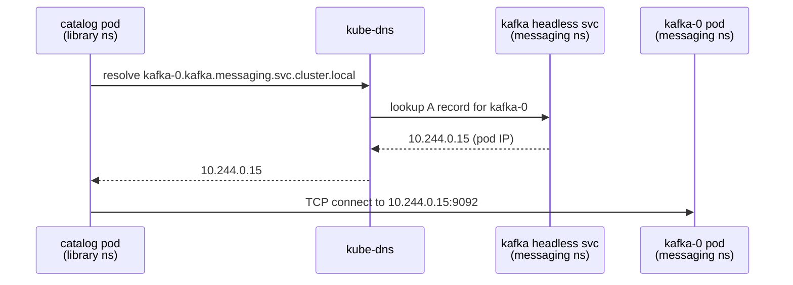

# 12.4 Infrastructure Manifests

Application services — `auth`, `catalog`, `reservation`, `search`, `gateway` — are stateless. Every pod is interchangeable. Kubernetes can kill one, schedule a replacement on a different node, and nothing is lost because state lives elsewhere. That is what makes Deployments work: all replicas are equivalent, any pod can be discarded.

Infrastructure is different. PostgreSQL stores your data on disk. Kafka stores committed log segments on disk. Meilisearch builds its search index on disk. When a pod restarts, that data must still be there. Kubernetes has a dedicated resource for exactly this: the **StatefulSet**.

---

## StatefulSet vs Deployment

A Deployment gives pods random names (`postgres-catalog-7b4f9-xk2p`) and no guarantees about order. A StatefulSet gives you four things that Deployments do not[^1]:

**Stable network identity.** Pods get predictable, ordinal names: `postgres-catalog-0`, `postgres-catalog-1`, and so on. The name is permanent — if pod-0 is deleted and rescheduled, it comes back as pod-0 with the same DNS identity. This is critical for stateful systems that embed their own hostname in configuration (Kafka's `KAFKA_ADVERTISED_LISTENERS` is the canonical example).

**Ordered startup and shutdown.** Pod-0 must reach the `Ready` state before pod-1 starts. Pod-1 must terminate before pod-0 during scale-down. This matters for Kafka's KRaft controller election and for any leader/follower replication scheme.

**`volumeClaimTemplates`.** Each pod gets its own dedicated PersistentVolumeClaim. This is not a shared volume — `postgres-catalog-0` and `postgres-catalog-1` each own their own disk. With a Deployment you would have to manage PVCs by hand; with a StatefulSet the template handles it automatically.

**Headless Service.** StatefulSets pair with a headless Service (`clusterIP: None`). Normal Services load-balance across all backing pods and return a single virtual IP. A headless Service performs no load balancing — DNS resolves directly to individual pod IPs. Combined with ordinal naming, this lets you address `postgres-catalog-0.postgres-catalog.data.svc.cluster.local` and know with certainty which pod you are talking to[^2].

---

## PostgreSQL — Catalog Service

The catalog database lives in the `data` namespace. The manifest set is three objects: a headless Service, a StatefulSet, and a ConfigMap. The Secret is assumed to be pre-created (covered in section 12.5).

### Headless Service

```yaml
# k8s/data/postgres-catalog-svc.yaml
apiVersion: v1
kind: Service
metadata:
  name: postgres-catalog
  namespace: data
spec:
  clusterIP: None                   # headless — no load balancing
  selector:
    app: postgres-catalog
  ports:
    - name: postgres
      port: 5432
      targetPort: 5432
```

`clusterIP: None` is the entire definition of a headless Service. With this in place, the DNS name `postgres-catalog.data.svc.cluster.local` resolves to the pod IP directly. Because the StatefulSet will create a pod named `postgres-catalog-0`, that pod is reachable at the full FQDN:

```
postgres-catalog-0.postgres-catalog.data.svc.cluster.local:5432
```

The format is `<pod-name>.<service-name>.<namespace>.svc.cluster.local`[^4]. Your application ConfigMaps will use this address as `DATABASE_URL`.

### ConfigMap

```yaml
# k8s/data/postgres-catalog-cm.yaml
apiVersion: v1
kind: ConfigMap
metadata:
  name: postgres-catalog-config
  namespace: data
data:
  POSTGRES_DB: catalog
  POSTGRES_USER: postgres
```

These two values correspond to the Docker Compose environment variables `POSTGRES_CATALOG_DB` and `POSTGRES_CATALOG_USER`. The password is intentionally absent here — it belongs in a Secret.

### StatefulSet

```yaml
# k8s/data/postgres-catalog-sts.yaml
apiVersion: apps/v1
kind: StatefulSet
metadata:
  name: postgres-catalog
  namespace: data
spec:
  serviceName: postgres-catalog     # must match the headless Service name
  replicas: 1
  selector:
    matchLabels:
      app: postgres-catalog
  template:
    metadata:
      labels:
        app: postgres-catalog
    spec:
      containers:
        - name: postgres
          image: postgres:16-alpine
          ports:
            - containerPort: 5432
          envFrom:
            - configMapRef:
                name: postgres-catalog-config
          env:
            - name: POSTGRES_PASSWORD
              valueFrom:
                secretKeyRef:
                  name: postgres-catalog-secret
                  key: POSTGRES_PASSWORD
          readinessProbe:
            exec:
              command: ["pg_isready", "-U", "postgres"]
            initialDelaySeconds: 5
            periodSeconds: 5
            failureThreshold: 5
          volumeMounts:
            - name: postgres-data
              mountPath: /var/lib/postgresql/data
  volumeClaimTemplates:
    - metadata:
        name: postgres-data
      spec:
        accessModes: ["ReadWriteOnce"]
        resources:
          requests:
            storage: 1Gi
```

Points worth calling out:

- `serviceName: postgres-catalog` links the StatefulSet to the headless Service. Kubernetes uses this to build the per-pod DNS records.
- `envFrom` loads `POSTGRES_DB` and `POSTGRES_USER` from the ConfigMap as environment variables. `env` adds `POSTGRES_PASSWORD` from the Secret — the two mechanisms compose cleanly.
- The readiness probe runs `pg_isready -U postgres` inside the container. This is exactly the same health check used in `docker-compose.yml` (the `pg_isready` call in the `healthcheck.test` array). A pod that fails this probe is removed from Service endpoints, so traffic never routes to an unready database.
- `volumeClaimTemplates` creates a PVC named `postgres-data-postgres-catalog-0` automatically. When the pod restarts, Kubernetes rebinds the same PVC — the data is not lost[^3].

---

## PostgreSQL — Auth and Reservation

The auth and reservation databases follow the same pattern. Only the names and database values differ:

```yaml
# postgres-auth: change these fields throughout the catalog template
metadata.name:        postgres-auth
spec.serviceName:     postgres-auth
selector/labels:      app: postgres-auth
configMapRef.name:    postgres-auth-config
secretKeyRef.name:    postgres-auth-secret

# ConfigMap
POSTGRES_DB: auth
POSTGRES_USER: postgres
```

```yaml
# postgres-reservation: change these fields throughout the catalog template
metadata.name:        postgres-reservation
spec.serviceName:     postgres-reservation
selector/labels:      app: postgres-reservation
configMapRef.name:    postgres-reservation-config
secretKeyRef.name:    postgres-reservation-secret

# ConfigMap
POSTGRES_DB: reservation
POSTGRES_USER: postgres
```

The resulting FQDNs for application ConfigMaps:

```
postgres-auth-0.postgres-auth.data.svc.cluster.local:5432
postgres-reservation-0.postgres-reservation.data.svc.cluster.local:5432
```

---

## Kafka

Kafka lives in the `messaging` namespace. The configuration is more involved because Kafka's advertised listener must resolve correctly from clients in a different namespace.

### The Networking Problem

In Docker Compose, `KAFKA_ADVERTISED_LISTENERS: "PLAINTEXT://kafka:9092"` works because all containers share the `library-net` bridge network and `kafka` resolves via Docker's built-in DNS. In Kubernetes, services in different namespaces cannot use short names. A pod in the `library` namespace resolving `kafka:9092` will fail — that name is not in scope.

The fix is the FQDN. When Kafka starts, it registers its advertised listener address with ZooKeeper (or, in KRaft mode, with the controller quorum). Clients use that address to establish connections. If Kafka advertises `kafka:9092`, a client in `library` cannot reach it. If Kafka advertises the full FQDN `kafka-0.kafka.messaging.svc.cluster.local:9092`, any pod in the cluster can connect regardless of namespace.

### ConfigMap

```yaml
# k8s/messaging/kafka-cm.yaml
apiVersion: v1
kind: ConfigMap
metadata:
  name: kafka-config
  namespace: messaging
data:
  KAFKA_NODE_ID: "1"
  KAFKA_PROCESS_ROLES: "broker,controller"
  KAFKA_LISTENERS: "PLAINTEXT://:9092,CONTROLLER://:9093"
  KAFKA_ADVERTISED_LISTENERS: "PLAINTEXT://kafka-0.kafka.messaging.svc.cluster.local:9092"
  KAFKA_CONTROLLER_QUORUM_VOTERS: "1@kafka-0.kafka.messaging.svc.cluster.local:9093"
  KAFKA_CONTROLLER_LISTENER_NAMES: "CONTROLLER"
  KAFKA_LISTENER_SECURITY_PROTOCOL_MAP: "CONTROLLER:PLAINTEXT,PLAINTEXT:PLAINTEXT"
  KAFKA_AUTO_CREATE_TOPICS_ENABLE: "true"
```

Compare with Docker Compose:

| Variable | Docker Compose | Kubernetes |
|---|---|---|
| `KAFKA_ADVERTISED_LISTENERS` | `PLAINTEXT://kafka:9092` | `PLAINTEXT://kafka-0.kafka.messaging.svc.cluster.local:9092` |
| `KAFKA_CONTROLLER_QUORUM_VOTERS` | `1@kafka:9093` | `1@kafka-0.kafka.messaging.svc.cluster.local:9093` |

Everything else — KRaft mode, `KAFKA_PROCESS_ROLES: "broker,controller"`, no ZooKeeper — is identical. The mode does not change between environments; only the addresses do.

### Headless Service

```yaml
# k8s/messaging/kafka-svc.yaml
apiVersion: v1
kind: Service
metadata:
  name: kafka
  namespace: messaging
spec:
  clusterIP: None
  selector:
    app: kafka
  ports:
    - name: broker
      port: 9092
      targetPort: 9092
    - name: controller
      port: 9093
      targetPort: 9093
```

### StatefulSet

```yaml
# k8s/messaging/kafka-sts.yaml
apiVersion: apps/v1
kind: StatefulSet
metadata:
  name: kafka
  namespace: messaging
spec:
  serviceName: kafka
  replicas: 1
  selector:
    matchLabels:
      app: kafka
  template:
    metadata:
      labels:
        app: kafka
    spec:
      containers:
        - name: kafka
          image: apache/kafka:3.9
          ports:
            - containerPort: 9092
            - containerPort: 9093
          envFrom:
            - configMapRef:
                name: kafka-config
          readinessProbe:
            exec:
              command:
                - /bin/sh
                - -c
                - /opt/kafka/bin/kafka-topics.sh --bootstrap-server localhost:9092 --list
            initialDelaySeconds: 30
            periodSeconds: 10
            failureThreshold: 5
          volumeMounts:
            - name: kafka-data
              mountPath: /var/lib/kafka/data
  volumeClaimTemplates:
    - metadata:
        name: kafka-data
      spec:
        accessModes: ["ReadWriteOnce"]
        resources:
          requests:
            storage: 2Gi
```

The readiness probe mirrors the Docker Compose health check: run `kafka-topics.sh --list` against `localhost:9092`. A 30-second initial delay gives KRaft time to elect a controller before the first probe fires.

---

## Meilisearch

Meilisearch is straightforward compared to Kafka — single instance, HTTP API, simple environment configuration.

### ConfigMap

```yaml
# k8s/data/meilisearch-cm.yaml
apiVersion: v1
kind: ConfigMap
metadata:
  name: meilisearch-config
  namespace: data
data:
  MEILI_ENV: development
  MEILI_NO_ANALYTICS: "true"
```

The master key is a secret, not a ConfigMap value. It will be injected from `meilisearch-secret`.

### StatefulSet

```yaml
# k8s/data/meilisearch-sts.yaml
apiVersion: apps/v1
kind: StatefulSet
metadata:
  name: meilisearch
  namespace: data
spec:
  serviceName: meilisearch
  replicas: 1
  selector:
    matchLabels:
      app: meilisearch
  template:
    metadata:
      labels:
        app: meilisearch
    spec:
      containers:
        - name: meilisearch
          image: getmeili/meilisearch:v1.12
          ports:
            - containerPort: 7700
          envFrom:
            - configMapRef:
                name: meilisearch-config
          env:
            - name: MEILI_MASTER_KEY
              valueFrom:
                secretKeyRef:
                  name: meilisearch-secret
                  key: MEILI_MASTER_KEY
          readinessProbe:
            httpGet:
              path: /health
              port: 7700
            initialDelaySeconds: 5
            periodSeconds: 5
            failureThreshold: 5
          volumeMounts:
            - name: meili-data
              mountPath: /meili_data
  volumeClaimTemplates:
    - metadata:
        name: meili-data
      spec:
        accessModes: ["ReadWriteOnce"]
        resources:
          requests:
            storage: 1Gi
```

The readiness probe is HTTP rather than `exec`. Kubernetes calls `GET /health` on port 7700 directly — no shell wrapper needed. A `200 OK` response signals the pod is ready. This matches the Docker Compose health check (`wget --spider http://localhost:7700/health`), just expressed in Kubernetes-native syntax.

Meilisearch's headless Service follows the same pattern as the others, with port 7700:

```yaml
# k8s/data/meilisearch-svc.yaml
apiVersion: v1
kind: Service
metadata:
  name: meilisearch
  namespace: data
spec:
  clusterIP: None
  selector:
    app: meilisearch
  ports:
    - name: http
      port: 7700
      targetPort: 7700
```

---

## Cross-Namespace Service Discovery

With these manifests deployed, application service ConfigMaps reference infrastructure using FQDNs:

```
postgres-catalog-0.postgres-catalog.data.svc.cluster.local:5432
postgres-auth-0.postgres-auth.data.svc.cluster.local:5432
postgres-reservation-0.postgres-reservation.data.svc.cluster.local:5432
meilisearch-0.meilisearch.data.svc.cluster.local:7700
kafka-0.kafka.messaging.svc.cluster.local:9092
```

This is how DNS resolution works for a pod in the `library` namespace reaching `kafka-0.kafka.messaging.svc.cluster.local`[^4]:



Key point: the headless Service does not proxy traffic. It only provides DNS records. Kubernetes DNS populates an A record per pod in the StatefulSet, using the pod's ordinal name as a subdomain of the service name. When `catalog` connects to `kafka-0.kafka.messaging.svc.cluster.local`, it is connecting directly to the Kafka pod IP — there is no intermediate load balancer.

---

## Kustomization Files

Each namespace has a `kustomization.yaml` that lists its resources, making `kubectl apply -k` work against the directory.

```yaml
# k8s/data/kustomization.yaml
apiVersion: kustomize.config.k8s.io/v1beta1
kind: Kustomization
namespace: data
resources:
  - postgres-catalog-svc.yaml
  - postgres-catalog-cm.yaml
  - postgres-catalog-sts.yaml
  - postgres-auth-svc.yaml
  - postgres-auth-cm.yaml
  - postgres-auth-sts.yaml
  - postgres-reservation-svc.yaml
  - postgres-reservation-cm.yaml
  - postgres-reservation-sts.yaml
  - meilisearch-svc.yaml
  - meilisearch-cm.yaml
  - meilisearch-sts.yaml
```

```yaml
# k8s/messaging/kustomization.yaml
apiVersion: kustomize.config.k8s.io/v1beta1
kind: Kustomization
namespace: messaging
resources:
  - kafka-svc.yaml
  - kafka-cm.yaml
  - kafka-sts.yaml
```

Apply the full `data` namespace:

```bash
kubectl apply -k k8s/data/
```

Apply just messaging:

```bash
kubectl apply -k k8s/messaging/
```

Kustomize processes all listed resources as a single apply operation — namespace, ConfigMaps, Services, and StatefulSets are applied together. Ordering within the apply is handled by the Kubernetes API server, which creates namespaced resources after the namespace object exists.

---

## Summary

| Resource | Purpose |
|---|---|
| StatefulSet | Manages stateful pods with stable identity and ordered lifecycle |
| Headless Service (`clusterIP: None`) | Provides per-pod DNS records without load balancing |
| `volumeClaimTemplates` | Provisions a dedicated PVC per pod automatically |
| FQDN in advertised listeners | Enables cross-namespace connectivity from `library` to `messaging` |
| ConfigMap | Non-secret environment configuration |
| Secret reference | Injects passwords and keys without embedding them in manifests |

The next section introduces Kustomize environments — including the overlay that generates these Secrets for local development without committing credentials to the repository.

---

[^1]: StatefulSets: https://kubernetes.io/docs/concepts/workloads/controllers/statefulset/
[^2]: Headless Services: https://kubernetes.io/docs/concepts/services-networking/service/#headless-services
[^3]: Persistent Volumes: https://kubernetes.io/docs/concepts/storage/persistent-volumes/
[^4]: DNS for Services and Pods: https://kubernetes.io/docs/concepts/services-networking/dns-pod-service/
