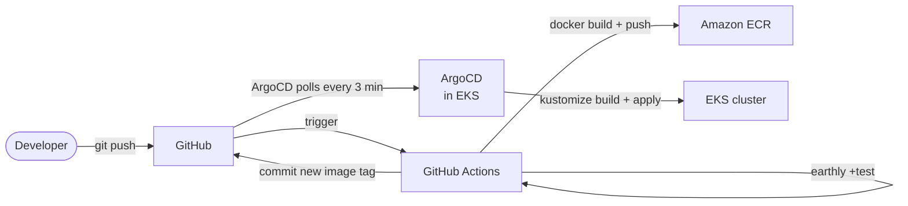

# 13.10 — GitOps with ArgoCD

Section 13.8 built a deployment pipeline where GitHub Actions calls `kubectl apply`. When tests pass, the pipeline renders the production Kustomize overlay and pushes the result to EKS. This works, and for a single team with a single environment it is reasonable. But it encodes a directional assumption: the CI system holds the cluster's desired state and pushes it outward on demand.

GitOps inverts that relationship. The cluster watches its own desired state in Git and pulls it in continuously. There is no push step. The CI pipeline's job ends at "commit the new image tag to the repository." From that moment, a controller running inside the cluster detects the change and reconciles. This section explains that model, introduces ArgoCD as the most widely adopted implementation, and maps out exactly how it would replace the pipeline you built in section 13.8 — without touching a line of application code.

This section is a discussion, not an implementation. ArgoCD is not added to the project here. The goal is to give you enough context to evaluate it against the simpler approach you already have and to know what adopting it later would require.

---

## What GitOps means

The term was coined by Weaveworks in 2017 to describe a practice they had developed internally. The definition has four principles, each worth unpacking:

**Git is the single source of truth.** Every change to the system — configuration, image tags, replica counts, secrets references — is expressed as a commit. The cluster's running state should always be derivable from the repository. If it is not, something has drifted.

**Desired state is declarative.** You describe what you want, not how to achieve it. This is already true of Kubernetes manifests, which is why Kubernetes and GitOps fit together so naturally. The Kustomize overlays you wrote in Chapter 12 and extended in section 13.7 are already in the right shape.

**Approved changes are applied automatically.** A merge to the production branch is sufficient authorization to deploy. There is no separate "run the pipeline" step. The controller watches the branch and acts.

**Software agents reconcile continuously.** The controller does not run once and stop. It runs a reconciliation loop on a short interval — typically every few minutes — comparing the live cluster state against the Git state. If they diverge for any reason (a pod restarted with a different image, someone ran `kubectl edit` directly), the controller corrects the drift.

The last point is what makes GitOps operationally distinct from CI/CD push pipelines: **drift correction is automatic and ongoing**, not a one-time action triggered by a commit.

---

## ArgoCD overview

ArgoCD is an open-source GitOps controller for Kubernetes, originally developed at Intuit and now a CNCF graduated project. It runs as a set of Deployments in your cluster, watches Git repositories, and applies Kubernetes manifests when the repository changes.

Its core data model is built on two Custom Resource Definitions.

**Application** maps a source (a Git repository path, a branch or tag, and a directory within the repo) to a destination (a Kubernetes cluster and namespace). An Application manifest looks like this:

```yaml
apiVersion: argoproj.io/v1alpha1
kind: Application
metadata:
  name: library-production
  namespace: argocd
spec:
  project: library
  source:
    repoURL: https://github.com/your-org/go-journey
    targetRevision: main
    path: k8s/overlays/production
  destination:
    server: https://kubernetes.default.svc
    namespace: library
  syncPolicy:
    automated:
      prune: true
      selfHeal: true
```

`path: k8s/overlays/production` is the Kustomize overlay directory you already have. ArgoCD detects Kustomize overlays automatically and runs `kustomize build` before applying. There is no ArgoCD-specific configuration inside the overlay itself.

`syncPolicy.automated.selfHeal: true` enables drift correction — if someone applies a manual change to the cluster, ArgoCD reverts it on the next reconciliation cycle.

`syncPolicy.automated.prune: true` means resources that exist in the cluster but have been removed from Git are deleted. Without this, stale resources accumulate silently.

**AppProject** groups one or more Application resources and defines the boundaries they are allowed to operate within: which source repositories are permitted, which destination namespaces are allowed, and which Kubernetes resource types can be managed. For a single-team project, a single AppProject covering all namespaces is sufficient. For a multi-team platform, AppProjects enforce that team A cannot accidentally modify team B's namespace.

Beyond the CRDs, ArgoCD ships a web UI that is genuinely useful in day-to-day operations. It visualizes the full resource tree for each Application — Deployments, ReplicaSets, Pods, Services, ConfigMaps — and shows their sync status, health, and any error messages. A diff view shows exactly what ArgoCD would change before it applies. Rollback to any previous Git revision is a single click. The UI also surfaces Kubernetes events, making it a reasonable first stop for diagnosing why a rollout is stuck without needing to reach for `kubectl describe` directly.

ArgoCD is not the only GitOps controller worth knowing. **Flux** (also a CNCF graduated project) takes a more modular, CLI-first approach: it decomposes into separate controllers for source tracking, Kustomize reconciliation, Helm releases, and image automation. The two tools are functionally comparable for the use case described here. ArgoCD is more commonly encountered in teams that prioritize the web UI and a single-binary install experience; Flux is more common in teams that prefer composability and GitOps-as-code with no UI dependency. The choice between them is largely organizational preference. Everything in this discussion applies equally to a Flux-based setup.

---

## How ArgoCD would replace section 13.8

With the `kubectl apply` pipeline, the flow is:

```
Developer → git push → CI tests → CI builds image → CI pushes to ECR → CI runs kubectl apply
```

With ArgoCD, the flow becomes:



The CI pipeline's deployment step changes from `kubectl apply` to a Git commit. Instead of applying the rendered Kustomize overlay directly, the pipeline updates the image tag in the production overlay — for example, by writing a new value to `k8s/overlays/production/image-tags.yaml` — and commits it to the repository. ArgoCD polls the repository on a configurable interval (the default is three minutes; webhooks can reduce this to near-instant) and applies the change when it detects the commit.

The CI pipeline's job boundaries change significantly. Previously, a successful pipeline both validated the code and mutated the cluster. With ArgoCD, those two responsibilities are separated: CI validates and publishes artifacts; ArgoCD is solely responsible for cluster mutations. This separation of concerns is easier to reason about and easier to audit.

The pipeline no longer needs OIDC permission to call `kubectl` against EKS. Its only AWS interaction is pushing the image to ECR. The `kubectl apply` step and the EKS OIDC configuration from section 13.8 are removed. ArgoCD, running inside the cluster, has the necessary permissions by virtue of its service account — no external credentials are involved.

This is a meaningful security reduction. The CI system goes from "can modify any resource in the cluster" to "can write to a Git repository." The blast radius of a compromised CI token shrinks considerably.

---

## The image tag commit pattern

One detail the architecture diagram glosses over is the mechanics of the CI pipeline committing a new image tag. This step has a specific convention worth understanding.

When the CI pipeline builds and pushes a new image to ECR, the new image tag (typically the Git commit SHA) exists in ECR but is not yet referenced by any Kustomize overlay. The pipeline must update the image tag in the repository so that ArgoCD picks it up. A minimal GitHub Actions step looks like this:

```yaml
- name: Update image tag in overlay
  run: |
    cd k8s/overlays/production
    kustomize edit set image \
      catalog=123456789012.dkr.ecr.us-east-1.amazonaws.com/library/catalog:${{ github.sha }}
    git config user.name "github-actions[bot]"
    git config user.email "github-actions[bot]@users.noreply.github.com"
    git commit -am "chore: update catalog image to ${{ github.sha }}"
    git push
```

`kustomize edit set image` writes the new image reference into the overlay's `kustomization.yaml` file without modifying the base manifests. The pipeline then commits that change to the repository. ArgoCD detects the commit on its next poll cycle and syncs.

A practical consideration: the pipeline is committing back to the same branch it was triggered by. This can cause infinite loop risks if not handled carefully — the commit by the bot user should either target a different branch than the trigger branch, or configure the pipeline to skip runs triggered by the bot user's commits. Teams typically handle this by using a dedicated `config` or `gitops` branch that only CI writes to, while humans work on `main`.

ArgoCD also has an optional companion component called **ArgoCD Image Updater** that automates this step: it watches ECR for new image tags matching a pattern and commits the update to Git automatically, without any CI involvement. For the library system's simple use case, the inline CI step above is sufficient and more transparent.

---

## Advantages over direct kubectl apply

**Drift detection and correction.** The most operationally significant difference. If a team member runs `kubectl set image deployment/catalog catalog=wrong-image:latest` directly against production — intentionally as a hotfix, or accidentally — ArgoCD reverts it on the next sync cycle. The cluster converges back to what Git says within minutes. With a push pipeline, that drift persists until the next deployment.

**Audit trail through Git history.** Every change to the cluster's state is a Git commit with an author, a timestamp, and a message. `git log k8s/overlays/production/` is your deployment history. `git show <sha>` shows exactly what changed. There is no separate deployment log to maintain, no CI job history to correlate. This matters for compliance and incident investigation.

**Multi-environment management.** ArgoCD can watch multiple overlay directories simultaneously. Pointing one Application at `k8s/overlays/staging` and another at `k8s/overlays/production` gives you independent sync status and health views for each environment, in a single UI. Promoting a change from staging to production is a Git merge, not a pipeline parameterization.

**Rollback via git revert.** Rolling back with `kubectl apply` requires knowing which image tag was running before and re-running the pipeline with that tag. Rolling back with ArgoCD is a `git revert` (or a click in the UI that performs the revert for you). The cluster is back to the previous state within minutes, and the revert is itself a commit — so the audit trail includes it.

**No outbound cluster credentials in CI.** As noted above, removing the `kubectl apply` step from CI eliminates the need to distribute cluster access credentials to the CI system. This is a meaningful reduction in the attack surface of the deployment pipeline.

---

## Disadvantages and costs

**An additional component to install and maintain.** ArgoCD is non-trivial — its full installation includes a dozen or more Kubernetes resources, a Redis instance, and several controllers. It needs to be upgraded as Kubernetes versions advance. Its own availability becomes part of your operational picture: if ArgoCD is down, deployments stall.

**Learning curve.** The CRD model, sync policies, resource health checks, and SSO integration (ArgoCD has its own authentication layer, often integrated with Dex or an external OIDC provider) all take time to learn. For a team already comfortable with the `kubectl apply` pipeline, the transition requires re-learning a workflow.

**The chicken-and-egg problem.** ArgoCD cannot install itself the first time. Something has to install ArgoCD into the cluster before it can manage anything. In practice this means keeping a small bootstrap script or Terraform module that runs once to install ArgoCD, after which ArgoCD can manage its own configuration and everything else. This is solvable, but it is a layer of bootstrapping complexity that does not exist with a pure `kubectl apply` approach.

**Sync feedback in CI.** With `kubectl apply` in CI, the pipeline waits for the apply to complete and can fail the job if it does not. With ArgoCD, the CI pipeline commits an image tag and exits successfully — it does not wait for the sync to finish. Monitoring whether the deployment actually succeeded requires polling ArgoCD's API or using its CLI (`argocd app wait`) in a separate job. Getting "did the deploy succeed?" feedback back into the CI pipeline requires additional wiring.

**Overkill for a single team and environment.** For a single developer or a two-person team with one production environment and no compliance requirements, the operational overhead of ArgoCD is not justified by its benefits. The direct pipeline is simpler to understand, simpler to debug, and simpler to change. Complexity should be introduced in response to problems that exist, not in anticipation of problems that might exist.

---

## When to adopt GitOps

The signal that a push pipeline is no longer sufficient usually comes from one of a few directions.

**Team size crosses a threshold.** When more than two or three engineers are deploying independently, the probability of conflicting or untracked manual changes increases. Drift detection becomes genuinely valuable because you can no longer rely on everyone knowing what was applied and when.

**Multiple environments become the norm.** A staging environment, a feature environment, a production environment — each with its own configuration — is where Kustomize overlays shine most, and it is also where ArgoCD's multi-Application model pays back its complexity. Managing three environments through a parameterized CI pipeline gets unwieldy. Pointing three ArgoCD Applications at three overlay directories is straightforward.

**Compliance or audit requirements appear.** Some regulatory frameworks require an immutable audit trail of every production change and the ability to demonstrate that the running system matches a declared desired state. A Git history of Kubernetes overlays satisfies both requirements in a way that CI pipeline logs do not.

**Manual changes are causing incidents.** If postmortems keep revealing that someone edited a ConfigMap directly or changed a replica count and forgot to update the manifest, drift detection is the right tool. When the same class of problem appears twice, it is worth the overhead of preventing it structurally.

---

## The foundation is already in place

ArgoCD is not implemented in this project, and you should not feel compelled to add it. The pipeline in section 13.8 is sufficient for the learning context here, it is easier to follow step by step, and it avoids introducing a new system in a late chapter.

What matters is that the groundwork for adopting ArgoCD later requires almost nothing new. The Kustomize overlay structure — `k8s/base/`, `k8s/overlays/staging/`, `k8s/overlays/production/` — is precisely the directory layout that ArgoCD expects as input. There are no ArgoCD-specific files inside an overlay; it reads standard Kustomize output.

Adopting ArgoCD when the project grows to where it makes sense is a three-step process: install ArgoCD into the cluster (typically via its Helm chart or the official install manifest), create an Application CRD pointing at `k8s/overlays/production`, and remove the `kubectl apply` step from the GitHub Actions pipeline. The application services, manifests, overlays, CI test stages, and ECR push steps all remain unchanged.

The investment you have made in clean declarative manifests and well-structured Kustomize layers is not specific to any deployment model. It transfers to ArgoCD, Flux, or any other GitOps tool with no rework. When the team grows, or the environments multiply, or the first drift-caused incident happens, the migration path is clear.

---

[^1]: ArgoCD Documentation: https://argo-cd.readthedocs.io/en/stable/
[^2]: CNCF GitOps Principles: https://opengitops.dev/
[^3]: Weaveworks — "GitOps — Operations by Pull Request": https://www.weave.works/blog/gitops-operations-by-pull-request
[^4]: ArgoCD Application CRD Reference: https://argo-cd.readthedocs.io/en/stable/operator-manual/application.yaml
[^5]: ArgoCD AppProject CRD Reference: https://argo-cd.readthedocs.io/en/stable/operator-manual/appproject.yaml
