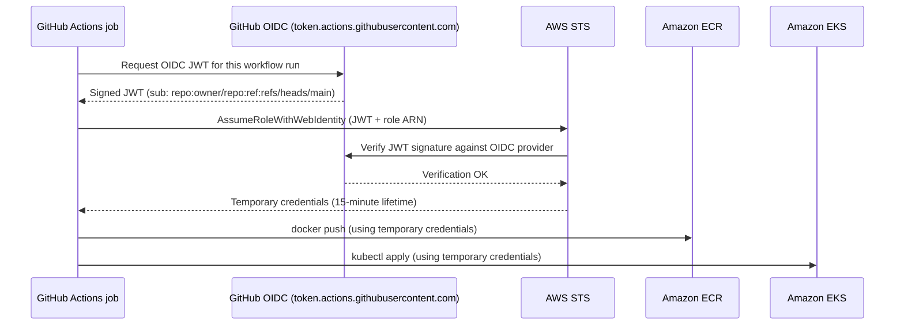

# 13.8 CI/CD Pipeline

Chapter 10 built a CI/CD pipeline that runs tests with Earthly and pushes container images to GitHub Container Registry (GHCR) on every push to `main`. That was the right scope for a pipeline with no cloud target: build it, verify it, store it. Now there is a cloud target. Every section of this chapter has added infrastructure—an EKS cluster, ECR repositories, an RDS database per service, an MSK broker—and none of it is doing anything useful until a deployment pipeline closes the loop. This section builds that pipeline.

The end state: a push to `main` runs the existing CI job, builds and pushes images to both GHCR and ECR, and then deploys to the EKS cluster by applying the production Kustomize overlay. No long-lived AWS credentials are stored in GitHub. A failed rollout fails the job so you can investigate. The entire process is auditable in the GitHub Actions log.

The central challenge is authentication. The pipeline needs permission to push to ECR and to call the Kubernetes API. The naive approach—create an IAM user, generate an access key, and store it as a GitHub secret—works, but it carries serious risk: long-lived credentials that never expire, credentials that must be rotated manually, and credentials that are one leaked secret away from full account access. The production answer is OIDC federation.

---

## OIDC federation: how it works

OpenID Connect (OIDC) is an identity layer built on OAuth 2.0. GitHub Actions has been an OIDC identity provider since 2021. Every job execution gets a short-lived JSON Web Token (JWT) signed by GitHub's private key. That token contains claims about the workflow: the repository, the branch, the actor, the event. AWS can be configured to trust tokens from GitHub's OIDC provider and exchange them for temporary IAM credentials.

The exchange works like this:



The critical detail is the `sub` claim. GitHub sets it to a string that encodes the repository and the ref that triggered the workflow: `repo:owner/repo:ref:refs/heads/main`. The IAM trust policy uses this claim as a condition. A token minted for a pull request from a fork has a different `sub`—it cannot assume the deployment role. You get branch-scoped permissions with no extra work.

The credentials STS returns are temporary—they expire in 15 minutes by default. If the token is leaked, the narrow exploitation window limits what an attacker can do. There is nothing to rotate. There is nothing stored in GitHub secrets that grants AWS access. This is the correct model for any pipeline interacting with a cloud provider.

---

## Terraform: wiring up the OIDC provider

Before the pipeline can use OIDC, you need to register GitHub's OIDC provider with your AWS account and create an IAM role with a trust policy scoped to your repository. This lives in `terraform/cicd.tf`.

```hcl
# terraform/cicd.tf

# Fetch the OIDC thumbprint from GitHub's well-known endpoint.
# Terraform retrieves this automatically; you do not hardcode it.
data "tls_certificate" "github_actions" {
  url = "https://token.actions.githubusercontent.com/.well-known/openid-configuration"
}

# Register GitHub Actions as a trusted OIDC identity provider in this account.
# This is a one-time, account-level resource. If your account already has it,
# import it rather than recreating:
#   terraform import aws_iam_openid_connect_provider.github_actions <arn>
resource "aws_iam_openid_connect_provider" "github_actions" {
  url             = "https://token.actions.githubusercontent.com"
  client_id_list  = ["sts.amazonaws.com"]
  thumbprint_list = [data.tls_certificate.github_actions.certificates[0].sha1_fingerprint]
}

# The IAM role that GitHub Actions will assume. The trust policy restricts
# which tokens can assume this role using the `sub` claim condition.
resource "aws_iam_role" "github_actions_deploy" {
  name = "github-actions-deploy"

  assume_role_policy = jsonencode({
    Version = "2012-10-17"
    Statement = [
      {
        Effect    = "Allow"
        Principal = { Federated = aws_iam_openid_connect_provider.github_actions.arn }
        Action    = "sts:AssumeRoleWithWebIdentity"
        Condition = {
          StringEquals = {
            # Scope to your repository's main branch only.
            # Replace owner/repo with your actual GitHub repository slug.
            "token.actions.githubusercontent.com:sub" = "repo:owner/repo:ref:refs/heads/main"
            "token.actions.githubusercontent.com:aud" = "sts.amazonaws.com"
          }
        }
      }
    ]
  })
}

# Inline policy granting the permissions the pipeline needs.
resource "aws_iam_role_policy" "github_actions_deploy" {
  name = "github-actions-deploy-policy"
  role = aws_iam_role.github_actions_deploy.id

  policy = jsonencode({
    Version = "2012-10-17"
    Statement = [
      # ECR: authenticate and push images to any repository in this account.
      {
        Sid    = "ECRPush"
        Effect = "Allow"
        Action = [
          "ecr:GetAuthorizationToken",
          "ecr:BatchCheckLayerAvailability",
          "ecr:InitiateLayerUpload",
          "ecr:UploadLayerPart",
          "ecr:CompleteLayerUpload",
          "ecr:PutImage",
          "ecr:BatchGetImage",
          "ecr:GetDownloadUrlForLayer",
        ]
        Resource = "*"
      },
      # EKS: describe the cluster so aws-actions/configure-aws-credentials
      # can generate a kubeconfig token. The actual Kubernetes permissions
      # are granted through the EKS access entry below, not IAM.
      {
        Sid      = "EKSDescribe"
        Effect   = "Allow"
        Action   = ["eks:DescribeCluster"]
        Resource = module.eks.cluster_arn
      },
    ]
  })
}

# Grant the IAM role access to the EKS cluster Kubernetes API.
# EKS access entries replace the legacy aws-auth ConfigMap approach.
# See: https://docs.aws.amazon.com/eks/latest/userguide/access-entries.html
resource "aws_eks_access_entry" "github_actions" {
  cluster_name  = module.eks.cluster_name
  principal_arn = aws_iam_role.github_actions_deploy.arn
  type          = "STANDARD"
}

# Associate a Kubernetes RBAC policy. AmazonEKSEditPolicy grants create,
# update, delete, and patch on workloads — enough to apply Kustomize overlays
# and check rollout status, but not enough to modify cluster-scoped resources
# like Nodes or ClusterRoles.
resource "aws_eks_access_policy_association" "github_actions" {
  cluster_name  = module.eks.cluster_name
  principal_arn = aws_iam_role.github_actions_deploy.arn
  policy_arn    = "arn:aws:eks::aws:cluster-access-policy/AmazonEKSEditPolicy"

  access_scope {
    type       = "namespace"
    namespaces = ["library", "data"]
  }
}

# Output the role ARN so you can reference it in the workflow without hardcoding.
output "github_actions_role_arn" {
  value       = aws_iam_role.github_actions_deploy.arn
  description = "IAM role ARN for GitHub Actions OIDC deployment"
}
```

The `ECRPush` statement uses `Resource = "*"` because `ecr:GetAuthorizationToken` is an account-level action—it cannot be scoped to a specific repository. The other ECR actions can be scoped, but since all repositories in this account belong to this project, the broad scope is acceptable. In a shared account, replace `"*"` with specific repository ARNs.

The `aws_eks_access_entry` approach is the modern replacement for editing the `aws-auth` ConfigMap manually. The ConfigMap approach required the cluster creator to have a special bootstrap IAM identity, had no Terraform resource prior to 2023, and was a frequent source of hard-to-debug lockouts. Access entries manage Kubernetes RBAC through the AWS API and are fully idempotent.

After applying this Terraform:

```
cd terraform
terraform apply -target=aws_iam_openid_connect_provider.github_actions \
                -target=aws_iam_role.github_actions_deploy \
                -target=aws_eks_access_entry.github_actions \
                -target=aws_eks_access_policy_association.github_actions

terraform output github_actions_role_arn
# arn:aws:iam::123456789012:role/github-actions-deploy
```

Copy the role ARN. You will store it as a GitHub Actions variable (not a secret—it contains no credentials) named `AWS_DEPLOY_ROLE_ARN`. Store your AWS region as `AWS_REGION` and your ECR registry URI as `ECR_REGISTRY`.

---

## Updated workflow: main.yml

The updated workflow preserves the existing `ci` and `build-and-push` jobs unchanged and adds a `deploy` job that runs after a successful build. The image promotion strategy is deliberate: the `build-and-push` job already built and pushed to GHCR. Rather than rebuilding, the deploy job pulls from GHCR and re-tags for ECR. This avoids double-building, ensures ECR contains exactly the same layer digests as GHCR, and keeps the ECR push atomic with the deployment.

```yaml
# .github/workflows/main.yml
name: CI/CD
on:
  push:
    branches: [main]

permissions:
  contents: read
  packages: write
  id-token: write  # Required for OIDC token generation

jobs:
  ci:
    runs-on: ubuntu-latest
    steps:
      - uses: actions/checkout@v4
      - name: Install Earthly
        uses: earthly/actions-setup@v1
        with:
          version: v0.8.15
      - name: Run CI
        run: earthly +ci

  build-and-push:
    needs: ci
    runs-on: ubuntu-latest
    strategy:
      matrix:
        service: [auth, catalog, gateway, reservation, search]
    steps:
      - uses: actions/checkout@v4
      - uses: docker/login-action@v3
        with:
          registry: ghcr.io
          username: ${{ github.actor }}
          password: ${{ secrets.GITHUB_TOKEN }}
      - uses: docker/build-push-action@v6
        with:
          context: .
          file: services/${{ matrix.service }}/Dockerfile
          push: true
          tags: |
            ghcr.io/${{ github.repository }}/${{ matrix.service }}:sha-${{ github.sha }}
            ghcr.io/${{ github.repository }}/${{ matrix.service }}:latest

  deploy:
    needs: build-and-push
    runs-on: ubuntu-latest
    environment: production  # Requires manual approval if configured
    env:
      AWS_REGION: ${{ vars.AWS_REGION }}
      ECR_REGISTRY: ${{ vars.ECR_REGISTRY }}
      IMAGE_TAG: sha-${{ github.sha }}
    steps:
      - uses: actions/checkout@v4

      # Exchange the GitHub OIDC JWT for temporary AWS credentials.
      # No long-lived secrets are stored anywhere.
      - name: Configure AWS credentials (OIDC)
        uses: aws-actions/configure-aws-credentials@v4
        with:
          role-to-assume: ${{ vars.AWS_DEPLOY_ROLE_ARN }}
          aws-region: ${{ env.AWS_REGION }}
          role-session-name: github-actions-deploy-${{ github.run_id }}

      # Authenticate Docker to ECR. The login token is valid for 12 hours,
      # which is well beyond the maximum workflow duration.
      - name: Log in to Amazon ECR
        uses: aws-actions/amazon-ecr-login@v2

      # Log in to GHCR so we can pull the images built in the previous job.
      - uses: docker/login-action@v3
        with:
          registry: ghcr.io
          username: ${{ github.actor }}
          password: ${{ secrets.GITHUB_TOKEN }}

      # Pull each image from GHCR and push to ECR under the same tag.
      # Re-tagging reuses already-pulled layers — no rebuild, no re-download
      # of the full image if it is already in the runner's layer cache.
      - name: Promote images to ECR
        run: |
          SERVICES=(auth catalog gateway reservation search)
          for SERVICE in "${SERVICES[@]}"; do
            GHCR_IMAGE="ghcr.io/${{ github.repository }}/${SERVICE}:${IMAGE_TAG}"
            ECR_IMAGE="${ECR_REGISTRY}/library/${SERVICE}:${IMAGE_TAG}"

            docker pull "${GHCR_IMAGE}"
            docker tag  "${GHCR_IMAGE}" "${ECR_IMAGE}"
            docker push "${ECR_IMAGE}"

            echo "Promoted ${SERVICE}: ${ECR_IMAGE}"
          done

      # Install kustomize. The version is pinned to avoid surprises.
      - name: Install kustomize
        uses: imranismail/setup-kustomize@v2
        with:
          kustomize-version: "5.3.0"

      # Update kubeconfig to point at the EKS cluster. The credentials are
      # already in the environment from the configure-aws-credentials step.
      - name: Update kubeconfig for EKS
        run: |
          aws eks update-kubeconfig \
            --region "${AWS_REGION}" \
            --name library-system

      # Patch the production overlay to use the exact image tags from this commit.
      # kustomize edit set image rewrites the image field in the overlay's
      # kustomization.yaml. The file change lives only in the runner's working
      # copy for this deployment — it is not committed back to git.
      - name: Set image tags in production overlay
        working-directory: deploy/k8s/overlays/production
        run: |
          SERVICES=(auth catalog gateway reservation search)
          for SERVICE in "${SERVICES[@]}"; do
            kustomize edit set image \
              "library/${SERVICE}=${ECR_REGISTRY}/library/${SERVICE}:${IMAGE_TAG}"
          done

      # Apply the production overlay. kubectl apply -k is equivalent to
      # running kustomize build | kubectl apply -f - but in a single command.
      - name: Deploy to EKS
        run: |
          kubectl apply -k deploy/k8s/overlays/production

      # Wait for each Deployment to finish rolling out before marking the
      # job successful. The timeout is generous; adjust based on observed
      # startup times in your environment.
      - name: Verify rollouts
        run: |
          SERVICES=(auth catalog gateway reservation search)
          for SERVICE in "${SERVICES[@]}"; do
            echo "Waiting for ${SERVICE}..."
            kubectl rollout status deployment/"${SERVICE}" \
              --namespace library \
              --timeout=300s
          done
          echo "All services rolled out successfully."
```

The `environment: production` declaration integrates with GitHub's Environments feature. If you configure the `production` environment to require a manual approval, every push to `main` pauses at the deploy step until a designated reviewer approves it. This is useful for projects where you want automated builds but gated deployments. If you want fully automated deploys, remove the line.

The `role-session-name` field in the OIDC step is optional but recommended. Including the `run_id` makes it trivial to correlate a set of AWS API calls—visible in CloudTrail—with the specific workflow run that made them.

---

## Optional: Terraform plan on pull requests

A common extension is running `terraform plan` on pull requests so reviewers can see infrastructure changes alongside code changes. The full PR workflow is out of scope here—it requires configuring OIDC trust for pull request events, which introduces complexity around scoping permissions appropriately for untrusted contributor branches—but the skeleton is worth showing.

```yaml
# .github/workflows/pr.yml
# Uncomment and complete this workflow once you have configured
# OIDC trust for pull_request events. Use a separate role with read-only
# permissions — never the deploy role — so that a contributor cannot craft
# a PR that uses CI credentials to modify infrastructure.

# name: Pull Request Checks
# on:
#   pull_request:
#     branches: [main]
#
# permissions:
#   contents: read
#   id-token: write
#   pull-requests: write  # Required to post plan output as a PR comment
#
# jobs:
#   terraform-plan:
#     runs-on: ubuntu-latest
#     steps:
#       - uses: actions/checkout@v4
#
#       - name: Configure AWS credentials (OIDC)
#         uses: aws-actions/configure-aws-credentials@v4
#         with:
#           role-to-assume: ${{ vars.AWS_ROLE_ARN_READONLY }}
#           aws-region: ${{ vars.AWS_REGION }}
#
#       - uses: hashicorp/setup-terraform@v3
#         with:
#           terraform_version: "1.5.x"
#
#       - name: Terraform init
#         working-directory: terraform
#         run: terraform init
#
#       - name: Terraform plan
#         working-directory: terraform
#         run: terraform plan -no-color -out=tfplan 2>&1 | tee plan.txt
#
#       - name: Post plan to PR
#         uses: actions/github-script@v7
#         with:
#           script: |
#             const fs = require('fs');
#             const plan = fs.readFileSync('terraform/plan.txt', 'utf8');
#             github.rest.issues.createComment({
#               ...context.repo,
#               issue_number: context.issue.number,
#               body: '```hcl\n' + plan.slice(0, 60000) + '\n```',
#             });
```

The key design consideration is the separate `AWS_ROLE_ARN_READONLY` variable. Its IAM trust policy would accept `pull_request` event tokens, and its permissions would be limited to reading Terraform state from S3 and describing existing resources. Giving PR workflows the same role as the deploy workflow means a contributor could open a PR with a modified workflow file and use it to exfiltrate credentials or apply unauthorized infrastructure changes.

---

## Rollback

`kubectl rollout undo` reverts a Deployment to its previous ReplicaSet. Kubernetes retains the last ten ReplicaSets by default (configurable via `revisionHistoryLimit` in the Deployment spec), so rollback does not require re-pushing an image.

```bash
# Roll back a single service to its previous version
kubectl rollout undo deployment/catalog --namespace library

# Verify the rollback completed
kubectl rollout status deployment/catalog --namespace library

# See rollout history for a deployment (shows revision numbers)
kubectl rollout history deployment/catalog --namespace library

# Roll back to a specific revision
kubectl rollout undo deployment/catalog --namespace library --to-revision=3
```

The rollback reverts the pod spec—the image reference, environment variables, resource limits—to whatever was in the previous ReplicaSet. It does not touch the Kustomize overlay files in git. If you roll back via `kubectl rollout undo`, the overlay in git and the live cluster are now out of sync. The next push to `main` will re-apply the overlay and re-advance to the current image tag, overwriting the rollback. For a quick recovery from a bad deploy this is acceptable. For a longer-lived rollback, commit a change to the production overlay that pins to the last known good image tag and let the pipeline apply it.

ECR retains every image tag you push unless you configure a lifecycle policy to expire old tags. The image that was running before a bad deploy is always available for re-deployment. The tag is `sha-<previous-commit-sha>`, which you can retrieve from the GitHub Actions log for any successful deploy job.

```bash
# Check which image is currently running
kubectl get deployment catalog -n library \
  -o jsonpath='{.spec.template.spec.containers[0].image}'

# Force a deployment to a specific previous image
# (bypasses the pipeline; use for emergency recovery only)
kubectl set image deployment/catalog \
  catalog=123456789012.dkr.ecr.us-east-1.amazonaws.com/library/catalog:sha-abc1234 \
  --namespace library
```

For production systems where rollback is a planned procedure rather than an emergency, the safer model is to treat every deployment as a git operation: create a commit that explicitly changes the image tag in the production overlay, push to `main`, and let the pipeline apply it. This preserves a complete audit trail of what was running when.

---

With the deploy job in place, every push to `main` now follows a fully automated path: tests pass, images are built and stored in both GHCR and ECR, and the production cluster converges to the new state. The entire process is observable—GitHub Actions logs show each step, CloudTrail logs show every AWS API call, and `kubectl rollout history` shows every revision the cluster has run. The library system is running in the cloud, deployed by a pipeline that stores no long-lived credentials.

---

[^1]: GitHub Actions OIDC documentation: https://docs.github.com/en/actions/deployment/security-hardening-your-deployments/about-security-hardening-with-openid-connect
[^2]: AWS IAM OIDC identity providers: https://docs.aws.amazon.com/IAM/latest/UserGuide/id_roles_providers_create_oidc.html
[^3]: aws-actions/configure-aws-credentials: https://github.com/aws-actions/configure-aws-credentials
[^4]: EKS access entries: https://docs.aws.amazon.com/eks/latest/userguide/access-entries.html
[^5]: Kubernetes rollout undo: https://kubernetes.io/docs/reference/generated/kubectl/kubectl-commands#rollout
[^6]: Kustomize edit set image: https://kubectl.docs.kubernetes.io/references/kustomize/cmd/edit/set/image/
