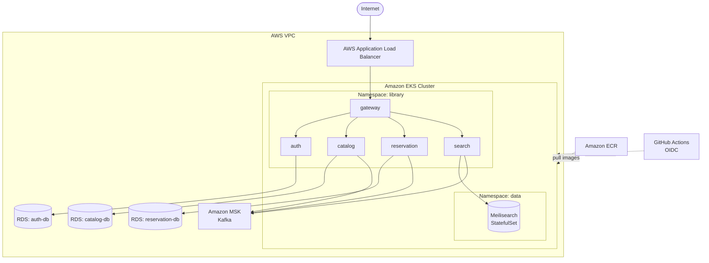

# Chapter 13: From Local to Cloud—Deploying to AWS

Chapter 12 got every service running in a real Kubernetes cluster: probes passing, StatefulSets stable, Ingress routing requests from your laptop to the gateway. kind gave you a full control plane in Docker containers—the right tool for developing and validating manifests without spending a cent. But kind is a development tool. The cluster lives on your machine, behind your home router, inaccessible from the internet. There is no persistent storage that outlives a `kind delete cluster`. There are no managed databases with automatic backups, no Multi-AZ brokers, no autoscaling node pools. If your laptop goes to sleep, the cluster does too.

This chapter takes the same application—the same manifests, the same container images, the same Kustomize base—and deploys it to AWS. The application services run on Amazon EKS. PostgreSQL will move from a StatefulSet to Amazon RDS instances, one per service. Kafka will move from a StatefulSet to Amazon MSK. Images will be stored in Amazon ECR. Deployments will be triggered by GitHub Actions, not `kubectl apply` from a terminal. By the end, you will have a production-grade deployment pipeline that runs on every push to `main`.

---

## Target architecture

The diagram below shows the system's target state after this chapter. The application namespace, the manifest structure, and the service communication patterns are identical to Chapter 12. What changes is the infrastructure surrounding the cluster.



Meilisearch remains a StatefulSet inside EKS—AWS has no managed full-text search offering that matches Meilisearch's API, and its data is re-indexable from PostgreSQL, so the operational simplicity of keeping it in-cluster outweighs the risk. Everything else that held persistent state in Chapter 12 moves to managed services.

The load balancer is an AWS Application Load Balancer provisioned by the AWS Load Balancer Controller—an EKS add-on that watches Ingress resources and creates ALBs automatically. It replaces the NGINX Ingress Controller from Chapter 12. The routing rules in the Ingress manifest stay the same; only the controller annotation changes.

GitHub Actions authenticates to AWS and to EKS using OIDC federation—no long-lived credentials stored as secrets. A push to `main` builds images, pushes them to ECR, and applies the production Kustomize overlay to the EKS cluster.

---

## Mapping local to cloud

Every piece of infrastructure from Chapter 12 has a direct AWS counterpart. The table below is your translation guide for the rest of the chapter.

| Local (kind) | AWS | Purpose |
|---|---|---|
| kind cluster | Amazon EKS | Kubernetes control plane and worker nodes |
| `kind load docker-image` | Amazon ECR | Container image storage and distribution |
| NGINX Ingress Controller | AWS Load Balancer Controller + ALB | External HTTP/S traffic routing |
| PostgreSQL StatefulSets | Amazon RDS (db.t3.micro) | Managed PostgreSQL with automated backups |
| Kafka StatefulSet (KRaft) | Amazon MSK (kafka.t3.small) | Managed Kafka with multi-AZ replication |
| `kubectl apply` from laptop | GitHub Actions + OIDC | Automated, auditable deployment pipeline |
| Kustomize local overlay | Kustomize production overlay | Environment-specific configuration |

The right column is not a wholesale replacement. kind stays in the development workflow. Your local overlay still works. The production overlay is additive—it targets the same base manifests and overrides the values that differ between environments: image registries, resource limits, replica counts, and external service endpoints.

---

## What changes and what stays the same

The Kustomize layering from Chapter 12 is paying its first serious dividend here. The base manifests under `k8s/base/` are untouched. You wrote them once, validated them against a kind cluster, and they are now ready to be promoted to production without modification.

What changes lives entirely in a new Kustomize overlay at `k8s/overlays/production/`. That overlay patches:

- **Image references**—from local names like `library/catalog:latest` to ECR URIs like `123456789012.dkr.ecr.us-east-1.amazonaws.com/library/catalog:abc1234`
- **Database endpoints**—the `DB_HOST` environment variable for each service now points to an RDS endpoint rather than `postgres.data.svc.cluster.local`
- **Kafka bootstrap servers**—the `KAFKA_BROKERS` variable points to MSK broker endpoints rather than `kafka.messaging.svc.cluster.local`
- **Replica counts**—production runs two replicas of each stateless service for availability
- **Resource limits**—CPU and memory bounds tuned for a paid compute environment
- **Ingress annotations**—the `kubernetes.io/ingress.class` annotation changes from `nginx` to `alb`, and ALB-specific annotations are added for certificate ARN, scheme, and target type

The application services themselves do not know or care whether they are talking to a Kubernetes StatefulSet or a managed cloud service. They connect to a hostname and a port. That hostname is what the overlay changes. This is the practical value of externalizing configuration: the same binary runs in every environment.

What also stays the same: namespaces, Service objects, ConfigMaps structure, gRPC communication patterns between services, health check endpoints, and the Earthfile CI targets from Chapter 10. The production pipeline will call the same `earthly +build` and `earthly +test` targets before deploying.

---

## Cost awareness

Running this infrastructure continuously is not free. Before you apply a single Terraform plan, understand what you are signing up for.

| Resource | Type | Monthly cost (approx.) |
|---|---|---|
| EKS control plane |—| $73 |
| Worker nodes | 2× t3.medium | $61 |
| RDS auth-db | db.t3.micro | $13 |
| RDS catalog-db | db.t3.micro | $13 |
| RDS reservation-db | db.t3.micro | $13 |
| MSK brokers | 2× kafka.t3.small | $73 |
| NAT Gateway |—| $33 |
| ALB |—| ~$16 |
| **Total** | | **~$295/month** |

These numbers are us-east-1 on-demand pricing as of early 2026 and will drift. The EKS control plane flat fee ($73/month, or about $0.10 per hour) and the NAT Gateway are the costs that catch people off guard—they run whether or not any traffic flows.

The single most important habit when working through this chapter: **run `terraform destroy` when you finish for the day.** Terraform tears down every resource it created in a few minutes. Leaving the cluster running overnight costs roughly $10. Leaving it running for a week costs roughly $70. The Terraform state is stored remotely (once you enable remote state (see section 13.1)), so destroying and recreating the cluster is safe—your application state lives in RDS, and your configuration lives in git.

A cost-saving shortcut: if you only need the cluster for a few hours, set the MSK broker count to 1 and skip multi-AZ for RDS. You will lose high availability, but the cluster will still function for learning purposes and the bill drops to roughly $160/month.

---

## Prerequisites

You need four things in place before starting section 13.1.

**AWS account** with sufficient IAM permissions to create EKS clusters, RDS instances, MSK clusters, VPCs, IAM roles, and ECR repositories. If you are using a personal account, attaching the `AdministratorAccess` policy to your IAM user is the simplest path. For a shared or corporate account, work with your administrator to scope the permissions appropriately.

**AWS CLI v2**—version 2.x is required; version 1 will not work with all EKS authentication mechanisms used here. Verify with:

```
aws --version
# aws-cli/2.x.x ...
```

Configure it with `aws configure` or by setting `AWS_ACCESS_KEY_ID`, `AWS_SECRET_ACCESS_KEY`, and `AWS_DEFAULT_REGION` in your environment.

**Terraform 1.5 or later**—this chapter uses features introduced in 1.5, including `check` blocks for post-apply validation. Verify with:

```
terraform version
# Terraform v1.5.x
```

**kubectl**—you already have this from Chapter 12. After the EKS cluster is provisioned, you will update your kubeconfig to point at it:

```
aws eks update-kubeconfig --region us-east-1 --name library-system
```

From that point, every `kubectl` command you used in Chapter 12 works against the EKS cluster unchanged.

---

## Chapter roadmap

The remaining sections build the AWS deployment of the library system in layers, starting with the network and working up to the application.

**13.1—Terraform Fundamentals** sets up the Terraform project: remote state in S3, the provider configuration, core concepts (providers, resources, variables, state), and the project structure.

**13.2—VPC and Networking** provisions the VPC with public and private subnets, NAT gateways, and the security groups that will govern traffic between EKS, RDS, and MSK.

**13.3—Amazon ECR and the Build Pipeline** creates ECR repositories for each service image and wires up the GitHub Actions workflow to build, tag, and push images on every commit to `main`.

**13.4—Amazon RDS** provisions three PostgreSQL instances—one per service that owns a database—with private subnets, automated backups, and parameter groups. You will run schema migrations as Kubernetes Jobs rather than embedding them in the application startup path.

**13.5—Amazon MSK** provisions a two-broker Kafka cluster in private subnets. You will configure the bootstrap server addresses as a ConfigMap consumed by the Catalog, Reservation, and Search services.

**13.6—EKS Cluster** provisions the EKS control plane and a managed node group. You will install the AWS Load Balancer Controller and configure OIDC federation so that pods can assume IAM roles without storing credentials.

**13.7—Production Kustomize Overlay** writes the overlay that patches image references, external endpoints, replica counts, and Ingress annotations. You will apply it manually first to verify the cluster comes up healthy, then hand control to the GitHub Actions pipeline.

**13.8—Continuous Deployment with GitHub Actions** builds the full pipeline: OIDC authentication, image build and push, Kustomize render and apply, and a smoke-test job that runs the integration tests from Chapter 11 against the live cluster.

**13.9—Deploying and Verifying** walks through the full `terraform apply` and `kubectl apply` sequence, verifies each resource is healthy, and provides a troubleshooting guide for common issues.

**13.10—GitOps with ArgoCD** discusses the GitOps deployment model, introduces ArgoCD, and explains how it would replace the push-based pipeline—without implementing it in the project.

---

By the end of this chapter, the library system will be running on durable infrastructure, deployed automatically on every push, and accessible over HTTPS from any network. The skills you have practiced—writing manifests, layering Kustomize overlays, thinking about probes and graceful shutdown—transfer directly. The cloud layer is new tooling around the same core mechanics.

Before writing a line of Terraform, run `aws sts get-caller-identity` and confirm your credentials are working. Every section from here forward assumes that command succeeds.

---

[^1]: Amazon EKS Documentation: https://docs.aws.amazon.com/eks/latest/userguide/what-is-eks.html
[^2]: Amazon RDS Documentation: https://docs.aws.amazon.com/AmazonRDS/latest/UserGuide/Welcome.html
[^3]: Amazon MSK Documentation: https://docs.aws.amazon.com/msk/latest/developerguide/what-is-msk.html
[^4]: Amazon ECR Documentation: https://docs.aws.amazon.com/AmazonECR/latest/userguide/what-is-ecr.html
[^5]: AWS Load Balancer Controller: https://kubernetes-sigs.github.io/aws-load-balancer-controller/
[^6]: Configuring OIDC for EKS: https://docs.aws.amazon.com/eks/latest/userguide/iam-roles-for-service-accounts.html
[^7]: Kustomize Documentation: https://kubectl.docs.kubernetes.io/references/kustomize/
