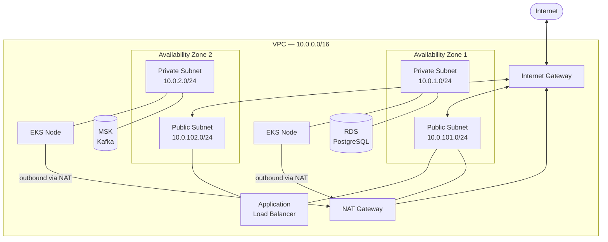

# 13.2—VPC and Networking

Every resource you deploy to AWS lives inside a **Virtual Private Cloud** (VPC). A VPC is an isolated, software-defined network that you own within the AWS region of your choosing. EKS worker nodes need IP addresses. RDS and MSK need subnets whose routing prevents direct access from the internet. The Application Load Balancer that fronts the cluster needs a public subnet so it can accept traffic from clients. None of that is possible without a well-designed VPC.

This section designs the VPC for the library system, explains the reasoning behind each decision, and writes the Terraform that provisions it.

---

## Network topology

The library system is deployed into two Availability Zones. An Availability Zone (AZ) is a physically separate data center within a region—distinct power, cooling, and networking. Running across two AZs is the minimum for fault-tolerant managed services: RDS Multi-AZ requires it, and MSK requires at least two brokers in separate AZs for replication to work.

Each AZ contains two subnets: one public and one private.

**Public subnets** are associated with the VPC's Internet Gateway, which means resources in them can receive traffic from the internet (if they have a public IP) and can initiate outbound connections directly. The Application Load Balancer lives here, because it must accept inbound HTTPS from clients. The NAT Gateway lives here too—itself a managed AWS resource that needs a route to the Internet Gateway so it can relay outbound traffic from private subnets.

**Private subnets** have no direct route to the internet. Resources here—EKS worker nodes, RDS, MSK—can reach the internet for outbound connections (to pull container images from ECR, for example) by routing through the NAT Gateway, but nothing on the internet can reach them directly. This is the correct posture for compute and data resources.



The NAT Gateway is deployed into a single public subnet—`10.0.101.0/24` in AZ 1—and shared by both private subnets. This is the `single_nat_gateway = true` configuration. A fully redundant deployment would place one NAT Gateway in each AZ, so that a failure in AZ 1's public subnet does not cut off outbound access for nodes in AZ 2. For a learning project, the cost of two NAT Gateways (roughly $33 per month each, plus data transfer) is not justified. In production, revisit this.

The CIDR block `10.0.0.0/16` gives you 65,536 IP addresses to distribute across subnets. The private subnets use `10.0.1.0/24` and `10.0.2.0/24` (256 addresses each). The public subnets use `10.0.101.0/24` and `10.0.102.0/24`. The gap between the low numbers (1, 2) and the high numbers (101, 102) is intentional—it leaves room to add subnets for future purposes (database-only subnets, intra-service tiers) without renumbering anything.

---

## The VPC module

Rather than assembling a VPC from individual `aws_vpc`, `aws_subnet`, `aws_route_table`, and `aws_route` resources—a dozen-plus resource blocks for what is fundamentally a standard configuration—you will use the community-maintained `terraform-aws-modules/vpc/aws` module. It is the most widely used Terraform module in the registry and encapsulates the entire standard VPC pattern behind a clean interface.

Create `terraform/vpc.tf`:

```hcl
data "aws_availability_zones" "available" {
  state = "available"
}

module "vpc" {
  source  = "terraform-aws-modules/vpc/aws"
  version = "~> 5.0"

  name = "${var.cluster_name}-vpc"
  cidr = "10.0.0.0/16"

  azs             = slice(data.aws_availability_zones.available.names, 0, 2)
  private_subnets = ["10.0.1.0/24", "10.0.2.0/24"]
  public_subnets  = ["10.0.101.0/24", "10.0.102.0/24"]

  enable_nat_gateway   = true
  single_nat_gateway   = true

  enable_dns_hostnames = true
  enable_dns_support   = true

  public_subnet_tags = {
    "kubernetes.io/role/elb"                      = 1
    "kubernetes.io/cluster/${var.cluster_name}"   = "shared"
  }

  private_subnet_tags = {
    "kubernetes.io/role/internal-elb"             = 1
    "kubernetes.io/cluster/${var.cluster_name}"   = "shared"
  }

  tags = {
    Environment = var.environment
    Project     = "library"
    ManagedBy   = "terraform"
  }
}
```

Walk through each block.

**`data "aws_availability_zones" "available"`** queries AWS for the AZs that are available in the current region. Using a data source instead of hardcoding `["us-east-1a", "us-east-1b"]` means this configuration works correctly when you change `var.aws_region`—you never have to update AZ names by hand. The `slice(..., 0, 2)` call takes only the first two AZs from however many the region offers.

**`name` and `cidr`** are self-explanatory. The name is prefixed with `var.cluster_name` so that if you ever run multiple environments in the same account, the VPC names do not collide.

**`azs`, `private_subnets`, `public_subnets`** are parallel lists. The first private subnet (`10.0.1.0/24`) and first public subnet (`10.0.101.0/24`) are placed in the first AZ; the second pair goes in the second AZ. The module creates the subnets, route tables, and route table associations automatically.

**`enable_nat_gateway = true`** tells the module to create at least one NAT Gateway and configure private subnet route tables to send `0.0.0.0/0` (all non-local traffic) through it. **`single_nat_gateway = true`** constrains it to one shared NAT Gateway rather than one per AZ.

**`enable_dns_hostnames` and `enable_dns_support`** are required for EKS. EKS nodes register themselves with the Kubernetes control plane using their DNS hostnames. RDS and MSK also provide DNS endpoints (rather than IP addresses) so that failovers are transparent to clients. Both must be enabled at the VPC level.

**Subnet tags** deserve particular attention. The tags

```
"kubernetes.io/role/elb"            = 1   # public subnets
"kubernetes.io/role/internal-elb"   = 1   # private subnets
```

are read by the AWS Load Balancer Controller—the Kubernetes operator that provisions ALBs and NLBs in response to Ingress and Service resources. When you create an Ingress, the controller looks for subnets tagged `kubernetes.io/role/elb` to place the ALB in. Without these tags, the controller cannot find the right subnets and the ALB provisioning fails. The tag value `1` is a convention; the controller checks only for the key's presence.

```
"kubernetes.io/cluster/${var.cluster_name}" = "shared"
```

This tag tells EKS that these subnets belong to the cluster and may be used for load balancers. The value `"shared"` means multiple clusters can share the subnet; `"owned"` would mean only this cluster uses it. For a single-cluster setup either works, but `"shared"` is the safer default.

---

## Security groups

The VPC module creates the networking infrastructure. Security groups control which traffic is allowed to flow between the resources within it. This file defines the RDS security group; the MSK security group is defined alongside the MSK cluster in `msk.tf` (section 13.5).

Add the following to `terraform/vpc.tf`, below the VPC module:

```hcl
# RDS security group — allows PostgreSQL access from EKS nodes only
resource "aws_security_group" "rds" {
  name        = "${var.cluster_name}-rds"
  description = "Allow PostgreSQL inbound from EKS nodes"
  vpc_id      = module.vpc.vpc_id

  ingress {
    description     = "PostgreSQL from EKS nodes"
    from_port       = 5432
    to_port         = 5432
    protocol        = "tcp"
    security_groups = [module.eks.node_security_group_id]
  }

  egress {
    from_port   = 0
    to_port     = 0
    protocol    = "-1"
    cidr_blocks = ["0.0.0.0/0"]
  }

  tags = {
    Name        = "${var.cluster_name}-rds"
    Environment = var.environment
    ManagedBy   = "terraform"
  }
}
```

> **Note:** This security group references the EKS module defined in section 13.6. Terraform resolves the dependency graph at plan time, but you must add `eks.tf` before running `terraform apply`.

The MSK security group is defined in `terraform/msk.tf` alongside the MSK cluster resource itself (see section 13.5). Keeping the MSK security group next to the cluster it protects—rather than grouping all security groups in `vpc.tf`—makes the MSK module self-contained: if you ever remove Kafka from the system, you delete a single file.

The RDS security group references `module.vpc.vpc_id` to place itself inside the VPC, and it references `module.eks.node_security_group_id` as the inbound source. Using a security group reference rather than a CIDR range is important—it means the rule automatically tracks all nodes in the EKS node group, regardless of their individual IP addresses. Nodes come and go as the group scales; a CIDR-based rule would require manual updates or overly broad IP ranges.

The `egress` block with `protocol = "-1"` allows all outbound traffic. This is the AWS default for security groups and is appropriate for application-layer resources: you want them to be able to reach S3, the AWS API, and other services without enumerating every destination.

The RDS security group opens port 5432—PostgreSQL's default port. The MSK security group, defined in section 13.5, opens port 9092—the Kafka plaintext listener. In Chapter 14, when TLS is configured on the Kafka cluster, you will add a second ingress rule for port 9094 (the TLS listener). For now, plaintext within the private subnet is acceptable because no traffic crosses the public internet.

---

## What Terraform will create

Running `terraform apply` with these two files will produce:

- 1 VPC
- 4 subnets (2 public, 2 private)
- 1 Internet Gateway
- 1 NAT Gateway (plus its Elastic IP)
- 4 route tables and their associations
- 1 security group (RDS; the MSK security group is created by `msk.tf`)

Before applying, initialize the module:

```
cd terraform
terraform init
terraform plan
```

The plan output will list all resources with their configuration. Review it carefully—in particular, verify that the subnet CIDRs and AZ assignments match the diagram above. Apply only when the plan looks correct:

```
terraform apply
```

The VPC resources are fast to provision, typically under two minutes. Once the apply completes, note the output values—`module.vpc.vpc_id`, `module.vpc.private_subnets`, and `module.vpc.public_subnets`—because subsequent sections reference them as inputs to the EKS and RDS modules.

---

[^1]: AWS VPC Documentation: https://docs.aws.amazon.com/vpc/latest/userguide/what-is-amazon-vpc.html
[^2]: terraform-aws-modules/vpc: https://registry.terraform.io/modules/terraform-aws-modules/vpc/aws/latest
[^3]: AWS Load Balancer Controller subnet discovery: https://kubernetes-sigs.github.io/aws-load-balancer-controller/latest/deploy/subnet_discovery/
[^4]: Amazon EKS VPC and subnet requirements: https://docs.aws.amazon.com/eks/latest/userguide/network_reqs.html
[^5]: AWS Security Groups: https://docs.aws.amazon.com/vpc/latest/userguide/vpc-security-groups.html
