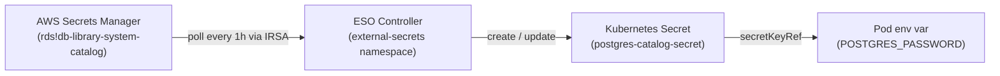

# 13.4 Secrets Management with External Secrets Operator

Chapter 12's production overlay left a comment in the `secretGenerator` block that was easy to skim past:

```yaml
# Substitute real values from `terraform output` and
# `aws secretsmanager get-secret-value` before deploying.
secretGenerator:
  - name: postgres-catalog-secret
    namespace: library
    literals:
      - POSTGRES_PASSWORD=REPLACE_WITH_RDS_PASSWORD
```

That comment describes a manual process: you run an AWS CLI command to retrieve the password, copy the output, paste it into the kustomization file or a shell command, run `kubectl apply`, and then delete the plaintext value from your terminal. It works once. It does not work well at any scale, and it introduces several problems that compound over time.

---

## The problem with manual secret management

**Shell history.** Every `aws secretsmanager get-secret-value` invocation that you pipe into a `kubectl create secret` call or paste into an environment variable leaves a copy of the plaintext credential in `~/.zsh_history` or `~/.bash_history`. That file is typically world-readable on developer laptops, synced to dotfile repositories, and occasionally included in support bundles. You are also trusting that every operator who has ever run this step on a shared bastion host did not leave similar traces.

**Rotation without downtime.** AWS Secrets Manager can rotate the RDS master password on a schedule — roughly every 30 days is a common policy. When it does, the old password stops working immediately. If your Kubernetes Secret still holds the old value, every pod that restarts or that reads the credential at connection-establishment time will fail with an authentication error. Manual rotation means someone has to notice the failure, retrieve the new password, update the Secret, and trigger a rolling restart — all while the application is broken.

**Error-prone during re-deployments.** Placeholder values are sticky. If you run `kustomize build overlays/production | kubectl apply -f -` after pulling the latest git state on a fresh machine, the Secrets you created manually are already in the cluster — so nothing breaks immediately. But the day you run `terraform destroy` and `terraform apply` to rebuild the cluster for a new region or disaster recovery, you have to reconstruct every Secret by hand. The list of secrets grows over time, documentation for the process drifts, and at least one value gets wrong.

**The principle of least manual intervention.** Infrastructure-as-code exists to make system state reproducible without human memory. A manual secret-pasting step is a gap in that reproducibility — a step that is not captured in any file that `git blame` can show you, not gated by any code review, and not executable by your CI pipeline without introducing its own secret-management problem.

The right answer is to treat secrets the same way you treat infrastructure: define them declaratively, let an automated system reconcile the desired state with the actual state, and audit the process rather than the operator.

---

## How External Secrets Operator works

**External Secrets Operator** (ESO) is a Kubernetes controller that bridges external secret stores — AWS Secrets Manager, HashiCorp Vault, GCP Secret Manager, Azure Key Vault, and others — with native Kubernetes Secrets.[^1] Instead of running a kubectl command, you declare two custom resources:

- A **`SecretStore`** that tells ESO how to connect to the external store. For AWS Secrets Manager, this specifies the region and the IAM authentication method.
- An **`ExternalSecret`** that tells ESO which value to fetch and what Kubernetes Secret to create from it. You specify the remote key name, the field within that key's JSON payload, and the local Secret key to populate.

ESO polls the external store on a configurable `refreshInterval`. When it fetches a value, it creates or updates the corresponding Kubernetes Secret. If the value changes in Secrets Manager — because RDS rotated the password — ESO writes the new value to the Secret on the next poll cycle.



From the pod's perspective, nothing changes. The Deployment still references `postgres-catalog-secret` via `secretKeyRef`. The difference is that ESO creates and maintains that Secret instead of a human with a clipboard.

ESO does not require any changes to application code, Dockerfiles, or the base Kustomize manifests. The interface between the operator and the application is the Kubernetes Secret object — a stable API that both sides already speak.

---

## IRSA for ESO

ESO needs permission to call `GetSecretValue` on the Secrets Manager secrets it is responsible for. In an EKS cluster, the correct way to grant AWS permissions to a pod is IRSA — the same pattern you used for the EBS CSI driver and the Load Balancer Controller in Chapter 12.

The `terraform-aws-modules/iam` module has a built-in preset for External Secrets Operator. Setting `attach_external_secrets_policy = true` creates a policy with the minimum required permissions: `secretsmanager:GetSecretValue`, `secretsmanager:DescribeSecret`, and `secretsmanager:ListSecretVersionIds`.[^2] You scope it to a resource ARN pattern to limit access to only the secrets this cluster owns.

RDS creates Secrets Manager entries automatically when `manage_master_user_password = true` is set on the `aws_db_instance` resource — which your Chapter 12 Terraform already does for all three databases. The automatically created secrets follow the naming pattern `rds!db-<identifier>`. The `*` wildcard in the ARN below matches the random suffix that Secrets Manager appends to prevent enumeration.

Create `terraform/eso.tf`:

```hcl
# terraform/eso.tf

# --- IRSA role for External Secrets Operator ---
# ESO needs GetSecretValue access to read RDS credentials and the
# manually created JWT and Meilisearch secrets.
module "eso_irsa" {
  source  = "terraform-aws-modules/iam/aws//modules/iam-role-for-service-accounts-eks"
  version = "~> 5.34"

  role_name = "${var.project_name}-external-secrets"

  attach_external_secrets_policy        = true
  external_secrets_secrets_manager_arns = [
    # RDS-managed secrets use the rds! prefix. The suffix after the secret
    # name is a random ID appended by Secrets Manager; the wildcard covers it.
    "arn:aws:secretsmanager:${var.region}:${data.aws_caller_identity.current.account_id}:secret:rds!*",
    # Manually created secrets for JWT and Meilisearch use a path prefix.
    "arn:aws:secretsmanager:${var.region}:${data.aws_caller_identity.current.account_id}:secret:library-system/*",
  ]

  oidc_providers = {
    main = {
      provider_arn               = module.eks.oidc_provider_arn
      # ESO's service account lives in the external-secrets namespace.
      # The trust policy allows only this exact namespace/serviceaccount pair
      # to assume the role.
      namespace_service_accounts = ["external-secrets:external-secrets"]
    }
  }

  tags = local.common_tags
}

# --- Install ESO via Helm ---
# The Helm chart installs the controller Deployment, the CRDs for
# SecretStore and ExternalSecret, and the RBAC rules ESO needs to
# create and update Kubernetes Secrets.
resource "helm_release" "external_secrets" {
  name       = "external-secrets"
  repository = "https://charts.external-secrets.io"
  chart      = "external-secrets"
  namespace  = "external-secrets"
  version    = "0.9.13"

  create_namespace = true

  # Annotate the service account with the role ARN so the OIDC webhook
  # can inject the web identity token at pod startup.
  set {
    name  = "serviceAccount.annotations.eks\\.amazonaws\\.com/role-arn"
    value = module.eso_irsa.iam_role_arn
  }

  # The controller must be running before any ExternalSecret resources
  # can be reconciled; the CRDs need to exist before Kubernetes will
  # accept ExternalSecret or SecretStore objects.
  depends_on = [module.eks]
}
```

The `namespace_service_accounts = ["external-secrets:external-secrets"]` entry is the binding between the Kubernetes identity and the IAM role. The trust policy it generates says: only tokens issued to the service account named `external-secrets` in the `external-secrets` namespace on this specific OIDC provider may call `AssumeRoleWithWebIdentity` for this role. A token issued to any other pod — even one in the same cluster — is denied.

Apply this before moving to the Kubernetes manifests:

```bash
cd terraform
terraform apply -target=module.eso_irsa -target=helm_release.external_secrets
```

Wait until the ESO pods are healthy before continuing:

```
$ kubectl get pods -n external-secrets

NAME                                                READY   STATUS    RESTARTS   AGE
external-secrets-6d8b9f7c4-xk9pz                   1/1     Running   0          90s
external-secrets-cert-controller-77b6d9b8c-m2jql   1/1     Running   0          90s
external-secrets-webhook-5c7f8d9b4-v8nrw            1/1     Running   0          90s
```

Three pods: the main controller that reconciles `ExternalSecret` resources, a cert-controller that manages the webhook TLS certificates, and an admission webhook that validates your `ExternalSecret` and `SecretStore` definitions at apply time. All three need to be `Running` before you create the Kubernetes resources.

---

## Creating the non-RDS secrets

RDS secrets are created automatically by Secrets Manager when you set `manage_master_user_password = true`. The JWT secret and the Meilisearch master key are not database credentials and have no equivalent automated source — you need to create them once:

```bash
# Generate a cryptographically random 64-byte JWT secret and store it.
# `openssl rand -hex 64` produces 128 hex characters — long enough that
# brute force is not a practical concern.
aws secretsmanager create-secret \
  --name library-system/jwt-secret \
  --description "JWT signing secret for the library system auth service" \
  --secret-string "{\"secret\":\"$(openssl rand -hex 64)\"}"

# Generate a random Meilisearch master key. Meilisearch requires this
# to be present at first startup; it cannot be changed after the index
# is populated without a full re-index.
aws secretsmanager create-secret \
  --name library-system/meilisearch-key \
  --description "Meilisearch master key for the library system search service" \
  --secret-string "{\"key\":\"$(openssl rand -hex 32)\"}"
```

The JSON wrapper (`{"secret": "..."}`) is deliberate. ESO's `remoteRef.property` field extracts a specific key from a JSON-formatted secret value. If you store a bare string instead, you must omit the `property` field and ESO will use the entire value — which works, but JSON-formatted secrets are easier to extend later (if you need to add a `rotation_lambda_arn` field, for example) and are the format Secrets Manager's own rotation framework expects.

Verify both secrets exist:

```bash
aws secretsmanager list-secrets --query "SecretList[?starts_with(Name, 'library-system')].Name"
```

Expected output:

```json
[
    "library-system/jwt-secret",
    "library-system/meilisearch-key"
]
```

---

## The SecretStore manifest

A `SecretStore` is a namespaced resource that tells ESO how to reach the external secrets backend. Create `deploy/k8s/overlays/production/secret-store.yaml`:

```yaml
# deploy/k8s/overlays/production/secret-store.yaml
apiVersion: external-secrets.io/v1beta1
kind: SecretStore
metadata:
  name: aws-secrets-manager
  namespace: library
spec:
  provider:
    aws:
      service: SecretsManager
      region: us-east-1
      # Use the JWT auth method: ESO's service account carries an OIDC
      # token issued by EKS. The serviceAccountRef points to the ESO
      # service account in the external-secrets namespace, which has the
      # IRSA annotation that maps to the IAM role you created above.
      auth:
        jwt:
          serviceAccountRef:
            name: external-secrets
            namespace: external-secrets
```

The `auth.jwt.serviceAccountRef` field is the cross-namespace reference that ties this `SecretStore` to ESO's IAM permissions. When ESO reconciles an `ExternalSecret` that references this `SecretStore`, it uses the JWT token from the `external-secrets` service account in the `external-secrets` namespace to call STS and assume the IRSA role. The ESO controller itself runs in `external-secrets`, so it can read that service account's token directly.

A `SecretStore` is namespaced — it is only usable by `ExternalSecret` resources in the same namespace. If you had multiple application namespaces, you would either create a `SecretStore` in each one or use a `ClusterSecretStore` (a cluster-scoped variant). For this system, which has a single `library` namespace, the namespaced variant is the right choice.

---

## The ExternalSecret manifests

Create `deploy/k8s/overlays/production/external-secrets.yaml`. This file defines one `ExternalSecret` per secret the application needs:

```yaml
# deploy/k8s/overlays/production/external-secrets.yaml

# --- Catalog database password ---
apiVersion: external-secrets.io/v1beta1
kind: ExternalSecret
metadata:
  name: postgres-catalog-secret
  namespace: library
spec:
  # Poll Secrets Manager every hour. If the RDS password rotates,
  # the Kubernetes Secret will be updated within one hour.
  refreshInterval: 1h
  secretStoreRef:
    name: aws-secrets-manager
    kind: SecretStore
  target:
    # name must match the secretKeyRef.name in the Deployment patch.
    name: postgres-catalog-secret
    # Owner means ESO sets itself as the owner of this Secret.
    # If you delete the ExternalSecret, the Secret is deleted too.
    creationPolicy: Owner
  data:
    - secretKey: POSTGRES_PASSWORD
      remoteRef:
        # RDS-managed secrets use the rds! prefix followed by the
        # db-instance identifier.
        key: rds!db-library-system-catalog
        # The RDS-managed secret is JSON: {"username": "...", "password": "..."}.
        # The property field extracts only the password field.
        property: password
---
# --- Auth database password ---
apiVersion: external-secrets.io/v1beta1
kind: ExternalSecret
metadata:
  name: postgres-auth-secret
  namespace: library
spec:
  refreshInterval: 1h
  secretStoreRef:
    name: aws-secrets-manager
    kind: SecretStore
  target:
    name: postgres-auth-secret
    creationPolicy: Owner
  data:
    - secretKey: POSTGRES_PASSWORD
      remoteRef:
        key: rds!db-library-system-auth
        property: password
---
# --- Reservation database password ---
apiVersion: external-secrets.io/v1beta1
kind: ExternalSecret
metadata:
  name: postgres-reservation-secret
  namespace: library
spec:
  refreshInterval: 1h
  secretStoreRef:
    name: aws-secrets-manager
    kind: SecretStore
  target:
    name: postgres-reservation-secret
    creationPolicy: Owner
  data:
    - secretKey: POSTGRES_PASSWORD
      remoteRef:
        key: rds!db-library-system-reservation
        property: password
---
# --- JWT signing secret ---
apiVersion: external-secrets.io/v1beta1
kind: ExternalSecret
metadata:
  name: jwt-secret
  namespace: library
spec:
  refreshInterval: 1h
  secretStoreRef:
    name: aws-secrets-manager
    kind: SecretStore
  target:
    name: jwt-secret
    creationPolicy: Owner
  data:
    - secretKey: JWT_SECRET
      remoteRef:
        key: library-system/jwt-secret
        property: secret
---
# --- Meilisearch master key ---
apiVersion: external-secrets.io/v1beta1
kind: ExternalSecret
metadata:
  name: meilisearch-secret
  namespace: library
spec:
  refreshInterval: 1h
  secretStoreRef:
    name: aws-secrets-manager
    kind: SecretStore
  target:
    name: meilisearch-secret
    creationPolicy: Owner
  data:
    - secretKey: MEILI_MASTER_KEY
      remoteRef:
        key: library-system/meilisearch-key
        property: key
```

Each `ExternalSecret` maps a single field from a Secrets Manager secret to a single key in a Kubernetes Secret. The `target.name` matches exactly the name used in the Deployment patches' `secretKeyRef.name` — `postgres-catalog-secret`, `postgres-auth-secret`, `postgres-reservation-secret`, `jwt-secret`, and `meilisearch-secret`. No Deployment manifest changes are required.

The `creationPolicy: Owner` setting is worth understanding. It means ESO creates the Kubernetes Secret and marks itself as the owner via a Kubernetes owner reference. If you run `kubectl delete externalsecret postgres-catalog-secret -n library`, Kubernetes will garbage-collect the associated Secret automatically. This is the right policy for production: the Secret should not outlive its source of truth. The alternative, `creationPolicy: Merge`, is useful when you want to add ESO-managed keys into an existing Secret that is partially managed by other means — not the case here.

---

## Updating the production overlay

With ESO managing the Secrets, the `secretGenerator` block in the production overlay is no longer needed. Remove it entirely from `deploy/k8s/overlays/production/kustomization.yaml`, along with the `generatorOptions` block:

```yaml
# Remove these lines from kustomization.yaml:

# secretGenerator:
#   - name: jwt-secret
#     namespace: library
#     literals:
#       - JWT_SECRET=REPLACE_WITH_PRODUCTION_SECRET
#   - name: postgres-catalog-secret
#     namespace: library
#     literals:
#       - POSTGRES_PASSWORD=REPLACE_WITH_RDS_PASSWORD
#   - name: postgres-auth-secret
#     namespace: library
#     literals:
#       - POSTGRES_PASSWORD=REPLACE_WITH_RDS_PASSWORD
#   - name: postgres-reservation-secret
#     namespace: library
#     literals:
#       - POSTGRES_PASSWORD=REPLACE_WITH_RDS_PASSWORD
#   - name: meilisearch-secret
#     namespace: library
#     literals:
#       - MEILI_MASTER_KEY=REPLACE_WITH_PRODUCTION_KEY
#
# generatorOptions:
#   disableNameSuffixHash: true
```

Add the two new manifest files to the `resources` list instead:

```yaml
resources:
  - ../../base
  - secret-store.yaml
  - external-secrets.yaml
```

The Deployment patches that reference `postgres-catalog-secret`, `jwt-secret`, and so on are unchanged. They were already written to consume a Kubernetes Secret by name. The only thing that changes is who creates those Secrets — Kustomize's `secretGenerator` is replaced by ESO.

Apply the updated overlay:

```bash
kubectl apply -k deploy/k8s/overlays/production/
```

Kustomize will apply the `SecretStore` and all five `ExternalSecret` objects. ESO's controller detects the new `ExternalSecret` resources almost immediately and begins reconciling.

---

## Verification

Check that ESO has reconciled each secret:

```
$ kubectl get externalsecrets -n library

NAME                       STORE                 REFRESH INTERVAL   STATUS         READY
jwt-secret                 aws-secrets-manager   1h                 SecretSynced   True
meilisearch-secret         aws-secrets-manager   1h                 SecretSynced   True
postgres-auth-secret       aws-secrets-manager   1h                 SecretSynced   True
postgres-catalog-secret    aws-secrets-manager   1h                 SecretSynced   True
postgres-reservation-secret aws-secrets-manager  1h                 SecretSynced   True
```

The `STATUS` column shows `SecretSynced` and `READY` is `True` for each resource when ESO has successfully fetched the value from Secrets Manager and written it to the cluster. If any row shows `SecretSyncedError`, inspect the status condition for detail:

```bash
kubectl describe externalsecret postgres-catalog-secret -n library
```

The `Status.Conditions` section will contain a message. Common causes:

- **`unauthorized`** — the IRSA role ARN is wrong, or the `namespace_service_accounts` field in the Terraform module does not exactly match `external-secrets:external-secrets`. Verify with `kubectl describe serviceaccount external-secrets -n external-secrets` and confirm the `eks.amazonaws.com/role-arn` annotation matches the Terraform output.
- **`ResourceNotFoundException`** — the secret key (e.g., `rds!db-library-system-catalog`) does not exist in Secrets Manager. The RDS identifier in Terraform and the key name in the `ExternalSecret` must match. Run `aws secretsmanager list-secrets` to see the actual names.
- **`InvalidParameterException`** — the `property` field does not match a key in the JSON payload. Verify the secret format with `aws secretsmanager get-secret-value --secret-id rds!db-library-system-catalog`.

Once all five resources are `SecretSynced`, confirm the Kubernetes Secrets exist:

```
$ kubectl get secrets -n library

NAME                         TYPE     DATA   AGE
jwt-secret                   Opaque   1      45s
meilisearch-secret           Opaque   1      45s
postgres-auth-secret         Opaque   1      45s
postgres-catalog-secret      Opaque   1      45s
postgres-reservation-secret  Opaque   1      45s
```

You can verify a specific value without exposing it in terminal history by decoding the base64-encoded data:

```bash
kubectl get secret postgres-catalog-secret -n library \
  -o jsonpath='{.data.POSTGRES_PASSWORD}' | base64 -d
```

The decoded value should match what `aws secretsmanager get-secret-value --secret-id rds!db-library-system-catalog --query SecretString --output text | jq -r '.password'` returns.

---

## Secret rotation

When RDS rotates the master password — either on a schedule you configure in Secrets Manager or triggered manually — the sequence is:

1. Secrets Manager stores the new password and marks the old version as `AWSPREVIOUS`.
2. ESO polls Secrets Manager at the next `refreshInterval` boundary (up to one hour later with the configuration above).
3. ESO fetches the new value and overwrites the Kubernetes Secret's `data` field.
4. Pods that have already started and cached the old value in memory will fail on the next database operation that requires re-authentication.

Step 4 is the gap that naive rotation handling leaves open. A connection pool that has established connections will not re-read environment variables while it is running. The connection remains authenticated until either the old password is invalidated by the next rotation cycle or the pod restarts.

There are two approaches to closing this gap:

**Rolling restart via a controller.** The [Reloader](https://github.com/stakater/Reloader) project watches Kubernetes Secrets and ConfigMaps for changes and triggers a rolling restart of any Deployment that references them.[^5] Installing it is three lines of Helm:

```bash
helm repo add stakater https://stakater.github.io/stakater-charts
helm repo update
helm install reloader stakater/reloader -n kube-system
```

Once installed, annotate any Deployment you want to be restarted automatically when its referenced Secret changes:

```yaml
annotations:
  reloader.stakater.com/auto: "true"
```

With Reloader in place, the rotation sequence becomes: ESO writes the new Secret → Reloader detects the change → pods restart in a rolling fashion, pulling fresh environment variables → the new password is in effect within a few minutes.

**Application-level reconnection.** The cleaner long-term solution is to write database connection code that catches authentication errors and re-reads the password from the environment or from a filesystem mount before retrying. This is more work but eliminates the dependency on an external restart controller. For a learning project, Reloader is the pragmatic choice; for a high-availability system where rolling restarts have a meaningful cost, application-level reconnection is worth implementing.

For this system, adding Reloader and the annotation to the three database-connected Deployments (auth, catalog, reservation) gives you complete automation: a password rotation in Secrets Manager results in zero manual intervention and a seamless rolling update within minutes.

---

## What you have now

The `secretGenerator` block is gone. No placeholder values exist anywhere in the git repository. The five Kubernetes Secrets that the application depends on are created and maintained by ESO, which reads live values from AWS Secrets Manager using a scoped IAM role that requires no static credentials. RDS passwords can rotate on a schedule without requiring any human action — the only question is whether you want automatic pod restarts (Reloader) or manual rolling restarts.

The shape of what changed:

| Before | After |
|--------|-------|
| `secretGenerator` with `REPLACE_WITH_*` literals | ESO `ExternalSecret` resources |
| Manual `aws secretsmanager get-secret-value` + paste | Automated poll every hour |
| Credentials in shell history on every deploy | No credentials in any shell command |
| Rotation requires manual Secret update + restart | Rotation is automatic; restart is optional via Reloader |
| Re-deploy to a new cluster requires reconstructing secrets | Re-deploy applies `external-secrets.yaml`; ESO fetches values |

The next section addresses the remaining production gap: Kafka connections currently use the plaintext listener on port 9092. Section 13.5 enables the TLS listener on MSK and updates the `KAFKA_BROKERS` environment variable in the production overlay to use port 9094.

---

[^1]: External Secrets Operator documentation: https://external-secrets.io/latest/
[^2]: terraform-aws-modules/iam IRSA submodule — External Secrets preset: https://registry.terraform.io/modules/terraform-aws-modules/iam/aws/latest/submodules/iam-role-for-service-accounts-eks
[^3]: AWS Secrets Manager — RDS managed passwords: https://docs.aws.amazon.com/AmazonRDS/latest/UserGuide/rds-secrets-manager.html
[^4]: EKS IRSA documentation: https://docs.aws.amazon.com/eks/latest/userguide/iam-roles-for-service-accounts.html
[^5]: Stakater Reloader: https://github.com/stakater/Reloader
