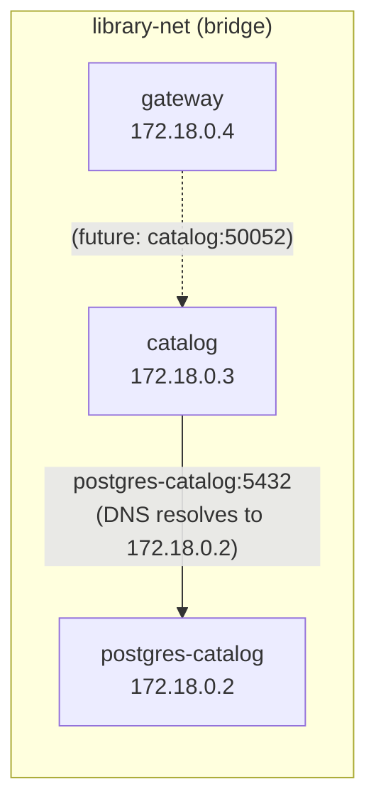

# 3.3 Docker Compose

<!-- [STRUCTURAL] Arc is good: motivate (manual commands are tedious) → show the compose file in full → dissect by section (services → networking → volumes → lifecycle) → exercise → summary. Code-to-prose balance is tight; each YAML snippet is immediately explained. -->
<!-- [STRUCTURAL] The "What Compose Solves" opening is a strong rhetorical hook: show the long form first, then the one-liner. Retain. -->
<!-- [STRUCTURAL] The "Networking" section mixes three topics (bridge networks, DNS, port mapping). They're related, but the flow jumps: explanation → diagram → isolation note → port mapping subsection. Consider promoting "Port Mapping" to its own top-level subsection outside Networking, since port mapping is a different concept (host-to-container plumbing, not inter-container networking). Minor. -->

Running one container manually is manageable. Running three containers -- each with specific environment variables, network connections, port mappings, and startup dependencies -- gets tedious fast. Docker Compose solves this by defining the entire stack in a single YAML file.
<!-- [COPY EDIT] Replace `--` with em dash `—` throughout per CMOS 6.85. -->
<!-- [COPY EDIT] Serial comma in list of four: "environment variables, network connections, port mappings, and startup dependencies" — correct (CMOS 6.19). -->

---

## What Compose Solves

Without Compose, starting the Catalog stack requires:

```bash
# Create a network
docker network create library-net

# Start PostgreSQL
docker run -d --name postgres-catalog \
  --network library-net \
  -e POSTGRES_USER=postgres \
  -e POSTGRES_PASSWORD=postgres \
  -e POSTGRES_DB=catalog \
  -v catalog-data:/var/lib/postgresql/data \
  -p 5433:5432 \
  postgres:16-alpine

# Wait for PostgreSQL to be ready...
# Start the catalog service
docker run -d --name catalog \
  --network library-net \
  -e DATABASE_URL="host=postgres-catalog port=5432 ..." \
  -p 50052:50052 \
  catalog:latest

# Start the gateway
docker run -d --name gateway \
  --network library-net \
  -p 8080:8080 \
  gateway:latest
```

That is six commands, error-prone, and doesn't handle startup ordering. With Compose:
<!-- [LINE EDIT] "That is six commands, error-prone, and doesn't handle startup ordering." — the three items aren't parallel (number, adjective, verb phrase). Rewrite: "Six commands, error-prone, and still no startup ordering." or "That's six error-prone commands with no startup ordering." -->
<!-- [COPY EDIT] Please verify: count the commands. `network create`, `run postgres`, `run catalog`, `run gateway` — plus one `wait` comment (not a command). Four commands. Consider "four commands" or recount. -->

```bash
docker compose -f deploy/docker-compose.yml up --build
```

One command. Compose reads the YAML, creates the network, builds the images, starts the containers in dependency order, and streams all logs to your terminal.

---

## The `docker-compose.yml` Structure

Here is `deploy/docker-compose.yml` in full:

```yaml
services:
  postgres-catalog:
    image: postgres:16-alpine
    environment:
      POSTGRES_USER: ${POSTGRES_CATALOG_USER:-postgres}
      POSTGRES_PASSWORD: ${POSTGRES_CATALOG_PASSWORD:-postgres}
      POSTGRES_DB: ${POSTGRES_CATALOG_DB:-catalog}
    ports:
      - "${POSTGRES_CATALOG_PORT:-5433}:5432"
    volumes:
      - catalog-data:/var/lib/postgresql/data
    healthcheck:
      test: ["CMD-SHELL", "pg_isready -U postgres"]
      interval: 5s
      timeout: 5s
      retries: 5
    networks:
      - library-net

  catalog:
    build:
      context: ..
      dockerfile: services/catalog/Dockerfile
    environment:
      DATABASE_URL: "host=postgres-catalog port=5432 user=${POSTGRES_CATALOG_USER:-postgres} password=${POSTGRES_CATALOG_PASSWORD:-postgres} dbname=${POSTGRES_CATALOG_DB:-catalog} sslmode=disable"
      GRPC_PORT: "50052"
    ports:
      - "${CATALOG_GRPC_PORT:-50052}:50052"
    depends_on:
      postgres-catalog:
        condition: service_healthy
    networks:
      - library-net

  gateway:
    build:
      context: ..
      dockerfile: services/gateway/Dockerfile
    environment:
      PORT: "8080"
    ports:
      - "${GATEWAY_PORT:-8080}:8080"
    networks:
      - library-net

volumes:
  catalog-data:

networks:
  library-net:
    driver: bridge
```

Let's walk through each section.
<!-- [LINE EDIT] "Let's walk through each section." → "Walk through it:" — optional tightening. -->

---

## Service Definitions

### PostgreSQL

```yaml
postgres-catalog:
  image: postgres:16-alpine
```

This service uses a pre-built image from Docker Hub rather than building from a Dockerfile. `postgres:16-alpine` is the official PostgreSQL 16 image on Alpine Linux -- small and production-tested.
<!-- [COPY EDIT] "pre-built" — hyphenated prefix; CMOS 7.89 allows or removes the hyphen depending on word. "prebuilt" (closed) is equally common in tech prose. -->
<!-- [COPY EDIT] Please verify: "PostgreSQL 16" — PostgreSQL 17 shipped September 2024, 18 scheduled 2026. Confirm version pin is intentional for the project and still current. -->
<!-- [COPY EDIT] "production-tested" — hyphenated compound adjective before an implied noun; here it is predicate. No hyphen strictly required (CMOS 7.81), but consistency-wise it's fine. -->

### Environment Variables and Defaults

```yaml
environment:
  POSTGRES_USER: ${POSTGRES_CATALOG_USER:-postgres}
  POSTGRES_PASSWORD: ${POSTGRES_CATALOG_PASSWORD:-postgres}
  POSTGRES_DB: ${POSTGRES_CATALOG_DB:-catalog}
```

The `${VAR:-default}` syntax is shell parameter expansion, and Compose supports it natively. If `POSTGRES_CATALOG_USER` is set in the environment (or in a `.env` file), its value is used. Otherwise, the default (`postgres`) applies.
<!-- [LINE EDIT] "its value is used" → "Compose uses its value" (active voice). Minor. -->

The `.env` file at `deploy/.env` provides these values:

```
POSTGRES_CATALOG_PORT=5433
POSTGRES_CATALOG_USER=postgres
POSTGRES_CATALOG_PASSWORD=postgres
POSTGRES_CATALOG_DB=catalog

GATEWAY_PORT=8080
CATALOG_GRPC_PORT=50052
```

Compose automatically loads `.env` from the same directory as the Compose file. You never need to `source` it -- Compose reads it directly. This separation keeps credentials out of `docker-compose.yml` (which is committed) and in `.env` (which is gitignored in production, though our learning project commits it for convenience).
<!-- [COPY EDIT] "gitignored" — informal/jargon but established. Accept in tutor voice. -->
<!-- [STRUCTURAL] Good call-out: reminds the reader that the learning project's practices diverge from production. -->

### Healthchecks and `depends_on`

```yaml
healthcheck:
  test: ["CMD-SHELL", "pg_isready -U postgres"]
  interval: 5s
  timeout: 5s
  retries: 5
```

This tells Docker to run `pg_isready` every 5 seconds. If it succeeds, the container is marked "healthy." If it fails 5 times in a row, it is marked "unhealthy."
<!-- [COPY EDIT] "5 seconds" — technical measurement, numeral correct (CMOS 9.16). -->
<!-- [COPY EDIT] Quoted states: "healthy." / "unhealthy." — period inside double quotes (CMOS 6.9). Correct. -->
<!-- [LINE EDIT] "is marked" — passive but contextually appropriate (Docker does the marking; subject is the container). Accept. -->

```yaml
catalog:
  depends_on:
    postgres-catalog:
      condition: service_healthy
```

Without `condition: service_healthy`, Compose would start the Catalog service as soon as PostgreSQL's *container* is running -- which is not the same as PostgreSQL being *ready to accept connections*. PostgreSQL needs a few seconds to initialize, especially on first run when it creates the database. The `service_healthy` condition makes Compose wait until the healthcheck passes.
<!-- [LINE EDIT] Strong, clear paragraph. No changes. -->

This is a common source of startup failures. If your service crashes with "connection refused" on startup, the database probably wasn't ready. Always use healthchecks for database dependencies.
<!-- [COPY EDIT] "\"connection refused\"" — technical string; period outside or inside? CMOS 6.9 says commas/periods inside. Here no terminal period follows the phrase inside a sentence, so not an issue. Leave. -->

### Build Configuration

```yaml
catalog:
  build:
    context: ..
    dockerfile: services/catalog/Dockerfile
```

`context: ..` sets the build context to the repository root (one level up from `deploy/`). This is the same as running `docker build .` from the repo root. `dockerfile` specifies which Dockerfile to use within that context.

---

## Networking

```yaml
networks:
  library-net:
    driver: bridge
```

A bridge network creates an isolated virtual network. All services attached to `library-net` can reach each other by **service name** as a DNS hostname. The Catalog service connects to PostgreSQL using `host=postgres-catalog` -- that hostname resolves to the PostgreSQL container's IP address on the bridge network.

This is container DNS at work. You never hardcode IP addresses. When Compose creates the network, it also runs an embedded DNS server that maps service names to container IPs. If a container is restarted and gets a new IP, the DNS updates automatically.
<!-- [LINE EDIT] "This is container DNS at work." — tight; keep. -->
<!-- [COPY EDIT] "embedded DNS server" — accurate; Docker's internal DNS resolver runs at 127.0.0.11 inside each container. Could add parenthetical for curious readers. -->



Services that are *not* on the same network cannot reach each other. This provides isolation -- in a larger system, you might put frontend services on one network and backend services on another.
<!-- [STRUCTURAL] Good forward-look to production-scale isolation without derailing. -->

### Port Mapping

<!-- [STRUCTURAL] See earlier note: consider making this its own `##` section since it's a distinct concept from the virtual network. Not required. -->
```yaml
ports:
  - "${POSTGRES_CATALOG_PORT:-5433}:5432"
```

The format is `host_port:container_port`. PostgreSQL listens on 5432 inside the container (its default). We map it to 5433 on the host. Why not 5432? Because you might have a local PostgreSQL installation already using that port. Using 5433 avoids the conflict.
<!-- [LINE EDIT] "We map it to 5433 on the host." Clear and active. Good. -->

The Catalog service's `DATABASE_URL` uses `port=5432` (not 5433) because it connects to PostgreSQL over the bridge network, where the container's internal port applies. Port mapping only affects access from the host machine.
<!-- [STRUCTURAL] Excellent clarification — this is exactly the trap first-timers fall into. Keep. -->

---

## Volumes

```yaml
volumes:
  catalog-data:

# Referenced in the postgres service:
volumes:
  - catalog-data:/var/lib/postgresql/data
```
<!-- [STRUCTURAL] The combined snippet shows two different `volumes:` keys (top-level vs. service-scoped). The comment `# Referenced in the postgres service:` does the disambiguation. Works, but a less experienced YAML reader might still conflate them. Consider a one-line clarifier in prose: "Note the two `volumes:` blocks — the top-level declaration and the per-service reference are different keys." -->

A **named volume** (`catalog-data`) persists data across container restarts. Without it, stopping and removing the PostgreSQL container would delete all your data. The volume maps to `/var/lib/postgresql/data` inside the container -- this is where PostgreSQL stores its data files.

Named volumes are managed by Docker and stored in Docker's internal storage area. You can inspect them with `docker volume ls` and `docker volume inspect catalog-data`.
<!-- [LINE EDIT] "stored in Docker's internal storage area" → "stored in Docker's managed storage area" or specify the path (`/var/lib/docker/volumes/` on Linux). Optional precision for a technical reader. -->

To completely reset the database (useful during development):
<!-- [LINE EDIT] "To completely reset" → "To reset" (drop "completely"; intensifier). -->

```bash
docker compose -f deploy/docker-compose.yml down -v
```

The `-v` flag removes named volumes. Without it, `down` only stops and removes containers and networks -- the data survives.

---

## Starting and Stopping the Stack

```bash
# Start everything (build images if needed, run in foreground)
docker compose -f deploy/docker-compose.yml up --build

# Start in detached mode (background)
docker compose -f deploy/docker-compose.yml up --build -d

# View logs when running detached
docker compose -f deploy/docker-compose.yml logs -f

# Stop everything (preserve volumes)
docker compose -f deploy/docker-compose.yml down

# Stop everything and delete volumes (full reset)
docker compose -f deploy/docker-compose.yml down -v
```

The `--build` flag ensures images are rebuilt if Dockerfiles or source code have changed. Without it, Compose reuses existing images, which can lead to confusion when your latest code changes aren't reflected.
<!-- [STRUCTURAL] Handy cheat-sheet. Consider consolidating "down" variants into a single row too, but the current fences are scannable. -->

---

## Exercise: Start the Stack and Create a Book

<!-- [STRUCTURAL] Exercise ties back to Chapter 2's gRPC CreateBook/ListBooks. Good continuity. -->

1. Start the production stack:
   ```bash
   cd deploy
   docker compose up --build
   ```

2. Wait for all services to report healthy. You should see PostgreSQL's healthcheck pass and the Catalog service connect to the database.
<!-- [LINE EDIT] "You should see" → "Expect to see" — more directive. Minor. -->

3. In a separate terminal, use `grpcurl` to create a book:
   ```bash
   grpcurl -plaintext -d '{
     "title": "The Go Programming Language",
     "author": "Donovan & Kernighan",
     "isbn": "978-0134190440",
     "genre": "Programming",
     "description": "A comprehensive guide to Go",
     "published_year": 2015,
     "total_copies": 5,
     "available_copies": 5
   }' localhost:50052 catalog.v1.CatalogService/CreateBook
   ```
<!-- [COPY EDIT] Please verify: ISBN "978-0134190440" is the correct ISBN-13 for "The Go Programming Language" by Donovan & Kernighan, Addison-Wesley 2015. Looks right. -->
<!-- [COPY EDIT] "Donovan & Kernighan" — ampersand usage; in prose CMOS prefers "and," but the string here is inside a JSON payload (author field). Leave. -->

4. List books to confirm persistence:
   ```bash
   grpcurl -plaintext localhost:50052 catalog.v1.CatalogService/ListBooks
   ```

5. Stop the stack with `Ctrl+C`, then start it again. List books again -- the data should still be there because of the named volume.
<!-- [COPY EDIT] "Ctrl+C" — CMOS has no strict rule; style is consistent with typical technical writing. -->

6. Now stop with `docker compose down -v` and start again. List books -- the data is gone.
<!-- [LINE EDIT] "Now stop" → "Stop" (drop "Now"; filler). -->

<details>
<summary>Solution</summary>

After step 3, `grpcurl` returns the created book with a generated `id`, `created_at`, and `updated_at` timestamp.
<!-- [LINE EDIT] "with a generated `id`, `created_at`, and `updated_at` timestamp" — singular "timestamp" oddly attached to a list where `id` is not a timestamp. Recast: "...returns the created book with a generated `id` and `created_at`/`updated_at` timestamps." -->

After step 5 (restart without `-v`), `ListBooks` still returns the book. The `catalog-data` volume preserved PostgreSQL's data directory.

After step 6 (restart with `-v`), `ListBooks` returns an empty list. The `-v` flag deleted the `catalog-data` volume, and PostgreSQL re-initialized an empty database.
<!-- [COPY EDIT] "re-initialized" — CMOS allows "reinitialized" (closed) since "re-" + word starting with a different letter doesn't strictly require hyphen; "re-initialize" preferred when hyphen prevents confusion. Either is acceptable; keep consistent. -->

This demonstrates the difference between `down` (preserves data) and `down -v` (full reset). In development, you will use `down -v` when you want to start fresh (e.g., after changing migrations). In production, you would never use `-v`.
<!-- [COPY EDIT] "e.g.," — comma after, correct (CMOS 6.43). -->

If `grpcurl` is not installed, install it with:
```bash
go install github.com/fullstorydev/grpcurl/cmd/grpcurl@latest
```
<!-- [COPY EDIT] Please verify: `github.com/fullstorydev/grpcurl/cmd/grpcurl` — correct install path. Yes, confirmed upstream. -->

If you see "connection refused" on port 50052, the Catalog service may not have started yet. Check `docker compose logs catalog` for errors.

</details>

---

## Summary

- Docker Compose defines multi-container stacks in a single YAML file, handling networks, volumes, build contexts, and startup ordering.
- The `${VAR:-default}` syntax enables environment-driven configuration with sensible defaults.
- Healthchecks with `condition: service_healthy` prevent services from starting before their dependencies are ready.
- Bridge networks provide DNS-based service discovery -- services reference each other by name, not IP.
- Port mapping (`host:container`) is for host access; inter-container communication uses internal ports.
<!-- [COPY EDIT] "inter-container" — hyphenation consistent with earlier "inter-module" choice; keep aligned. -->
- Named volumes persist data across container restarts; `down -v` removes them for a full reset.

---

## References

[^1]: [Docker Compose overview](https://docs.docker.com/compose/) -- official Compose documentation and specification.
<!-- [COPY EDIT] Please verify URL. -->
[^2]: [Compose file reference](https://docs.docker.com/reference/compose-file/) -- complete reference for all Compose YAML options.
<!-- [COPY EDIT] Please verify URL. -->
[^3]: [Networking in Compose](https://docs.docker.com/compose/how-tos/networking/) -- how Compose handles networks and DNS.
<!-- [COPY EDIT] Please verify URL. -->
[^4]: [Environment variables in Compose](https://docs.docker.com/compose/how-tos/environment-variables/) -- `.env` files, variable substitution, and precedence rules.
<!-- [COPY EDIT] Please verify URL. -->
<!-- [FINAL] Cold read: no typos or homophones. One numeric nit (count of commands in the manual example) and one minor list-parallelism issue in the solution flagged. -->
