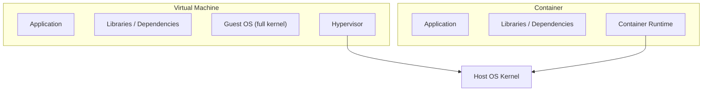
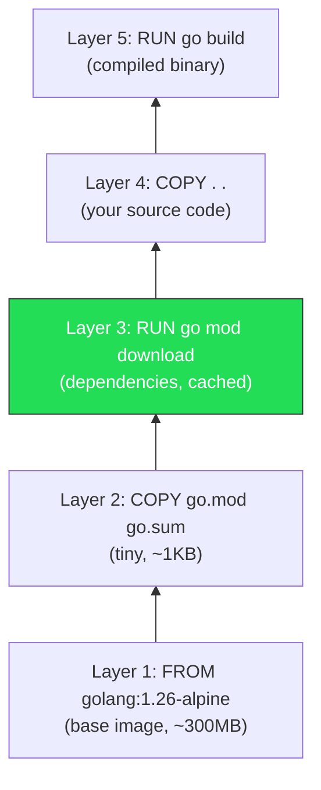

# 3.1 Docker Fundamentals

<!-- [STRUCTURAL] Heading delivery: "Docker Fundamentals" is an accurate umbrella. The section progresses well: motivation → what-is → images-vs-containers → layers → multi-stage → why. Good pedagogical arc. The JVM analogy is smart for a Java-experienced reader and is maintained consistently (not just a throwaway). -->
<!-- [STRUCTURAL] Consider renaming the final section "Why Containerize Go?" to sit *before* "Multi-Stage Builds" — as written, you show readers the mechanics before telling them why they should care about the mechanics. Counter-argument: by the time you reach "Why Containerize," the reader already understands layers and multi-stage, which lets you refer to them concretely. The current order is defensible; flagging for author decision, not mandating a move. -->

Before writing any Dockerfiles, you need a solid mental model of what containers actually are and how Docker builds images. This section covers the foundational concepts. If you already have Docker experience, skim through and make sure the multi-stage build section is clear -- it is central to the Dockerfiles we write in the next section.
<!-- [LINE EDIT] "what containers actually are" → "what containers are" (drop "actually"; filler emphatic). -->
<!-- [COPY EDIT] Replace `--` with em dash (`—`, no spaces) per CMOS 6.85. Applies throughout. -->

---

## What Are Containers?

<!-- [STRUCTURAL] Opens with the JVM bridge — excellent for the target reader. Motivation-before-mechanics. -->
If you are coming from Java, think of a container as a standardized JVM runtime -- but for any language. A JVM gives your Java bytecode a consistent execution environment regardless of the host OS: it handles memory management, provides standard libraries, and isolates your application from low-level platform details. Containers do the same thing, but at the OS level rather than the language level.
<!-- [LINE EDIT] "the same thing" → "the same job" or "the same work"; "thing" is vague. -->
<!-- [COPY EDIT] "low-level platform" — hyphenated compound adjective before noun. Correct (CMOS 7.81). -->
<!-- [COPY EDIT] "OS level" / "language level" — here used as post-modifier (predicate): no hyphen needed. Correct. -->

A container is a **process** (or group of processes) running on the host kernel with restricted visibility. It sees its own filesystem, its own network interfaces, its own process tree -- but it shares the host's kernel. This is fundamentally different from a virtual machine, which runs its own kernel inside a hypervisor.
<!-- [LINE EDIT] "fundamentally different" → "different"; "fundamentally" is almost always filler. -->
<!-- [COPY EDIT] Serial comma: "its own filesystem, its own network interfaces, its own process tree" — three items joined by em dash + "but," not a three-item list needing serial comma. Leave. -->



<!-- [STRUCTURAL] Diagram is well-placed; immediately supports the VM-vs-container comparison. -->
The practical consequence: containers start in milliseconds (no kernel boot), consume less memory (no guest OS overhead), and are more portable (they package only the application and its dependencies, not an entire operating system).

### The JVM Analogy, Extended

<!-- [STRUCTURAL] The analogy table is gold for a Java dev. Parallelism of rows is good. -->
| Concept | JVM | Container |
|---|---|---|
| Unit of deployment | JAR / WAR file | Container image |
| Runtime environment | JVM (java binary) | Container runtime (Docker, containerd) |
| Isolation | Class loaders, security manager | Linux namespaces, cgroups |
| Configuration | JVM flags, system properties | Environment variables, mounted configs |
| Dependency bundling | Fat JAR with libs | Image layers with OS packages + app binary |
| Startup time | Seconds (JVM warm-up) | Milliseconds (no kernel boot) |
<!-- [COPY EDIT] "warm-up" — hyphenated noun form is acceptable but "warmup" is also widely used in tech contexts. CMOS tilts toward "warm-up"; keep. -->
<!-- [COPY EDIT] Please verify: Java Security Manager is being deprecated (JEP 411, Java 17+). In a contemporary book, readers may not know the security manager. Consider footnote or swap to "Java SecurityManager (deprecated in Java 17+)." -->

The key difference: the JVM abstracts the CPU architecture and OS API. Containers do not abstract the CPU architecture (an x86 container won't run on ARM without emulation), but they *do* abstract the OS distribution and installed packages. Your Go binary built on Alpine Linux 3.19 will run on any host with a Linux kernel, regardless of what the host has installed.
<!-- [COPY EDIT] Please verify: "Alpine Linux 3.19" — check latest stable Alpine release at time of publication (3.20 and 3.21 exist as of 2025). Dockerfiles in the book pin 3.19, so the prose is internally consistent. -->
<!-- [COPY EDIT] "won't" — contraction is fine in tutor voice. Consistent with rest of book. -->

---

## Images vs. Containers

<!-- [STRUCTURAL] Clear, short, uses OO analogy (class/object). Strong for the target reader. -->
This distinction trips up many newcomers. An **image** is a read-only template -- a blueprint. A **container** is a running instance of that image.
<!-- [LINE EDIT] "trips up many newcomers" — soft filler. "This distinction matters:" is sharper. Optional. -->

To use object-oriented terms you already know: an image is a class; a container is an object. You can create multiple containers from the same image, each with its own writable layer and its own state.
<!-- [LINE EDIT] "To use object-oriented terms you already know:" → "In object-oriented terms:"; trims. -->

```bash
# Build an image (compile the class)
docker build -t catalog:latest .

# Run a container (instantiate the object)
docker run --name catalog-1 catalog:latest
docker run --name catalog-2 catalog:latest   # second instance, same image
```

Images are stored locally and can be pushed to registries (Docker Hub, GitHub Container Registry, AWS ECR) for sharing. When you `docker pull postgres:16-alpine`, you are downloading an image. When you `docker run` it, you create a container.
<!-- [COPY EDIT] "AWS ECR" — on first use, spell out: "AWS Elastic Container Registry (ECR)." Alternatively leave; experienced readers know ECR. Author's call. -->
<!-- [COPY EDIT] "Docker Hub, GitHub Container Registry, AWS ECR" — three-item list with serial comma. Correct (CMOS 6.19). -->

---

## Layers and Caching

Docker images are built from a series of **layers**. Each instruction in a Dockerfile (`FROM`, `COPY`, `RUN`, etc.) creates a new layer. Layers are content-addressed and cached -- if a layer hasn't changed, Docker reuses the cached version instead of rebuilding it.
<!-- [COPY EDIT] "e.g.," and "etc." — CMOS 6.43 prefers comma after. "etc." here is fine without trailing comma because it ends a parenthetical list. Leave. -->
<!-- [COPY EDIT] "content-addressed" — hyphenated compound adjective before "and cached." Correct (CMOS 7.81). -->
<!-- [COPY EDIT] Please verify: technically not every instruction creates a layer (e.g., `ENV`, `LABEL`, `WORKDIR` historically created layers; some were optimized away). Modern BuildKit behavior may differ. A precise phrasing: "most build instructions create a new layer." Author's call on precision level. -->

This has a critical implication: **instruction order in your Dockerfile determines cache efficiency.**

Consider this naive Dockerfile:

```dockerfile
FROM golang:1.26-alpine
WORKDIR /app
COPY . .
RUN go mod download
RUN go build -o /bin/server ./cmd/
```

<!-- [COPY EDIT] Please verify: "golang:1.26-alpine" — Go 1.26 release timing. As of early 2026 this is plausible (Go 1.24 released Feb 2025, 1.25 Aug 2025, 1.26 Feb 2026). Confirm at publication. -->
Every time you change *any* source file, the `COPY . .` layer is invalidated. That invalidates every subsequent layer, including `go mod download` -- which re-downloads all dependencies even if `go.mod` hasn't changed. On a project with many dependencies, this adds minutes to every build.

Now consider the optimized version:

```dockerfile
FROM golang:1.26-alpine
WORKDIR /app
COPY go.mod go.sum ./
RUN go mod download
COPY . .
RUN go build -o /bin/server ./cmd/
```

Here, `go.mod` and `go.sum` are copied first and dependencies are downloaded. This layer is cached as long as your dependencies don't change. When you edit source code, only the `COPY . .` and `go build` layers are invalidated. This is the two-phase COPY pattern, and we use it in all our Dockerfiles.
<!-- [LINE EDIT] "Here, `go.mod` and `go.sum` are copied first and dependencies are downloaded." → "Here we copy `go.mod` and `go.sum` first, then download dependencies." (active voice, CMOS tone) -->

### Layer Visualization



The green layer is the key -- it is expensive (network + disk I/O) but cached across most builds.
<!-- [COPY EDIT] Units: "~300MB", "~1KB", "network + disk I/O" — use non-breaking space between number and unit per CMOS 9.16 (e.g., `~300 MB`, `~1 KB`). Docker conventionally writes them concatenated; leave per-project style but note. -->

---

## Multi-Stage Builds

A naive Dockerfile produces an image that contains the Go toolchain (~300MB), all source code, all downloaded modules, *and* the compiled binary. For a Go service that compiles to a ~15MB static binary, this is wasteful and creates a larger attack surface.
<!-- [LINE EDIT] "larger attack surface" — good, concrete. -->
<!-- [COPY EDIT] "~300MB" / "~15MB" — see MB/KB note above. -->

Multi-stage builds solve this. You use one stage (the "builder") to compile your code and a second stage (the "runtime") that contains only the final binary:

```dockerfile
# Stage 1: Build
FROM golang:1.26-alpine AS builder
WORKDIR /app
COPY go.mod go.sum ./
RUN go mod download
COPY . .
RUN CGO_ENABLED=0 go build -o /bin/server ./cmd/

# Stage 2: Runtime
FROM alpine:3.19
RUN addgroup -S app && adduser -S app -G app
COPY --from=builder /bin/server /usr/local/bin/server
USER app
ENTRYPOINT ["/usr/local/bin/server"]
```

The `COPY --from=builder` instruction reaches into the builder stage and extracts only the compiled binary. The final image is based on `alpine:3.19` (~5MB), not `golang:1.26-alpine` (~300MB). The total image size ends up around 15-20MB instead of 300+MB.
<!-- [COPY EDIT] "15-20MB" / "300+MB" — use en dash for ranges (CMOS 6.78): "15–20 MB" and consider "more than 300 MB". -->
<!-- [COPY EDIT] "300+MB" — awkward; prefer "over 300 MB" or "300 MB and up." -->

The `USER app` instruction switches to a non-root user. Running containers as root is a security risk: if the process is compromised, the attacker has root inside the container. Our Go binary is statically linked and needs no elevated privileges, so there is no reason to run as root.
<!-- [COPY EDIT] "non-root" — hyphenated; correct (CMOS 7.89, the "non-" prefix before a vowel takes hyphen for clarity). -->
<!-- [STRUCTURAL] Good: rationale-forward explanation of USER app. Not just "run this command." -->

`CGO_ENABLED=0` deserves explanation. Go can link against C libraries via cgo. Setting `CGO_ENABLED=0` disables this and produces a fully static binary with no runtime dependencies on libc. This is what lets us run the binary on a minimal Alpine image (or even `scratch` -- an empty image). Since we are not using any C libraries (GORM's PostgreSQL driver uses pure Go), there is no downside.
<!-- [COPY EDIT] Please verify: "GORM's PostgreSQL driver uses pure Go." GORM's default Postgres driver wraps `jackc/pgx` (pure Go). Confirm — and if the book uses `pgx` directly (per Chapter 2 revision), consider whether "GORM" is still accurate here or should read "pgx" for internal consistency. This looks like a drift between chapters. -->
<!-- [LINE EDIT] "deserves explanation" — minor; fine. -->

### Why This Matters

| Metric | Single-stage | Multi-stage |
|---|---|---|
| Image size | ~350MB | ~20MB |
| Attack surface | Go toolchain, source code, build tools | Binary + Alpine base |
| Pull time (deploy) | Slow | Fast |
| Layer cache reuse | Poor (source changes invalidate everything) | Good (dependency layer is stable) |
<!-- [COPY EDIT] "~350MB" / "~20MB" — see MB spacing note. -->
<!-- [COPY EDIT] "Single-stage" / "Multi-stage" — consistent hyphenated compound adjective before implied noun. Good. -->

In production, smaller images mean faster deploys, less bandwidth, and fewer CVEs in vulnerability scans (fewer packages = fewer things to patch).
<!-- [COPY EDIT] "CVEs" — expand on first use: "Common Vulnerabilities and Exposures (CVEs)." -->
<!-- [COPY EDIT] "fewer packages = fewer things to patch" — equals sign as shorthand in prose is informal; tutor voice accepts it, but CMOS prefers "means" in formal prose. Author's call. -->

---

## Why Containerize Go?

<!-- [STRUCTURAL] Placement here (after mechanics) is defensible: you can now reference layers and images concretely. But note the intro already partially motivates containerization; some overlap with index.md's "Why" framing. Not redundant enough to cut. -->
Go produces static binaries. You *could* just `scp` the binary to a server and run it. Why bother with Docker?
<!-- [LINE EDIT] "just" — delete; filler per the editorial guide. "You could `scp` the binary to a server and run it." -->

1. **Dependency isolation.** Your service needs PostgreSQL connection strings, TLS certificates, and specific environment variables. A container bundles the runtime configuration expectations alongside the binary. The `Dockerfile` documents what the service needs to run.

2. **Consistency across environments.** "It works on my machine" stops being a problem when the container *is* the machine. Development, CI, staging, and production all run the same image.
<!-- [COPY EDIT] "It works on my machine" — period inside the closing quote per CMOS 6.9. Currently: "...my machine" stops..." — period is outside (correct, because the quote is a fragment embedded mid-sentence, not a terminal quotation). Actually CMOS 6.9 says terminal commas/periods go *inside* American quotes even mid-sentence. Rephrase or accept idiomatic usage; here the comma belongs inside. Check. -->

3. **Deployment uniformity.** Whether you deploy to Kubernetes, AWS ECS, or a single Docker host, the deployment unit is always a container image. Operations teams don't need to know whether your service is Go, Java, or Python -- they pull and run an image.
<!-- [COPY EDIT] "Kubernetes, AWS ECS, or a single Docker host" — serial comma correct. -->

4. **Matching production locally.** In the next section, we will run PostgreSQL in a container alongside the Catalog service. You don't need to install PostgreSQL on your host machine, manage different versions for different projects, or worry about port conflicts with other databases.

5. **Orchestration compatibility.** Kubernetes -- which we cover in a later chapter -- only speaks containers. Containerizing now means the transition to Kubernetes is about writing manifests, not rearchitecting your deployment.
<!-- [COPY EDIT] "-- which we cover in a later chapter --" — em dashes without spaces per CMOS 6.85. -->

---

## Summary

<!-- [STRUCTURAL] Summary bullets accurately cover the section content and are parallel in form. Good. -->
- Containers are isolated processes sharing the host kernel -- not virtual machines. Think of them as a universal, OS-level equivalent of the JVM.
- An image is a read-only blueprint; a container is a running instance.
- Dockerfile instructions create layers. Layer caching is the primary tool for fast builds -- copy dependency manifests before source code.
- Multi-stage builds separate the build environment from the runtime, producing small, secure images.
- Containerizing Go services provides consistency, isolation, and compatibility with orchestration platforms -- even though Go binaries are already self-contained.

---

## References

[^1]: [Docker overview](https://docs.docker.com/get-started/overview/) -- official Docker documentation covering architecture and concepts.
<!-- [COPY EDIT] Please verify URL: https://docs.docker.com/get-started/overview/ — Docker restructured their docs; the canonical path may now be /get-started/ or /manuals/. -->
[^2]: [Dockerfile best practices](https://docs.docker.com/build/building/best-practices/) -- Docker's guide to writing efficient Dockerfiles.
<!-- [COPY EDIT] Please verify URL. -->
[^3]: [Multi-stage builds](https://docs.docker.com/build/building/multi-stage/) -- official documentation on multi-stage build patterns.
<!-- [COPY EDIT] Please verify URL. -->
[^4]: [Why containers?](https://cloud.google.com/containers) -- Google Cloud's overview of container benefits in production environments.
<!-- [COPY EDIT] Please verify URL. -->
<!-- [FINAL] Cold read: no doubled words, no typos detected. "healthchecks" vs "health checks" inconsistency doesn't appear in this file. "hot-reload" doesn't appear here. -->
