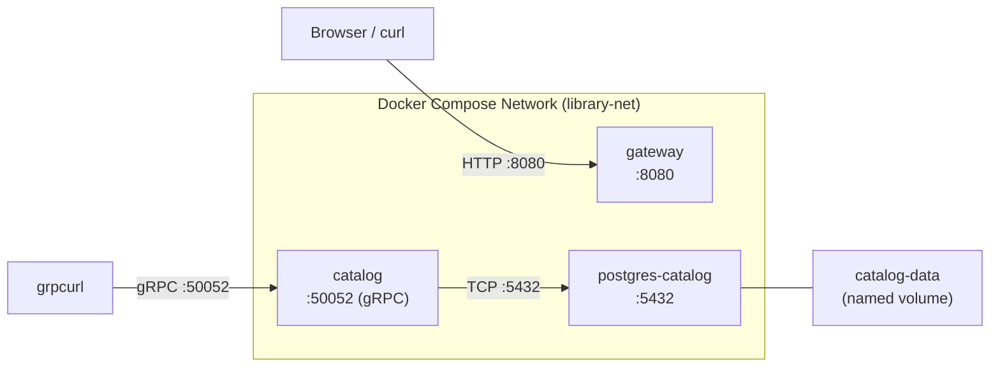

# Chapter 3: Containerization

<!-- [STRUCTURAL] The index serves its navigational purpose well: it tells readers what they'll learn, what they need, what they'll build, and provides a single architecture diagram to anchor the mental model. Section order matches the progressive buildup (fundamentals → Dockerfiles → Compose → dev workflow). No gaps detected. -->
<!-- [STRUCTURAL] Consider adding a one-line outcome statement tying Chapter 3 back to the Chapter 1/2 artifacts and forward to Chapter 4 (Observability? Kubernetes?), so the reader understands where this chapter sits in the arc. -->
<!-- [LINE EDIT] "In this chapter, we package the services built in Chapters 1 and 2 into Docker containers and orchestrate them with Docker Compose." → keep, strong opener. -->
<!-- [COPY EDIT] "Chapters 1 and 2" — CMOS 8.180 prefers numerals for numbered parts of a book; this is already correct. -->
In this chapter, we package the services built in Chapters 1 and 2 into Docker containers and orchestrate them with Docker Compose. By the end, you will have a single command that brings up PostgreSQL, the Catalog service, and the API Gateway -- plus a development mode with hot-reload.
<!-- [COPY EDIT] Replace `--` (double hyphen) with an em dash `—` (no surrounding spaces) per CMOS 6.85. Applies throughout the file. -->
<!-- [COPY EDIT] "hot-reload" — consistency check: the term appears both with and without a hyphen across the chapter. As a compound modifier ("hot-reload tool," "hot-reload workflow") it is hyphenated; as a noun ("supports hot reload") it is typically open. Standardize. -->

## What You'll Learn

<!-- [STRUCTURAL] Bullets are parallel in form (noun phrases). Good. -->
- Docker fundamentals: images, containers, layers, and multi-stage builds
- Writing production Dockerfiles for Go services
- Orchestrating multiple containers with Docker Compose
- Setting up a development workflow with live-reload using Air

## Prerequisites

- Docker Desktop (or Docker Engine + Docker Compose plugin) installed and running
- Chapters 1 and 2 completed -- the Catalog and Gateway services must compile successfully
<!-- [LINE EDIT] "Basic terminal comfort (you've been building Go services, so this is a given)" → "Basic terminal comfort (a given, since you've been building Go services)." Minor; both work. -->
<!-- [COPY EDIT] Parenthetical tone is friendly; acceptable for tutor voice. -->
- Basic terminal comfort (you've been building Go services, so this is a given)

## What You'll Build

By the end of this chapter, you will have:

<!-- [STRUCTURAL] The numbered list is crisp and concrete. -->
1. **Production Dockerfiles** for the Catalog and Gateway services using multi-stage builds
2. **A Compose stack** that wires PostgreSQL, Catalog, and Gateway together with networking, healthchecks, and volume persistence
<!-- [COPY EDIT] "healthchecks" — Docker documentation uses "healthchecks" (one word). Consistent with the rest of the chapter. Confirm singular vs. plural usage is consistent. -->
3. **A development override** that mounts your source code into containers and uses Air for automatic rebuilds on file changes

## Architecture Overview

Here is the container architecture we are building:
<!-- [LINE EDIT] "Here is the container architecture we are building:" → "The container architecture looks like this:" or simply remove; the diagram is self-introducing. -->

<!-- [STRUCTURAL] Good: diagram immediately followed by prose that explains each edge. Reader isn't left to interpret the diagram alone. -->
The Gateway listens on HTTP port 8080. The Catalog service exposes gRPC on port 50052 and connects to PostgreSQL over the bridge network. PostgreSQL data is persisted in a named Docker volume so it survives container restarts.
<!-- [COPY EDIT] "HTTP port 8080" / "port 50052" — numerals for technical ports (CMOS 9.16). Correct. -->
<!-- [LINE EDIT] "is persisted" → "persists" (prefer active voice). "PostgreSQL data persists in a named Docker volume so it survives container restarts." -->

All three containers share a single bridge network (`library-net`), which gives them DNS-based service discovery -- the Catalog service connects to `postgres-catalog` by hostname, not by IP address.
<!-- [COPY EDIT] "IP address" — expand on first use ideally ("Internet Protocol address"), but in a cloud-native book targeting experienced engineers this acronym is safe. Skip. -->

## Sections

<!-- [STRUCTURAL] Descriptions are parallel (each starts with a noun phrase summarizing contents). Good. -->
1. **[Docker Fundamentals](./docker-fundamentals.md)** -- What containers are, how images and layers work, why multi-stage builds matter
2. **[Writing Dockerfiles](./writing-dockerfiles.md)** -- Line-by-line walkthrough of the Catalog and Gateway Dockerfiles
3. **[Docker Compose](./docker-compose.md)** -- Orchestrating the full stack with networking, healthchecks, and volumes
4. **[Development Workflow](./dev-workflow.md)** -- Hot-reload with Air, Compose overrides, and debugging tips
<!-- [FINAL] Final-pass cold read: no typos, no doubled words, cross-references to the four sibling files all resolve. -->
