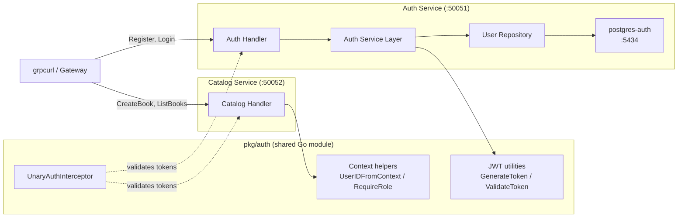

# Chapter 4: Authentication

<!-- [STRUCTURAL] The opening paragraph doubles as both hook and scope statement. That is efficient, but the chapter opener could benefit from one sentence framing *why* authentication deserves its own chapter (previous chapters built CRUD and inter-service plumbing; now we gate access). Currently the reader has to infer the motivation from the bullet list below. -->
<!-- [LINE EDIT] "your library system will support user registration with bcrypt-hashed passwords, stateless JWT-based sessions, OAuth2 login with Google, and a shared interceptor that protects both the Auth and Catalog services." → This is a 40-word sentence. Consider splitting: "your library system will support user registration with bcrypt-hashed passwords, stateless JWT-based sessions, and OAuth2 login with Google. A shared interceptor will protect both the Auth and Catalog services." -->
In this chapter, we build an authentication service from scratch. By the end, your library system will support user registration with bcrypt-hashed passwords, stateless JWT-based sessions, OAuth2 login with Google, and a shared interceptor that protects both the Auth and Catalog services.

## Architecture Overview

<!-- [STRUCTURAL] Good — diagram precedes prose explanation, and the prose paragraph below names the linchpin component. Consider labeling the dashed edge style in the diagram (e.g., add a legend: "dashed = interceptor"). -->
<!-- [LINE EDIT] "it lives outside both services so that any microservice can import it" → "it lives outside both services so any microservice can import it" (drop "that"). -->
<!-- [COPY EDIT] "linchpin -- it lives" → em dash without spaces per CMOS 6.85: "linchpin—it lives". The rest of the chapter uses "--" consistently, which appears to be a source convention (likely rendered to en/em dash by the static site generator). If so, this is fine; flagging as a query. -->
<!-- [COPY EDIT] Please verify: is "--" a deliberate Pandoc/Markdown en-dash convention in this book, or should it be replaced with Unicode em dashes (—) per CMOS 6.85? The convention is applied consistently across all ch04 files. -->
The `pkg/auth` module is the linchpin -- it lives outside both services so that any microservice can import it. The interceptor validates JWTs on every request (unless the method is in the skip list), and the context helpers let handlers extract the authenticated user's ID and role.

## What You'll Learn

<!-- [STRUCTURAL] The "What You'll Learn" and "What You'll Build" lists partially overlap (JWTs, OAuth2, interceptors appear in both). Consider framing one as outcomes/concepts and the other as artifacts. Current framing mostly does this but blurs on items 3 and 5. -->
<!-- [COPY EDIT] "bcrypt is the right choice" — bcrypt is correctly lowercased (CMOS product name). Good. -->
<!-- [COPY EDIT] "Role-based access control across multiple services" — "Role-based" uses correct hyphenation for compound adjective before noun (CMOS 7.81). Good. -->
- Why bcrypt is the right choice for password hashing and how it works
- How JWTs provide stateless authentication for microservices
- Building a complete gRPC auth service with registration, login, and token validation
- Implementing OAuth2 authorization code flow with Google
- Writing gRPC interceptors -- the middleware pattern for gRPC
- Role-based access control across multiple services

## Prerequisites

<!-- [COPY EDIT] "Chapters 1--3" — en dash for numeric range is correct (CMOS 6.78), assuming the source "--" renders as en dash here. -->
<!-- [LINE EDIT] "(the Catalog service and Docker Compose stack should build and run)" — consider "(the Catalog service and Docker Compose stack build and run cleanly)" — active and slightly tighter. -->
- Chapters 1--3 completed (the Catalog service and Docker Compose stack should build and run)
- Docker Desktop (or Docker Engine + Compose plugin) running
- Basic understanding of gRPC and Protocol Buffers from Chapter 2

## What You'll Build

<!-- [COPY EDIT] "six gRPC RPCs" — "gRPC RPCs" is redundant (RPC = Remote Procedure Call; the gRPC prefix already conveys this). Consider "six RPCs" since context already establishes gRPC. -->
<!-- [LINE EDIT] "six gRPC RPCs: Register, Login, ValidateToken, GetUser, InitOAuth2, CompleteOAuth2" → "six RPCs: Register, Login, ValidateToken, GetUser, InitOAuth2, and CompleteOAuth2" (serial comma, CMOS 6.19). -->
1. **A shared `pkg/auth` library** with JWT generation/validation, context helpers, and a reusable auth interceptor
2. **An Auth service** with six gRPC RPCs: Register, Login, ValidateToken, GetUser, InitOAuth2, CompleteOAuth2
3. **OAuth2 integration with Google** using the authorization code flow
4. **Protected Catalog endpoints** where only admins can create, update, or delete books

## Sections

<!-- [STRUCTURAL] Section titles and descriptions read well. Consider adding a one-line note at the end ("Read in order — each section builds on the previous") since section 4 references artifacts from 4.2 and 4.3. -->
1. **[Authentication Fundamentals](./auth-fundamentals.md)** -- Password hashing, JWTs, and when to use each authentication strategy
2. **[The Auth Service](./auth-service.md)** -- Proto definition, migrations, repository, service, handler, and DI wiring
3. **[OAuth2 with Google](./oauth2.md)** -- Authorization code flow, state parameters, and the find-or-create pattern
4. **[Protecting Services with Interceptors](./interceptors.md)** -- gRPC middleware, the shared auth library, and role-based authorization
