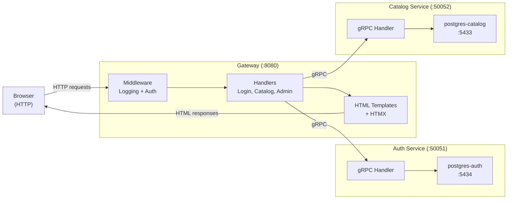

<!-- [STRUCTURAL] Chapter lead is solid: motivates the BFF (HTTP/HTML for end users) and names it before expanding. Consider a one-line "why not a React SPA?" aside, since that is the natural reader question when "build a gateway that renders HTML" is proposed in 2026. Currently that justification lives in 5.2; a forward-reference here would tighten the arc. -->
# Chapter 5: Gateway & Frontend

<!-- [STRUCTURAL] Opening paragraph does triple duty (problem statement, solution preview, pattern name). It works, but the Backend-for-Frontend acronym is introduced inside a dense sentence. Consider moving the BFF definition to its own sentence. -->
<!-- [LINE EDIT] "That is fine for service-to-service communication" → "That works for service-to-service communication" — tightens and removes a mild hedge. -->
<!-- [COPY EDIT] "Backend-for-Frontend (BFF) pattern" — CMOS defines-on-first-use convention is fine here, but prefer the lowercase "backend for frontend (BFF)" used in most industry literature (including Sam Newman's reference [^2]). The hyphenated, title-case form is a style choice; if kept, use consistently across the chapter. Currently "Backend-for-Frontend" appears here and "Backend-for-Frontend (BFF)" appears in bff-pattern.md §5.1 heading-adjacent text; "BFF" appears bare elsewhere. Lock a single form. -->
Up to this point, the only way to interact with the library system is through `grpcurl` or a gRPC client library. That is fine for service-to-service communication, but end users need a browser-friendly interface. In this chapter, we build a **gateway service** -- an HTTP server that renders HTML pages and delegates all business logic to the Auth and Catalog gRPC services behind it. This is the Backend-for-Frontend (BFF) pattern: a thin, presentation-focused layer tailored to a single client type (the browser).

<!-- [STRUCTURAL] Architecture diagram placement is correct — right after the verbal overview. Diagram is readable. -->
## Architecture Overview

<!-- [LINE EDIT] "The gateway has no database of its own. It holds no business state" — the two sentences say nearly the same thing. Consider: "The gateway has no database and holds no business state; it is a translation layer between HTTP/HTML and gRPC." -->
<!-- [COPY EDIT] "pkg/auth" should be inline code — already is. Good. -->
The gateway has no database of its own. It holds no business state -- it is a translation layer between HTTP/HTML and gRPC. Authentication state lives in a JWT cookie that the gateway validates on every request using the same `pkg/auth` library the backend services use.

<!-- [STRUCTURAL] "What You'll Learn" list is well-scoped and matches the section breakdown below. Good. -->
## What You'll Learn

- The Backend-for-Frontend pattern and why it suits microservices frontends
- Go's `net/http` stdlib router with Go 1.22+ method-based patterns
- Go's `html/template` package and the clone-per-page pattern for layouts
<!-- [COPY EDIT] "HTMX" — product name capitalization confirmed. Good. -->
<!-- [LINE EDIT] "HTMX for progressive enhancement without a JavaScript framework" — fine. -->
- HTMX for progressive enhancement without a JavaScript framework
- Cookie-based session management with JWTs
- OAuth2 flow orchestration from the browser's perspective
- Role-based access control in HTTP handlers
<!-- [COPY EDIT] "Form handling, POST-redirect-GET, and gRPC-to-HTTP error mapping" — CMOS serial comma present (6.19). Good. "POST-redirect-GET" hyphenation is inconsistent with §5.3's "POST-Redirect-GET" title case. Pick one form. Conventional is "Post/Redirect/Get" (the Wikipedia title) or all-caps "POST-REDIRECT-GET". -->
- Form handling, POST-redirect-GET, and gRPC-to-HTTP error mapping

## Prerequisites

<!-- [COPY EDIT] "Chapters 1--4 completed" — CMOS 6.78 en dash for ranges is correct; in Markdown, `--` renders as an en dash in most processors. Confirm the book's Markdown processor converts `--` → en dash (–), not em dash (—). If the processor treats `--` as em dash, change to `Chapters 1-4` or `Chapters 1 through 4`. -->
- Chapters 1--4 completed (Auth and Catalog services running via Docker Compose)
- Familiarity with HTTP, cookies, and basic HTML forms

## Sections

<!-- [STRUCTURAL] Section list matches file list. The "and" chains in each bullet are fine for a TOC-like list but feel slightly breathless. Minor. -->
<!-- [COPY EDIT] "HTMX-powered" — hyphenated compound adjective before noun (CMOS 7.81). Correct. -->
1. **[The BFF Pattern](./bff-pattern.md)** -- What a BFF is, the Server struct, stdlib routing, and middleware
2. **[Templates & HTMX](./templates-htmx.md)** -- Go templates, the clone-per-page pattern, and HTMX-powered filtering
3. **[Session Management](./session-management.md)** -- JWT cookies, login/logout flows, OAuth2 orchestration, and flash messages
4. **[Admin CRUD](./admin-crud.md)** -- Role guards, form handling, gRPC error mapping, and the Docker build
