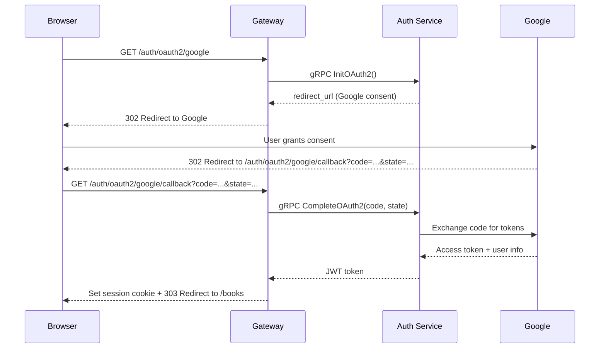

# 5.3 Session Management

<!-- [STRUCTURAL] Strong opener: ties to Chapter 4's gRPC-metadata JWT and positions the browser variant as a storage change, not a new auth mechanism. -->
<!-- [LINE EDIT] Good concision. Keep. -->
The gateway needs to know who the current user is on every request. In Chapter 4, we built JWT-based authentication for gRPC services using metadata headers. For the browser, we use the same JWTs -- but stored in cookies instead of gRPC metadata.

---

## JWT in Cookies vs. localStorage

<!-- [STRUCTURAL] Table → narrative → Spring bridge. Good pedagogical order. -->
There are two common places to store a JWT in the browser:

<!-- [LINE EDIT] "There are two common places" — existential-there. Mild. Could be "Two common places exist" or "Web apps store JWTs in one of two places:" — optional. -->
<!-- [COPY EDIT] `localStorage` is case-sensitive; correctly rendered as inline code. -->
<!-- [COPY EDIT] "HttpOnly cookie" — exact attribute casing matches RFC 6265 convention. Correct. -->
<!-- [COPY EDIT] "`SameSite`" — exact attribute casing. Correct. -->
| Storage | XSS protection | CSRF protection | Sent automatically |
|---|---|---|---|
| **`localStorage`** | Vulnerable -- any JavaScript can read it | Not vulnerable | No -- you must add an `Authorization` header manually |
| **HttpOnly cookie** | Protected -- JavaScript cannot access the cookie | Needs `SameSite` attribute | Yes -- the browser sends it on every request |

<!-- [LINE EDIT] "The tradeoff is clear:" — mild throat-clearing. Could cut: "We use HttpOnly cookies. `localStorage` is vulnerable to XSS…". -->
<!-- [COPY EDIT] "tradeoff" — CMOS prefers "trade-off" (7.89). Check house style: chapter uses "tradeoff" twice (here and in admin-crud.md "The tradeoff is"). Lock one form. -->
<!-- [COPY EDIT] "`localStorage` is vulnerable to XSS (if an attacker injects JavaScript into your page, they can steal the token)" — parenthetical is a complete sentence; grammar fine. -->
<!-- [COPY EDIT] "`SameSite`" — inline-code OK. -->
<!-- [LINE EDIT] "The CSRF risk from cookies is mitigated by the `SameSite` attribute, which prevents the browser from sending the cookie on cross-origin requests." — accurate and concise. Keep. -->
We use HttpOnly cookies. The tradeoff is clear: `localStorage` is vulnerable to XSS (if an attacker injects JavaScript into your page, they can steal the token), while HttpOnly cookies are invisible to JavaScript entirely. The CSRF risk from cookies is mitigated by the `SameSite` attribute, which prevents the browser from sending the cookie on cross-origin requests.

<!-- [LINE EDIT] "this is the same tradeoff between `JwtAuthenticationFilter` (reading from `Authorization` header, typically used by SPAs storing tokens in `localStorage`) and cookie-based session management" — parenthetical is long; consider splitting. Minor. -->
<!-- [COPY EDIT] "cookie-based session management" — hyphenated compound before noun (CMOS 7.81). Correct. -->
If you have worked with Spring Security, this is the same tradeoff between `JwtAuthenticationFilter` (reading from `Authorization` header, typically used by SPAs storing tokens in `localStorage`) and cookie-based session management.

---

## Cookie Attributes

<!-- [STRUCTURAL] Code block → per-attribute explanation → clearing variant. Textbook sequencing. -->
The `setSessionCookie` function writes the JWT to a cookie with specific security attributes:

```go
// services/gateway/internal/handler/auth.go

func setSessionCookie(w http.ResponseWriter, token string) {
    http.SetCookie(w, &http.Cookie{
        Name:     "session",
        Value:    token,
        Path:     "/",
        HttpOnly: true,
        SameSite: http.SameSiteLaxMode,
        MaxAge:   86400,
    })
}
```

Each attribute matters:

<!-- [COPY EDIT] "HttpOnly" — RFC 6265 capitalization. Correct. -->
<!-- [LINE EDIT] "This is your primary defense against XSS token theft." — good. -->
- **`HttpOnly: true`** -- The cookie is invisible to JavaScript. `document.cookie` will not include it. This is your primary defense against XSS token theft.
<!-- [COPY EDIT] "`SameSite: Lax`" — casing matches Go stdlib `http.SameSiteLaxMode`. Correct. -->
<!-- [LINE EDIT] "`Strict` would also block the cookie on top-level navigations from other sites, which breaks OAuth2 callbacks." — useful aside; keep. -->
- **`SameSite: Lax`** -- The cookie is sent on same-site requests and top-level navigations (clicking a link) but not on cross-site sub-requests (embedded images, iframes, AJAX from another domain). This prevents most CSRF attacks. `Strict` would also block the cookie on top-level navigations from other sites, which breaks OAuth2 callbacks.
<!-- [COPY EDIT] "24 hours" — CMOS 9.2 says spell out numbers zero–ninety-nine in nontechnical prose, but technical measurements use numerals (9.16). "24 hours" is fine for a duration. -->
<!-- [LINE EDIT] "no clock skew issues" — tight, accurate. -->
- **`MaxAge: 86400`** -- The cookie expires in 24 hours (matching the JWT expiration from Chapter 4). `MaxAge` is preferred over `Expires` because it is relative, not absolute -- no clock skew issues.
- **`Path: "/"`** -- The cookie is sent for all paths. Without this, the cookie would only apply to the path that set it.
<!-- [COPY EDIT] "`Secure`" — correct product/attribute capitalization. -->
<!-- [LINE EDIT] "In production, you must add `Secure: true` so the cookie is only sent over HTTPS." — good explicit production reminder. -->
- **`Secure`** is omitted because we are running on `localhost` over HTTP during development. In production, you must add `Secure: true` so the cookie is only sent over HTTPS.

<!-- [LINE EDIT] "Clearing the cookie on logout sets `MaxAge: -1`, which tells the browser to delete it immediately:" — active, tight. Keep. -->
Clearing the cookie on logout sets `MaxAge: -1`, which tells the browser to delete it immediately:

```go
func clearSessionCookie(w http.ResponseWriter) {
    http.SetCookie(w, &http.Cookie{
        Name:   "session",
        Path:   "/",
        MaxAge: -1,
    })
}
```

---

## Login Flow: POST-Redirect-GET

<!-- [COPY EDIT] "POST-Redirect-GET" — casing should be consistent with index.md (currently index.md uses "POST-redirect-GET"). Lock one form. -->
<!-- [STRUCTURAL] Good: numbered sequence first, then code. -->
The login flow follows the POST-Redirect-GET (PRG) pattern, which prevents the browser from resubmitting the form on refresh:

<!-- [COPY EDIT] "303 See Other" — HTTP reason phrase correctly capitalized. -->
1. User fills in the login form and clicks Submit.
2. Browser sends `POST /login` with form data.
3. Gateway calls the Auth service via gRPC.
4. On success: set the session cookie, set a flash message, redirect to `/books` with `303 See Other`.
5. On failure: re-render the login page with an error message (no redirect).

```go
// services/gateway/internal/handler/auth.go

func (s *Server) LoginSubmit(w http.ResponseWriter, r *http.Request) {
    email := r.FormValue("email")
    password := r.FormValue("password")
    if email == "" || password == "" {
        s.render(w, r, "login.html", map[string]any{"Error": "Email and password are required"})
        return
    }
    resp, err := s.auth.Login(r.Context(), &authv1.LoginRequest{Email: email, Password: password})
    if err != nil {
        s.render(w, r, "login.html", map[string]any{"Error": "Invalid email or password", "Email": email})
        return
    }
    setSessionCookie(w, resp.Token)
    s.setFlash(w, "Welcome back!")
    http.Redirect(w, r, "/books", http.StatusSeeOther)
}
```

<!-- [LINE EDIT] "Notice the error handling: when login fails, we re-render the form with the email pre-filled (`\"Email\": email`) so the user does not have to re-type it." — concrete and instructive. Keep. -->
<!-- [COPY EDIT] "re-type" — hyphenation per CMOS 7.89: "re" compounds with hyphen when the following word begins with a vowel or when the hyphen avoids confusion. "re-type" is borderline; "retype" is also acceptable. Minor. -->
<!-- [LINE EDIT] "We do not pre-fill the password for security reasons." — "for security reasons" is mild filler. Consider: "Pre-filling the password would leak it into browser autofill caches and HTML source." — stronger and teaches the "why". -->
Notice the error handling: when login fails, we re-render the form with the email pre-filled (`"Email": email`) so the user does not have to re-type it. We do not pre-fill the password for security reasons.

<!-- [LINE EDIT] "The `http.StatusSeeOther` (303) status code tells the browser to follow the redirect with a GET request, even though the original request was a POST." — accurate. -->
The `http.StatusSeeOther` (303) status code tells the browser to follow the redirect with a GET request, even though the original request was a POST. This is the "redirect" in PRG -- the browser's address bar now shows `/books`, and refreshing the page sends a harmless GET instead of re-posting the login form.

---

## Auth Middleware

<!-- [STRUCTURAL] The "soft auth" framing (enrich context, never block) is an important design decision and it's called out — good. -->
The auth middleware runs on every request. It reads the session cookie, validates the JWT, and injects the user's identity into the request context. If validation fails (expired token, tampered token, no cookie), the request continues as anonymous -- the middleware does not block it.

```go
// services/gateway/internal/middleware/auth.go

func Auth(next http.Handler, jwtSecret string) http.Handler {
    return http.HandlerFunc(func(w http.ResponseWriter, r *http.Request) {
        cookie, err := r.Cookie("session")
        if err != nil || cookie.Value == "" {
            next.ServeHTTP(w, r)
            return
        }
        claims, err := pkgauth.ValidateToken(cookie.Value, jwtSecret)
        if err != nil {
            // Invalid/expired token — continue as anonymous
            next.ServeHTTP(w, r)
            return
        }
        ctx := pkgauth.ContextWithUser(r.Context(), claims.UserID, claims.Role)
        next.ServeHTTP(w, r.WithContext(ctx))
    })
}
```

<!-- [LINE EDIT] "This is a \"soft\" auth middleware -- it enriches the context when a valid token is present but never rejects a request." — good, opinionated phrasing. Keep. -->
<!-- [LINE EDIT] "Individual handlers decide whether to require authentication (by checking `userFromContext`)." — good; forward-references §5.4. -->
<!-- [LINE EDIT] "This design means public pages like the catalog work for anonymous users, while protected pages like admin CRUD can redirect to login." — accurate summary. -->
This is a "soft" auth middleware -- it enriches the context when a valid token is present but never rejects a request. Individual handlers decide whether to require authentication (by checking `userFromContext`). This design means public pages like the catalog work for anonymous users, while protected pages like admin CRUD can redirect to login.

<!-- [LINE EDIT] "Compare this to Spring Security's filter chain: in Spring, you configure URL patterns in `SecurityFilterChain` to require authentication." — accurate Java-bridge. -->
<!-- [LINE EDIT] "Both approaches work -- the Go version is more explicit about the decision point." — opinionated but fair. Keep. -->
Compare this to Spring Security's filter chain: in Spring, you configure URL patterns in `SecurityFilterChain` to require authentication. In our gateway, the middleware always runs and handlers opt-in to requiring auth. Both approaches work -- the Go version is more explicit about the decision point.

---

## OAuth2 Flow Through the Gateway

<!-- [STRUCTURAL] Sequence diagram before the code is correct. Labels are clear. -->
<!-- [COPY EDIT] Mermaid "participant Go as Google" — using "Go" as the participant id conflicts with the language name used throughout the chapter. Consider "G as Google" + rename the gateway participant to "GW" to avoid the clash. -->
In Chapter 4, we implemented OAuth2 on the Auth service's gRPC API. The gateway orchestrates this flow for the browser:



<!-- [LINE EDIT] "The gateway acts as a redirect orchestrator. It does not handle OAuth2 tokens directly -- it passes the authorization code and state parameter to the Auth service, which exchanges them for user information and returns a JWT." — clean. -->
The gateway acts as a redirect orchestrator. It does not handle OAuth2 tokens directly -- it passes the authorization code and state parameter to the Auth service, which exchanges them for user information and returns a JWT.

```go
// services/gateway/internal/handler/auth.go

func (s *Server) OAuth2Start(w http.ResponseWriter, r *http.Request) {
    resp, err := s.auth.InitOAuth2(r.Context(), &authv1.InitOAuth2Request{})
    if err != nil {
        s.renderError(w, r, http.StatusInternalServerError, "Failed to initiate OAuth2 login")
        return
    }
    http.Redirect(w, r, resp.RedirectUrl, http.StatusFound)
}

func (s *Server) OAuth2Callback(w http.ResponseWriter, r *http.Request) {
    code := r.URL.Query().Get("code")
    state := r.URL.Query().Get("state")
    resp, err := s.auth.CompleteOAuth2(r.Context(), &authv1.CompleteOAuth2Request{
        Code:  code,
        State: state,
    })
    if err != nil {
        s.renderError(w, r, http.StatusUnauthorized, "OAuth2 login failed")
        return
    }
    setSessionCookie(w, resp.Token)
    s.setFlash(w, "Welcome!")
    http.Redirect(w, r, "/books", http.StatusSeeOther)
}
```

<!-- [LINE EDIT] "`OAuth2Start` uses `302 Found` (not 303) because we want the browser to follow the redirect with the same method -- standard for OAuth2 authorization redirects." — accurate and clear. -->
<!-- [COPY EDIT] Please verify: OAuth2 authorization-endpoint redirects commonly use 302/303 interchangeably; RFC 6749 does not mandate. The statement "standard for OAuth2 authorization redirects" is a simplification — acceptable for tutorial context. -->
`OAuth2Start` uses `302 Found` (not 303) because we want the browser to follow the redirect with the same method -- standard for OAuth2 authorization redirects. `OAuth2Callback` uses `303 See Other` after setting the cookie, following the PRG pattern.

---

## Flash Messages

<!-- [STRUCTURAL] Good opening: defines flash, lands Spring analogy, then explains the Go approach. -->
<!-- [LINE EDIT] "one-time notifications displayed after a redirect" — clean. -->
<!-- [COPY EDIT] "HMAC-signed" — hyphenated compound adjective (CMOS 7.81). Correct. -->
Flash messages are one-time notifications displayed after a redirect -- "Book created", "Welcome back!", etc. In Spring, you would use `RedirectAttributes.addFlashAttribute()` backed by the session store. We use a simpler approach: a short-lived cookie, HMAC-signed so the client cannot tamper with it.

```go
// services/gateway/internal/handler/render.go

func (s *Server) setFlash(w http.ResponseWriter, message string) {
    encoded, err := s.flash.Encode("flash", message)
    if err != nil {
        slog.Error("failed to encode flash cookie", "error", err)
        return
    }
    http.SetCookie(w, &http.Cookie{
        Name:     "flash",
        Value:    encoded,
        Path:     "/",
        MaxAge:   10,
        HttpOnly: true,
    })
}

func (s *Server) consumeFlash(w http.ResponseWriter, r *http.Request) string {
    c, err := r.Cookie("flash")
    if err != nil {
        return ""
    }
    http.SetCookie(w, &http.Cookie{
        Name:   "flash",
        Path:   "/",
        MaxAge: -1,
    })
    var message string
    if err := s.flash.Decode("flash", c.Value, &message); err != nil {
        return ""
    }
    return message
}
```

The pattern:

<!-- [LINE EDIT] "`MaxAge: 10` (10 seconds -- enough time for the redirect to complete)" — accurate. -->
1. Before a redirect, `setFlash` writes an HMAC-signed cookie with `MaxAge: 10` (10 seconds -- enough time for the redirect to complete).
2. The `render` function calls `consumeFlash`, which reads the cookie, verifies the signature, and immediately deletes the cookie by setting `MaxAge: -1`.
3. The template displays the flash message if it exists.

<!-- [LINE EDIT] "This is stateless -- no server-side session store needed." — tight closer. Keep. -->
This is stateless -- no server-side session store needed.

### Why sign the cookie?

<!-- [STRUCTURAL] This subsection is excellent — it narrates the security rationale as threat-modeling rather than asserting "because security". Keep. -->
<!-- [LINE EDIT] "Nothing seemed wrong with that at first" — good prose; keep. -->
<!-- [LINE EDIT] "But treating \"it would be escaped at render time\" as your only defence is fragile:" — "defence" is British spelling; rest of chapter is US ("defense" at L43). Lock one. -->
<!-- [COPY EDIT] "defence" → "defense" (CMOS prefers US spelling; chapter uses "defense" earlier, e.g., "primary defense against XSS token theft"). Change for consistency. -->
An early version of this handler wrote the message to the cookie as plaintext. Nothing seemed wrong with that at first: `html/template` auto-escapes, so even a tampered `<script>` payload would render as harmless text. But treating "it would be escaped at render time" as your only defence is fragile:

<!-- [LINE EDIT] "Any future code path that puts the flash value into a URL, a `Location` header, or a log message bypasses HTML escaping." — strong, concrete. -->
<!-- [COPY EDIT] "sloppy third-party script" — hyphenated correctly (CMOS 7.81). -->
<!-- [LINE EDIT] "Trust in UI messaging erodes." — nice one-liner; keep. -->
- Any future code path that puts the flash value into a URL, a `Location` header, or a log message bypasses HTML escaping.
- An attacker who can set cookies on your domain (XSS elsewhere, a poisoned CDN, a sloppy third-party script) can silently hand-craft flash messages that look like they came from the server. Trust in UI messaging erodes.
- The cookie is HTTP-visible in logs and proxies, so injecting hostile content there has downstream effects you do not control.

<!-- [LINE EDIT] "Signing with [`gorilla/securecookie`][securecookie] closes all of that off with one line of server-side crypto." — "one line" is mild rhetorical flourish; true enough in practice. Keep. -->
<!-- [COPY EDIT] "`HMAC(key, message) || message`" — the || is the concatenation operator common in crypto notation. Readers may not know it; brief gloss would help: "concatenates an HMAC of the message with the message itself". -->
<!-- [LINE EDIT] "A tampered value decodes to an empty string; the user sees no flash, which is the correct failure mode." — good explicit fail-safe framing. -->
Signing with [`gorilla/securecookie`][securecookie] closes all of that off with one line of server-side crypto. The server writes `HMAC(key, message) || message`, reads it back with the same key, and discards anything that does not verify. A tampered value decodes to an empty string; the user sees no flash, which is the correct failure mode.

<!-- [LINE EDIT] "same 12-Factor philosophy as `JWT_SECRET`" — 12-Factor is a proper noun; capitalization correct. -->
<!-- [COPY EDIT] "12-Factor" — per CMOS 9.7, expressing proper nouns with numerals is OK when the source brands itself this way (12factor.net). Correct. -->
<!-- [COPY EDIT] "at least 32 random bytes" — numeric threshold, CMOS 9.2 prefers numerals for technical thresholds. Correct. -->
The key must be at least 32 random bytes, read from the `FLASH_COOKIE_KEY` environment variable at startup (the gateway fails fast if it is unset -- same 12-Factor philosophy as `JWT_SECRET`). Generate one with:

```bash
openssl rand -hex 32
```

<!-- [LINE EDIT] "The codec is wired into the `Server` via a functional option so tests can spin up a server with a random per-process key without touching the 30+ constructor call sites:" — 40 words, at the edge of the pass-2 threshold. Acceptable but could split. -->
<!-- [COPY EDIT] "30+" — CMOS 9.2 prefers "more than 30" for prose. Consider "more than 30 constructor call sites". -->
<!-- [COPY EDIT] "per-process" — hyphenated compound adjective, correct. -->
The codec is wired into the `Server` via a functional option so tests can spin up a server with a random per-process key without touching the 30+ constructor call sites:

```go
srv := handler.New(authClient, catalogClient, reservationClient, searchClient, tmpl,
    handler.WithFlashKey(flashKey))
```

<!-- [COPY EDIT] Please verify: gorilla/securecookie package path (https://pkg.go.dev/github.com/gorilla/securecookie). -->
[securecookie]: https://pkg.go.dev/github.com/gorilla/securecookie

---

## Logout

<!-- [LINE EDIT] "Logout is straightforward -- clear the session cookie and redirect:" — tight. -->
Logout is straightforward -- clear the session cookie and redirect:

```go
func (s *Server) Logout(w http.ResponseWriter, r *http.Request) {
    clearSessionCookie(w)
    http.Redirect(w, r, "/", http.StatusSeeOther)
}
```

<!-- [LINE EDIT] "The JWT itself is not invalidated -- it is still valid until its `exp` claim." — accurate and honest about the limitation. -->
<!-- [LINE EDIT] "As discussed in section 4.1, true JWT revocation requires a blocklist or token versioning, which we intentionally omit for simplicity." — good back-reference. -->
<!-- [COPY EDIT] "blocklist" — one word, per current style guides. Correct. -->
The JWT itself is not invalidated -- it is still valid until its `exp` claim. But without the cookie, the browser will not send it, and the user is effectively logged out. As discussed in section 4.1, true JWT revocation requires a blocklist or token versioning, which we intentionally omit for simplicity.

<!-- [LINE EDIT] "The logout route is `POST /logout`, not `GET /logout`." — assertive and correct. -->
<!-- [LINE EDIT] "This is important: GET requests should not have side effects." — accurate HTTP semantics. -->
<!-- [COPY EDIT] "A malicious page could embed `` and log users out." — note the verb/noun split: chapter uses "log in"/"log out" as verbs (correct). Good. -->
The logout route is `POST /logout`, not `GET /logout`. This is important: GET requests should not have side effects. A malicious page could embed `` and log users out. Using POST with a form submission prevents this.

---

## References

<!-- [COPY EDIT] Please verify URLs still resolve: OWASP Session Management Cheat Sheet; MDN cookies page; RFC 6265; Wikipedia PRG; OWASP CSRF. -->
[^1]: [OWASP Session Management Cheat Sheet](https://cheatsheetseries.owasp.org/cheatsheets/Session_Management_Cheat_Sheet.html) -- Best practices for session management in web applications.
[^2]: [MDN -- Using HTTP cookies](https://developer.mozilla.org/en-US/docs/Web/HTTP/Cookies) -- Comprehensive reference on cookie attributes (HttpOnly, SameSite, Secure, etc.).
[^3]: [RFC 6265 -- HTTP State Management Mechanism](https://datatracker.ietf.org/doc/html/rfc6265) -- The cookie specification.
[^4]: [Post/Redirect/Get pattern](https://en.wikipedia.org/wiki/Post/Redirect/Get) -- Wikipedia article on the PRG pattern.
[^5]: [OWASP Cross-Site Request Forgery Prevention](https://cheatsheetseries.owasp.org/cheatsheets/Cross-Site_Request_Forgery_Prevention_Cheat_Sheet.html) -- CSRF prevention techniques including SameSite cookies.
