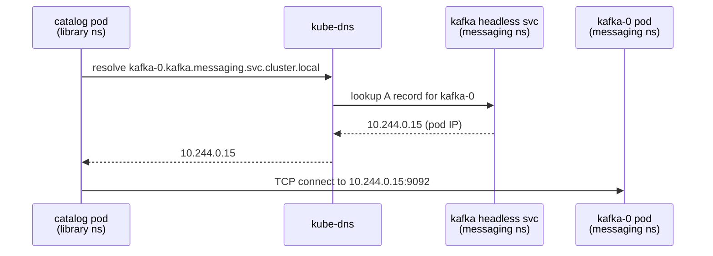

# 12.4 Infrastructure Manifests

<!-- [STRUCTURAL] Strong opening: contrast between stateless apps (Deployment) and stateful infrastructure (StatefulSet) frames the section crisply. -->
<!-- [LINE EDIT] "That is what makes Deployments work: all replicas are equivalent, any pod can be discarded." — good parallel clause. -->
<!-- [COPY EDIT] "`auth`, `catalog`, `reservation`, `search`, `gateway`" — serial comma present. Good. -->
Application services — `auth`, `catalog`, `reservation`, `search`, `gateway` — are stateless. Every pod is interchangeable. Kubernetes can kill one, schedule a replacement on a different node, and nothing is lost because state lives elsewhere. That is what makes Deployments work: all replicas are equivalent, any pod can be discarded.

<!-- [LINE EDIT] "Infrastructure is different. PostgreSQL stores your data on disk. Kafka stores committed log segments on disk. Meilisearch builds its search index on disk." — three parallel short sentences work well rhetorically. Keep. -->
<!-- [COPY EDIT] "Kubernetes has a dedicated resource for exactly this: the **StatefulSet**." — good. -->
Infrastructure is different. PostgreSQL stores your data on disk. Kafka stores committed log segments on disk. Meilisearch builds its search index on disk. When a pod restarts, that data must still be there. Kubernetes has a dedicated resource for exactly this: the **StatefulSet**.

---

## StatefulSet vs Deployment

<!-- [COPY EDIT] Heading "StatefulSet vs Deployment" — CMOS 7.59 treats "vs." with period in general prose; without period in headlines/titles. Title context here, so "vs" is acceptable. Could also use "versus." Either works in headings. Be consistent across book. -->
<!-- [LINE EDIT] "A Deployment gives pods random names (`postgres-catalog-7b4f9-xk2p`) and no guarantees about order." — good. -->
A Deployment gives pods random names (`postgres-catalog-7b4f9-xk2p`) and no guarantees about order. A StatefulSet gives you four things that Deployments do not[^1]:

<!-- [LINE EDIT] "Pods get predictable, ordinal names: `postgres-catalog-0`, `postgres-catalog-1`, and so on." — clear. -->
<!-- [COPY EDIT] "critical for databases that embed their own hostname in configuration (Kafka's `KAFKA_ADVERTISED_LISTENERS` is the canonical example)" — Kafka is not a database, but the author is using "databases" loosely to mean "stateful systems." Rephrase or clarify. Consider: "critical for stateful systems that embed their own hostname in configuration (Kafka's `KAFKA_ADVERTISED_LISTENERS` is the canonical example)." -->
**Stable network identity.** Pods get predictable, ordinal names: `postgres-catalog-0`, `postgres-catalog-1`, and so on. The name is permanent — if pod-0 is deleted and rescheduled, it comes back as pod-0 with the same DNS identity. This is critical for databases that embed their own hostname in configuration (Kafka's `KAFKA_ADVERTISED_LISTENERS` is the canonical example).

<!-- [LINE EDIT] "Pod-0 must reach the `Ready` state before pod-1 starts. Pod-1 must terminate before pod-0 during scale-down." — good specific rules. -->
<!-- [COPY EDIT] "Pod-0" / "pod-0" — casing inconsistent within the paragraph. The Kubernetes API resource is "Pod" (capitalized); the ordinal suffix is usually written as "pod-0" (lowercase). Normalize throughout. -->
<!-- [COPY EDIT] "KRaft controller election" — KRaft is Kafka's mode name, uppercase. Correct. -->
**Ordered startup and shutdown.** Pod-0 must reach the `Ready` state before pod-1 starts. Pod-1 must terminate before pod-0 during scale-down. This matters for Kafka's KRaft controller election and for any leader/follower replication scheme.

<!-- [LINE EDIT] "This is not a shared volume" — good clarification. -->
<!-- [COPY EDIT] "`volumeClaimTemplates`." — heading form with code-formatted term. Good. -->
**`volumeClaimTemplates`.** Each pod gets its own dedicated PersistentVolumeClaim. This is not a shared volume — `postgres-catalog-0` and `postgres-catalog-1` each own their own disk. With a Deployment you would have to manage PVCs by hand; with a StatefulSet the template handles it automatically.

<!-- [LINE EDIT] "A headless Service performs no load balancing — DNS resolves directly to individual pod IPs." — clear. -->
<!-- [COPY EDIT] "(`clusterIP: None`)" — backticked correctly. -->
**Headless Service.** StatefulSets pair with a headless Service (`clusterIP: None`). Normal Services load-balance across all backing pods and return a single virtual IP. A headless Service performs no load balancing — DNS resolves directly to individual pod IPs. Combined with ordinal naming, this lets you address `postgres-catalog-0.postgres-catalog.data.svc.cluster.local` and know with certainty which pod you are talking to[^2].

---

## PostgreSQL — Catalog Service

<!-- [COPY EDIT] "PostgreSQL — Catalog Service" — heading reads ambiguously ("the catalog service's PostgreSQL instance"). The "Service" here could be read as the Kubernetes Service resource. Consider "PostgreSQL — Catalog Database" or "Catalog's PostgreSQL Instance" for clarity. -->
<!-- [LINE EDIT] "The Secret is assumed to be pre-created (covered in Section 12.5)." — good forward-reference. -->
<!-- [COPY EDIT] "Section 12.5" — capital S on cross-reference inconsistent with other occurrences in this chapter (e.g., "section 12.1" in kind-setup.md). Pick one. CMOS 8.178: prose cross-references are typically lowercase ("section 12.5") unless at the start of a sentence. -->
The catalog database lives in the `data` namespace. The manifest set is three objects: a headless Service, a StatefulSet, and a ConfigMap. The Secret is assumed to be pre-created (covered in Section 12.5).

### Headless Service

```yaml
# k8s/data/postgres-catalog-svc.yaml
apiVersion: v1
kind: Service
metadata:
  name: postgres-catalog
  namespace: data
spec:
  clusterIP: None                   # headless — no load balancing
  selector:
    app: postgres-catalog
  ports:
    - name: postgres
      port: 5432
      targetPort: 5432
```

<!-- [COPY EDIT] Comment path: `k8s/data/postgres-catalog-svc.yaml` — but in app-manifests.md and kustomize.md the path convention is `deploy/k8s/base/...`. Normalize the prefix; pick one (`k8s/` or `deploy/k8s/base/`) and apply across chapter. -->
<!-- [LINE EDIT] "With this in place, the DNS name `postgres-catalog.data.svc.cluster.local` resolves to the pod IP directly." — correct for a single-pod StatefulSet backed by a headless Service. For multi-pod, DNS returns A records for all ready pods. -->
`clusterIP: None` is the entire definition of a headless Service. With this in place, the DNS name `postgres-catalog.data.svc.cluster.local` resolves to the pod IP directly. Because the StatefulSet will create a pod named `postgres-catalog-0`, that pod is reachable at the full FQDN:

```
postgres-catalog-0.postgres-catalog.data.svc.cluster.local:5432
```

The format is `<pod-name>.<service-name>.<namespace>.svc.cluster.local`[^4]. Your application ConfigMaps will use this address as `DATABASE_URL`.

### ConfigMap

```yaml
# k8s/data/postgres-catalog-cm.yaml
apiVersion: v1
kind: ConfigMap
metadata:
  name: postgres-catalog-config
  namespace: data
data:
  POSTGRES_DB: catalog
  POSTGRES_USER: postgres
```

<!-- [LINE EDIT] "These two values correspond to the Docker Compose environment variables `POSTGRES_CATALOG_DB` and `POSTGRES_CATALOG_USER`." — useful Compose → K8s mapping. -->
<!-- [COPY EDIT] Please verify: the postgres:16-alpine image uses POSTGRES_DB and POSTGRES_USER environment variables (not POSTGRES_CATALOG_DB). Correct — the per-pod ConfigMap scopes the variables. -->
These two values correspond to the Docker Compose environment variables `POSTGRES_CATALOG_DB` and `POSTGRES_CATALOG_USER`. The password is intentionally absent here — it belongs in a Secret.

### StatefulSet

```yaml
# k8s/data/postgres-catalog-sts.yaml
apiVersion: apps/v1
kind: StatefulSet
metadata:
  name: postgres-catalog
  namespace: data
spec:
  serviceName: postgres-catalog     # must match the headless Service name
  replicas: 1
  selector:
    matchLabels:
      app: postgres-catalog
  template:
    metadata:
      labels:
        app: postgres-catalog
    spec:
      containers:
        - name: postgres
          image: postgres:16-alpine
          ports:
            - containerPort: 5432
          envFrom:
            - configMapRef:
                name: postgres-catalog-config
          env:
            - name: POSTGRES_PASSWORD
              valueFrom:
                secretKeyRef:
                  name: postgres-catalog-secret
                  key: POSTGRES_PASSWORD
          readinessProbe:
            exec:
              command: ["pg_isready", "-U", "postgres"]
            initialDelaySeconds: 5
            periodSeconds: 5
            failureThreshold: 5
          volumeMounts:
            - name: postgres-data
              mountPath: /var/lib/postgresql/data
  volumeClaimTemplates:
    - metadata:
        name: postgres-data
      spec:
        accessModes: ["ReadWriteOnce"]
        resources:
          requests:
            storage: 1Gi
```

<!-- [STRUCTURAL] Good follow-up commentary highlighting the important fields. Four bullets is the right density. -->
<!-- [COPY EDIT] "postgres:16-alpine" — using a minor version tag. Good practice; better than `postgres:latest`. Please verify: postgres:16-alpine image still exists in Docker Hub and is actively maintained. Correct as of recent Docker Hub listings. -->
<!-- [COPY EDIT] This StatefulSet lacks the securityContext blocks (runAsNonRoot, readOnlyRootFilesystem) that app-manifests.md emphasised as "principle of least privilege" and recommends for all manifests. For databases this is harder (readOnlyRootFilesystem breaks Postgres; it needs to write). Consider an aside: "Note: unlike the stateless services, PostgreSQL needs write access to its data volume; we leave runAsNonRoot and readOnlyRootFilesystem off for StatefulSets because Postgres requires writable paths in /var/lib/postgresql/data and sometimes /tmp. Production setups can still tighten this (e.g., runAsUser: 999 matching the postgres user in the image)." -->
Points worth calling out:

<!-- [LINE EDIT] "Kubernetes uses this to build the per-pod DNS records." — clear and correct. -->
- `serviceName: postgres-catalog` links the StatefulSet to the headless Service. Kubernetes uses this to build the per-pod DNS records.
<!-- [LINE EDIT] "`env` adds `POSTGRES_PASSWORD` from the Secret — the two mechanisms compose cleanly." — good summary. -->
- `envFrom` loads `POSTGRES_DB` and `POSTGRES_USER` from the ConfigMap as environment variables. `env` adds `POSTGRES_PASSWORD` from the Secret — the two mechanisms compose cleanly.
<!-- [LINE EDIT] "This is exactly the same health check used in `docker-compose.yml` (the `pg_isready` call in the `healthcheck.test` array)." — good Compose cross-reference. -->
- The readiness probe runs `pg_isready -U postgres` inside the container. This is exactly the same health check used in `docker-compose.yml` (the `pg_isready` call in the `healthcheck.test` array). A pod that fails this probe is removed from Service endpoints, so traffic never routes to an unready database.
<!-- [LINE EDIT] "`volumeClaimTemplates` creates a PVC named `postgres-data-postgres-catalog-0` automatically." — good concrete example. -->
<!-- [COPY EDIT] "the data is not lost" — correct. PVC retention policy is separate from pod lifecycle. -->
- `volumeClaimTemplates` creates a PVC named `postgres-data-postgres-catalog-0` automatically. When the pod restarts, Kubernetes rebinds the same PVC — the data is not lost[^3].

---

## PostgreSQL — Auth and Reservation

<!-- [STRUCTURAL] Good pattern: avoid boilerplate repetition by documenting only the diffs. -->
The auth and reservation databases follow the same pattern. Only the names and database values differ:

<!-- [COPY EDIT] The code block presents a list of field paths and target values. This is not valid YAML; it reads as a diff-like pseudocode. Consider a visual cue (e.g., prefix with `# Changes:` or use markdown table) so readers don't try to copy-paste it. Or just use a prose list. -->
```yaml
# postgres-auth: change these fields throughout the catalog template
metadata.name:        postgres-auth
spec.serviceName:     postgres-auth
selector/labels:      app: postgres-auth
configMapRef.name:    postgres-auth-config
secretKeyRef.name:    postgres-auth-secret

# ConfigMap
POSTGRES_DB: auth
POSTGRES_USER: postgres
```

```yaml
# postgres-reservation: change these fields throughout the catalog template
metadata.name:        postgres-reservation
spec.serviceName:     postgres-reservation
selector/labels:      app: postgres-reservation
configMapRef.name:    postgres-reservation-config
secretKeyRef.name:    postgres-reservation-secret

# ConfigMap
POSTGRES_DB: reservation
POSTGRES_USER: postgres
```

The resulting FQDNs for application ConfigMaps:

```
postgres-auth-0.postgres-auth.data.svc.cluster.local:5432
postgres-reservation-0.postgres-reservation.data.svc.cluster.local:5432
```

---

## Kafka

<!-- [STRUCTURAL] Good focused opening: names the problem (advertised listener must resolve across namespaces) before showing the fix. -->
Kafka lives in the `messaging` namespace. The configuration is more involved because Kafka's advertised listener must resolve correctly from clients in a different namespace.

### The Networking Problem

<!-- [LINE EDIT] "In Docker Compose, `KAFKA_ADVERTISED_LISTENERS: "PLAINTEXT://kafka:9092"` works because all containers share the `library-net` bridge network and `kafka` resolves via Docker's built-in DNS." — good diagnostic preamble. -->
<!-- [COPY EDIT] "A pod in the `library` namespace resolving `kafka:9092` will fail — that name is not in scope." — accurate. -->
In Docker Compose, `KAFKA_ADVERTISED_LISTENERS: "PLAINTEXT://kafka:9092"` works because all containers share the `library-net` bridge network and `kafka` resolves via Docker's built-in DNS. In Kubernetes, services in different namespaces cannot use short names. A pod in the `library` namespace resolving `kafka:9092` will fail — that name is not in scope.

<!-- [COPY EDIT] "When Kafka starts, it registers its advertised listener address with ZooKeeper (or, in KRaft mode, with the controller quorum)." — good distinction between modes. -->
<!-- [LINE EDIT] "If Kafka advertises the full FQDN `kafka-0.kafka.messaging.svc.cluster.local:9092`, any pod in the cluster can connect regardless of namespace." — clean statement of the fix. -->
The fix is the FQDN. When Kafka starts, it registers its advertised listener address with ZooKeeper (or, in KRaft mode, with the controller quorum). Clients use that address to establish connections. If Kafka advertises `kafka:9092`, a client in `library` cannot reach it. If Kafka advertises the full FQDN `kafka-0.kafka.messaging.svc.cluster.local:9092`, any pod in the cluster can connect regardless of namespace.

### ConfigMap

```yaml
# k8s/messaging/kafka-cm.yaml
apiVersion: v1
kind: ConfigMap
metadata:
  name: kafka-config
  namespace: messaging
data:
  KAFKA_NODE_ID: "1"
  KAFKA_PROCESS_ROLES: "broker,controller"
  KAFKA_LISTENERS: "PLAINTEXT://:9092,CONTROLLER://:9093"
  KAFKA_ADVERTISED_LISTENERS: "PLAINTEXT://kafka-0.kafka.messaging.svc.cluster.local:9092"
  KAFKA_CONTROLLER_QUORUM_VOTERS: "1@kafka-0.kafka.messaging.svc.cluster.local:9093"
  KAFKA_CONTROLLER_LISTENER_NAMES: "CONTROLLER"
  KAFKA_LISTENER_SECURITY_PROTOCOL_MAP: "CONTROLLER:PLAINTEXT,PLAINTEXT:PLAINTEXT"
  KAFKA_AUTO_CREATE_TOPICS_ENABLE: "true"
```

<!-- [COPY EDIT] "KAFKA_AUTO_CREATE_TOPICS_ENABLE: 'true'" — auto-create is convenient for development; production typically disables it. Consider a brief aside: "For production we disable auto-create and provision topics explicitly (see Chapter 13 on ops topics)." -->
Compare with Docker Compose:

| Variable | Docker Compose | Kubernetes |
|---|---|---|
| `KAFKA_ADVERTISED_LISTENERS` | `PLAINTEXT://kafka:9092` | `PLAINTEXT://kafka-0.kafka.messaging.svc.cluster.local:9092` |
| `KAFKA_CONTROLLER_QUORUM_VOTERS` | `1@kafka:9093` | `1@kafka-0.kafka.messaging.svc.cluster.local:9093` |

<!-- [LINE EDIT] "The mode does not change between environments; only the addresses do." — pithy. Keep. -->
Everything else — KRaft mode, `KAFKA_PROCESS_ROLES: "broker,controller"`, no ZooKeeper — is identical. The mode does not change between environments; only the addresses do.

### Headless Service

```yaml
# k8s/messaging/kafka-svc.yaml
apiVersion: v1
kind: Service
metadata:
  name: kafka
  namespace: messaging
spec:
  clusterIP: None
  selector:
    app: kafka
  ports:
    - name: broker
      port: 9092
      targetPort: 9092
    - name: controller
      port: 9093
      targetPort: 9093
```

### StatefulSet

```yaml
# k8s/messaging/kafka-sts.yaml
apiVersion: apps/v1
kind: StatefulSet
metadata:
  name: kafka
  namespace: messaging
spec:
  serviceName: kafka
  replicas: 1
  selector:
    matchLabels:
      app: kafka
  template:
    metadata:
      labels:
        app: kafka
    spec:
      containers:
        - name: kafka
          image: apache/kafka:3.9
          ports:
            - containerPort: 9092
            - containerPort: 9093
          envFrom:
            - configMapRef:
                name: kafka-config
          readinessProbe:
            exec:
              command:
                - /bin/sh
                - -c
                - /opt/kafka/bin/kafka-topics.sh --bootstrap-server localhost:9092 --list
            initialDelaySeconds: 30
            periodSeconds: 10
            failureThreshold: 5
          volumeMounts:
            - name: kafka-data
              mountPath: /var/lib/kafka/data
  volumeClaimTemplates:
    - metadata:
        name: kafka-data
      spec:
        accessModes: ["ReadWriteOnce"]
        resources:
          requests:
            storage: 2Gi
```

<!-- [COPY EDIT] Please verify: `apache/kafka:3.9` — Apache Kafka 3.9 was released late 2024. Confirm tag exists. https://hub.docker.com/r/apache/kafka/tags -->
<!-- [COPY EDIT] "kafka-topics.sh" path — `/opt/kafka/bin/kafka-topics.sh` — verify: the apache/kafka image installs Kafka to /opt/kafka/. Correct. -->
<!-- [LINE EDIT] "A 30-second initial delay gives KRaft time to elect a controller before the first probe fires." — good rationale. -->
<!-- [COPY EDIT] "30-second" — CMOS 7.81 hyphenate compound modifier before noun. Good. -->
The readiness probe mirrors the Docker Compose health check: run `kafka-topics.sh --list` against `localhost:9092`. A 30-second initial delay gives KRaft time to elect a controller before the first probe fires.

---

## Meilisearch

<!-- [LINE EDIT] "Meilisearch is straightforward compared to Kafka — single instance, HTTP API, simple environment configuration." — good summary. -->
Meilisearch is straightforward compared to Kafka — single instance, HTTP API, simple environment configuration.

### ConfigMap

```yaml
# k8s/data/meilisearch-cm.yaml
apiVersion: v1
kind: ConfigMap
metadata:
  name: meilisearch-config
  namespace: data
data:
  MEILI_ENV: development
  MEILI_NO_ANALYTICS: "true"
```

<!-- [COPY EDIT] `MEILI_ENV: development` — for production deployments, this should be `production`. The overlay (12.5) should patch this. Currently the base is development-defaulted, which contradicts the principle of keeping environment-specific values out of the base (app-manifests.md stated this principle for Secrets; same applies here). Consider moving MEILI_ENV to the overlay. -->
<!-- [LINE EDIT] "The master key is a secret, not a ConfigMap value. It will be injected from `meilisearch-secret`." — good pointer. -->
The master key is a secret, not a ConfigMap value. It will be injected from `meilisearch-secret`.

### StatefulSet

```yaml
# k8s/data/meilisearch-sts.yaml
apiVersion: apps/v1
kind: StatefulSet
metadata:
  name: meilisearch
  namespace: data
spec:
  serviceName: meilisearch
  replicas: 1
  selector:
    matchLabels:
      app: meilisearch
  template:
    metadata:
      labels:
        app: meilisearch
    spec:
      containers:
        - name: meilisearch
          image: getmeili/meilisearch:v1.12
          ports:
            - containerPort: 7700
          envFrom:
            - configMapRef:
                name: meilisearch-config
          env:
            - name: MEILI_MASTER_KEY
              valueFrom:
                secretKeyRef:
                  name: meilisearch-secret
                  key: MEILI_MASTER_KEY
          readinessProbe:
            httpGet:
              path: /health
              port: 7700
            initialDelaySeconds: 5
            periodSeconds: 5
            failureThreshold: 5
          volumeMounts:
            - name: meili-data
              mountPath: /meili_data
  volumeClaimTemplates:
    - metadata:
        name: meili-data
      spec:
        accessModes: ["ReadWriteOnce"]
        resources:
          requests:
            storage: 1Gi
```

<!-- [COPY EDIT] Please verify: `getmeili/meilisearch:v1.12` — Meilisearch 1.12 released in late 2024. Confirm tag. https://hub.docker.com/r/getmeili/meilisearch/tags -->
<!-- [LINE EDIT] "Kubernetes calls `GET /health` on port 7700 directly — no shell wrapper needed." — clean. -->
<!-- [LINE EDIT] "This matches the Docker Compose health check (`wget --spider http://localhost:7700/health`), just expressed in Kubernetes-native syntax." — good bridge. -->
The readiness probe is HTTP rather than `exec`. Kubernetes calls `GET /health` on port 7700 directly — no shell wrapper needed. A `200 OK` response signals the pod is ready. This matches the Docker Compose health check (`wget --spider http://localhost:7700/health`), just expressed in Kubernetes-native syntax.

<!-- [LINE EDIT] "Meilisearch's headless Service follows the same pattern as the others, with port 7700." — tucked-away mention. Reader might miss it — consider showing at least the Service snippet for completeness (3 lines). -->
<!-- [STRUCTURAL] Meilisearch Service is not shown explicitly. The kustomize.md directory listing expects `meilisearch-service.yaml` (named `meilisearch-svc.yaml` here per comment prefix). Show the YAML snippet for completeness, like the others. -->
Meilisearch's headless Service follows the same pattern as the others, with port 7700.

---

## Cross-Namespace Service Discovery

<!-- [STRUCTURAL] Nice wrap-up subsection that consolidates the DNS story across all infra. Good teaching moment. -->
With these manifests deployed, application service ConfigMaps reference infrastructure using FQDNs:

```
postgres-catalog-0.postgres-catalog.data.svc.cluster.local:5432
postgres-auth-0.postgres-auth.data.svc.cluster.local:5432
postgres-reservation-0.postgres-reservation.data.svc.cluster.local:5432
meilisearch-0.meilisearch.data.svc.cluster.local:7700
kafka-0.kafka.messaging.svc.cluster.local:9092
```

<!-- [COPY EDIT] "meilisearch-0.meilisearch.data.svc.cluster.local:7700" — but search-configmap.yaml in app-manifests.md uses `MEILI_URL: "http://meilisearch.data.svc.cluster.local:7700"` (without pod ordinal). Inconsistency between sections: decide whether the app references the pod directly (preferred for StatefulSets per 12.4's teaching) or via the regular Service name. Reconcile. -->
This is how DNS resolution works for a pod in the `library` namespace reaching `kafka-0.kafka.messaging.svc.cluster.local`[^4]:



<!-- [COPY EDIT] Diagram: "HS as kafka headless svc" — "svc" abbreviation inconsistent with "kube-dns" full name. Minor. -->
<!-- [COPY EDIT] "kube-dns" — actually CoreDNS in modern kind/Kubernetes clusters (since ~1.13). "kube-dns" was the name of the Service/Deployment but the actual DNS server is CoreDNS. For technical precision, use "CoreDNS" in the diagram and prose. Not a hard error — Kubernetes docs still use "kube-dns" as the Service name. Flag as a query. -->
<!-- [LINE EDIT] "Key point: the headless Service does not proxy traffic. It only provides DNS records." — emphatic and correct. -->
Key point: the headless Service does not proxy traffic. It only provides DNS records. Kubernetes DNS populates an A record per pod in the StatefulSet, using the pod's ordinal name as a subdomain of the service name. When `catalog` connects to `kafka-0.kafka.messaging.svc.cluster.local`, it is connecting directly to the Kafka pod IP — there is no intermediate load balancer.

---

## Kustomization Files

<!-- [STRUCTURAL] Same concern as in app-manifests.md: Kustomize is introduced in 12.5 but used here. Add a brief pointer: "We cover Kustomize in detail in section 12.5; for now treat these files as resource manifests." -->
Each namespace has a `kustomization.yaml` that lists its resources, making `kubectl apply -k` work against the directory.

```yaml
# k8s/data/kustomization.yaml
apiVersion: kustomize.config.k8s.io/v1beta1
kind: Kustomization
namespace: data
resources:
  - postgres-catalog-svc.yaml
  - postgres-catalog-cm.yaml
  - postgres-catalog-sts.yaml
  - postgres-auth-svc.yaml
  - postgres-auth-cm.yaml
  - postgres-auth-sts.yaml
  - postgres-reservation-svc.yaml
  - postgres-reservation-cm.yaml
  - postgres-reservation-sts.yaml
  - meilisearch-svc.yaml
  - meilisearch-cm.yaml
  - meilisearch-sts.yaml
```

<!-- [COPY EDIT] Filename inconsistency: the kustomize.md directory listing uses `...-configmap.yaml`, `...-service.yaml`, `...-statefulset.yaml` suffixes, but here they are `-cm.yaml`, `-svc.yaml`, `-sts.yaml`. Pick one. Recommend the full names (clearer for humans) unless there's a directory reason to use the short forms. -->
```yaml
# k8s/messaging/kustomization.yaml
apiVersion: kustomize.config.k8s.io/v1beta1
kind: Kustomization
namespace: messaging
resources:
  - kafka-svc.yaml
  - kafka-cm.yaml
  - kafka-sts.yaml
```

<!-- [LINE EDIT] "Kustomize processes all listed resources as a single transaction — namespace, ConfigMaps, Services, and StatefulSets are applied together." — "single transaction" is imprecise. Kubernetes has no multi-resource transactional apply; kubectl streams them individually. Consider "as a single apply operation" or "as a batch." -->
<!-- [COPY EDIT] "Ordering within the apply is handled by the Kubernetes API server, which creates namespaced resources after the namespace object exists." — but this kustomization.yaml does NOT include the namespace object. It relies on the namespace being pre-created by the base kustomization.yaml. Worth clarifying. -->
Apply the full `data` namespace:

```bash
kubectl apply -k k8s/data/
```

Apply just messaging:

```bash
kubectl apply -k k8s/messaging/
```

Kustomize processes all listed resources as a single transaction — namespace, ConfigMaps, Services, and StatefulSets are applied together. Ordering within the apply is handled by the Kubernetes API server, which creates namespaced resources after the namespace object exists.

---

## Summary

| Resource | Purpose |
|---|---|
| StatefulSet | Manages stateful pods with stable identity and ordered lifecycle |
| Headless Service (`clusterIP: None`) | Provides per-pod DNS records without load balancing |
| `volumeClaimTemplates` | Provisions a dedicated PVC per pod automatically |
| FQDN in advertised listeners | Enables cross-namespace connectivity from `library` to `messaging` |
| ConfigMap | Non-secret environment configuration |
| Secret reference | Injects passwords and keys without embedding them in manifests |

<!-- [LINE EDIT] "The next section covers Secrets management — how to create the `postgres-catalog-secret`, `meilisearch-secret`, and similar objects without committing credentials to the repository." — but 12.5 is Kustomize Environments, covering secret generation along with overlays. The phrasing implies secrets are the main topic of 12.5; rework to reflect the broader overlay topic. -->
<!-- [FINAL] "The next section covers Secrets management" → "The next section covers Kustomize environments — including how to generate secrets for local development without committing credentials." -->
The next section covers Secrets management — how to create the `postgres-catalog-secret`, `meilisearch-secret`, and similar objects without committing credentials to the repository.

---

[^1]: StatefulSets: https://kubernetes.io/docs/concepts/workloads/controllers/statefulset/
[^2]: Headless Services: https://kubernetes.io/docs/concepts/services-networking/service/#headless-services
[^3]: Persistent Volumes: https://kubernetes.io/docs/concepts/storage/persistent-volumes/
[^4]: DNS for Services and Pods: https://kubernetes.io/docs/concepts/services-networking/dns-pod-service/
