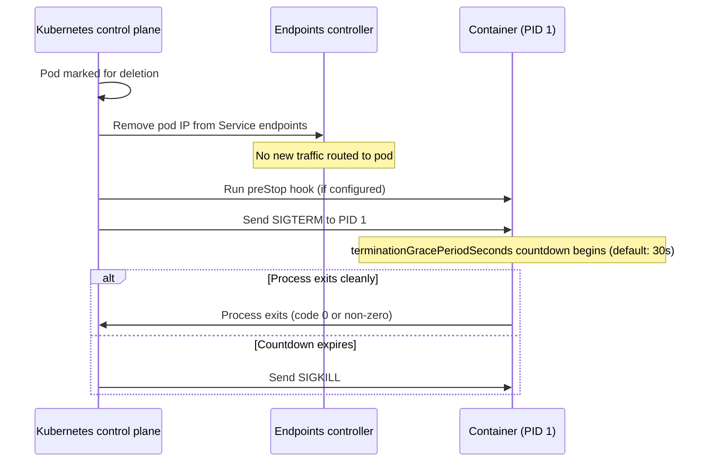

# 12.2 Preparing Services for Kubernetes

<!-- [STRUCTURAL] Strong opening: frames the two code-level concerns (graceful shutdown, health checks) and explains why Kubernetes demands more than Compose. Motivates the whole section. -->
<!-- [LINE EDIT] "Docker Compose was forgiving about both — containers could exit abruptly without consequence and Compose had no built-in mechanism to check whether a service was actually ready to handle traffic." — well over 40 words when combined with the next sentence. Consider splitting at "was forgiving about both —". -->
<!-- [COPY EDIT] "Kubernetes is not forgiving." — strong, short. Keep. -->
<!-- [COPY EDIT] "configurable window" — good. -->
Before writing a single manifest, two code-level concerns need addressing: graceful shutdown and health checks. Docker Compose was forgiving about both — containers could exit abruptly without consequence and Compose had no built-in mechanism to check whether a service was actually ready to handle traffic. Kubernetes is not forgiving. It manages pod termination with a structured lifecycle, routes traffic based on probe results, and will kill a pod that fails to terminate cleanly within a configurable window. Getting both right before touching YAML saves a lot of confusing debugging later.

---

## Graceful Shutdown

### The Pod Termination Lifecycle

<!-- [LINE EDIT] "When Kubernetes decides to stop a pod — whether because of a rolling update, a node drain, or a manual `kubectl delete pod` — it follows this sequence" — clear. -->
When Kubernetes decides to stop a pod — whether because of a rolling update, a node drain, or a manual `kubectl delete pod` — it follows this sequence[^1]:



<!-- [STRUCTURAL] Good use of sequence diagram here — the two-line commentary after it (race between endpoint removal and SIGTERM) is the critical insight. Keep diagram + prose pairing. -->
<!-- [LINE EDIT] "endpoint removal and `SIGTERM` are issued concurrently — there is a race between traffic stopping and your process receiving the signal" — tighten: "Kubernetes issues endpoint removal and `SIGTERM` concurrently; there's a race between traffic stopping and your process receiving the signal." -->
<!-- [COPY EDIT] "A `preStop` sleep hook (e.g., `sleep 5`)" — CMOS 6.43: "e.g.," followed by comma. Good. -->
<!-- [COPY EDIT] "30 seconds (by default)" / "default: 30s" earlier — pick one style. Consider prose: "30 seconds by default". -->
Two things are important here. First, endpoint removal and `SIGTERM` are issued concurrently — there is a race between traffic stopping and your process receiving the signal. A `preStop` sleep hook (e.g., `sleep 5`) is the conventional workaround: it gives the load balancer time to drain in-flight connections before shutdown begins. Second, you have up to 30 seconds (by default) between `SIGTERM` and `SIGKILL`. Any work that exceeds that window is forcibly interrupted.

### Why It Matters

<!-- [STRUCTURAL] The three concrete failure modes (gRPC, Kafka, DB) anchor the abstract "signal handling matters" claim. Strong pedagogical move. -->
Without signal handling, when Kubernetes sends `SIGTERM` during a rolling update:

<!-- [LINE EDIT] "Callers receive an `UNAVAILABLE` error. If the client has no retry logic, that RPC is lost." — correct. -->
- **gRPC servers** drop in-flight RPCs mid-stream. Callers receive an `UNAVAILABLE` error. If the client has no retry logic, that RPC is lost.
<!-- [LINE EDIT] "Kafka consumers do not commit their current offset. On restart, the consumer re-processes messages it already handled." — good concrete consequence. -->
- **Kafka consumers** do not commit their current offset. On restart, the consumer re-processes messages it already handled. Depending on whether your handlers are idempotent, this causes duplicate side effects.
<!-- [COPY EDIT] "connections evaporate" — vivid but imprecise; the connections are terminated by the kernel when the process is SIGKILLed. Consider "connections are force-closed" or "connections terminate abruptly." -->
- **Database connections** in the GORM pool are not closed cleanly. PostgreSQL sees the connections evaporate and eventually times them out, but during the window you may hit connection limits under high churn.

Handling `SIGTERM` lets each component finish what it is doing and shut down in a controlled order.

### The Go Pattern: `signal.NotifyContext`

<!-- [COPY EDIT] "`signal.NotifyContext`" — backticked correctly. -->
<!-- [LINE EDIT] "The standard library's `signal.NotifyContext` creates a `context.Context` that is cancelled when a specified signal is received." — good. -->
The standard library's `signal.NotifyContext` creates a `context.Context` that is cancelled when a specified signal is received. Passing this context to long-running goroutines gives them a clean cancellation signal:

```go
ctx, cancel := signal.NotifyContext(context.Background(), syscall.SIGINT, syscall.SIGTERM)
defer cancel()
```

<!-- [LINE EDIT] "The Kafka consumers in catalog and search already use this pattern" — good internal cross-reference. -->
<!-- [COPY EDIT] "`grpcServer.Serve` is not wired to the same context" — correct. -->
The Kafka consumers in catalog and search already use this pattern — the consumer loop checks `ctx.Done()` and exits cleanly when the context is cancelled. The gap is that `grpcServer.Serve` is not wired to the same context. It runs forever until the process dies.

<!-- [LINE EDIT] "The fix is a goroutine that waits for context cancellation and then calls `grpcServer.GracefulStop()`. `GracefulStop` stops the server from accepting new connections and blocks until all active RPCs complete, then returns. The `Serve` call unblocks when `GracefulStop` is called." — 3 sentences, dense but correct. The third sentence slightly repeats the second. Consider dropping "The `Serve` call unblocks when `GracefulStop` is called" — implicit in the preceding sentence. -->
The fix is a goroutine that waits for context cancellation and then calls `grpcServer.GracefulStop()`. `GracefulStop` stops the server from accepting new connections and blocks until all active RPCs complete, then returns. The `Serve` call unblocks when `GracefulStop` is called.

### Catalog: Wire the Existing Context

<!-- [STRUCTURAL] Service-by-service walkthrough. Each one is small. Good pedagogical scaffolding. -->
Catalog already has `signal.NotifyContext`. It just needs the shutdown goroutine added before the `Serve` call:

```diff
 ctx, cancel := signal.NotifyContext(context.Background(), syscall.SIGINT, syscall.SIGTERM)
 defer cancel()

 if len(brokers) > 0 {
     go func() {
         slog.Info("starting kafka consumer", "topic", "reservations")
         if err := consumer.Run(ctx, brokers, "reservations", catalogSvc); err != nil {
             slog.Error("kafka consumer error", "error", err)
         }
     }()
 }

 // ... listener and server setup ...

+go func() {
+    <-ctx.Done()
+    slog.Info("shutting down catalog gRPC server")
+    grpcServer.GracefulStop()
+}()
+
 slog.Info("catalog service listening", "port", grpcPort)
 if err := grpcServer.Serve(lis); err != nil {
     slog.Error("failed to serve", "error", err)
     os.Exit(1)
 }
```

<!-- [LINE EDIT] "When `SIGTERM` arrives, `ctx.Done()` is closed, the goroutine calls `GracefulStop`, and `Serve` returns." — clean. -->
<!-- [COPY EDIT] "`main` proceeds through its `defer` statements (OTel shutdown, Kafka publisher close, GORM connection pool teardown) and exits cleanly." — the three concrete defers earn their parenthetical mention. -->
When `SIGTERM` arrives, `ctx.Done()` is closed, the goroutine calls `GracefulStop`, and `Serve` returns. `main` proceeds through its `defer` statements (OTel shutdown, Kafka publisher close, GORM connection pool teardown) and exits cleanly.

### Auth: Add Signal Handling

<!-- [LINE EDIT] "Auth currently has no signal handling at all — `main` just calls `grpcServer.Serve` and blocks." — good. -->
<!-- [COPY EDIT] "Auth uses `log` rather than `slog`, so keep that consistent" — good rationale for keeping two logging styles (matches existing code). -->
Auth currently has no signal handling at all — `main` just calls `grpcServer.Serve` and blocks. Add both the context and the shutdown goroutine. Auth uses `log` rather than `slog`, so keep that consistent:

```diff
+import (
+    "os/signal"
+    "syscall"
+    // ... existing imports ...
+)

+ctx, cancel := signal.NotifyContext(context.Background(), syscall.SIGINT, syscall.SIGTERM)
+defer cancel()
+
 lis, err := net.Listen("tcp", ":"+grpcPort)
 if err != nil {
     log.Fatalf("failed to listen: %v", err)
 }

 grpcServer := grpc.NewServer(grpc.UnaryInterceptor(interceptor))
 authv1.RegisterAuthServiceServer(grpcServer, authHandler)
 reflection.Register(grpcServer)

+go func() {
+    <-ctx.Done()
+    log.Println("shutting down auth gRPC server")
+    grpcServer.GracefulStop()
+}()
+
 log.Printf("auth service listening on :%s", grpcPort)
 if err := grpcServer.Serve(lis); err != nil {
     log.Fatalf("failed to serve: %v", err)
 }
```

### Reservation: Same Pattern

<!-- [LINE EDIT] "Reservation uses `slog` and already imports `context`. Add `os/signal` and `syscall` to the imports, then the same two blocks:" — clean tutorial prose. -->
Reservation uses `slog` and already imports `context`. Add `os/signal` and `syscall` to the imports, then the same two blocks:

```diff
+import (
+    "os/signal"
+    "syscall"
+    // ... existing imports ...
+)

+ctx, cancel := signal.NotifyContext(context.Background(), syscall.SIGINT, syscall.SIGTERM)
+defer cancel()
+
 // ... repo, service, handler wiring ...

 grpcServer := grpc.NewServer(
     grpc.StatsHandler(otelgrpc.NewServerHandler()),
     grpc.UnaryInterceptor(interceptor),
 )
 reservationv1.RegisterReservationServiceServer(grpcServer, reservationHandler)
 reflection.Register(grpcServer)

+go func() {
+    <-ctx.Done()
+    slog.Info("shutting down reservation gRPC server")
+    grpcServer.GracefulStop()
+}()
+
 slog.Info("reservation service listening", "port", grpcPort)
 if err := grpcServer.Serve(lis); err != nil {
     slog.Error("failed to serve", "error", err)
     os.Exit(1)
 }
```

<!-- [STRUCTURAL] The "One note on variable naming" paragraph is a useful tip but interrupts the service-by-service rhythm. Consider converting to a callout/aside or moving to the end of the Graceful Shutdown subsection. -->
<!-- [LINE EDIT] "the OTel `shutdown` func should not receive a cancelled context at teardown time" — correct and worth stating. -->
One note on variable naming: reservation initialises `otelCtx` as a separate `context.Background()` at the top of `main` specifically for the OTel shutdown defer. Keep that separate variable — the OTel `shutdown` func should not receive a cancelled context at teardown time. Use the signal context only for the gRPC server and any consumers.

### Search: Wire the Existing Context

Search already has `signal.NotifyContext` (used for the Kafka consumer and bootstrap). The same goroutine pattern applies:

```diff
 log.Printf("search service listening on :%s", grpcPort)

+go func() {
+    <-ctx.Done()
+    log.Println("shutting down search gRPC server")
+    grpcServer.GracefulStop()
+}()
+
 if err := grpcServer.Serve(lis); err != nil {
     log.Fatalf("failed to serve: %v", err)
 }
```

### Gateway: HTTP Graceful Shutdown

<!-- [LINE EDIT] "The standard library's `http.Server` has a `Shutdown(ctx context.Context)` method that stops the listener, closes idle connections, and waits for active connections to complete." — good. -->
The gateway uses `net/http` rather than gRPC. The standard library's `http.Server` has a `Shutdown(ctx context.Context)` method that stops the listener, closes idle connections, and waits for active connections to complete. Replace the one-liner `http.ListenAndServe` call with an explicit `http.Server` struct:

```diff
+import (
+    "os/signal"
+    "syscall"
+    "time"
+    // ... existing imports ...
+)

+sigCtx, cancel := signal.NotifyContext(context.Background(), syscall.SIGINT, syscall.SIGTERM)
+defer cancel()

 addr := fmt.Sprintf(":%s", port)
 slog.Info("gateway listening", "addr", addr)
-if err := http.ListenAndServe(addr, h); err != nil {
-    slog.Error("server failed", "error", err)
-    os.Exit(1)
-}
+server := &http.Server{Addr: addr, Handler: h}
+
+go func() {
+    <-sigCtx.Done()
+    slog.Info("shutting down gateway")
+    shutdownCtx, shutdownCancel := context.WithTimeout(context.Background(), 10*time.Second)
+    defer shutdownCancel()
+    if err := server.Shutdown(shutdownCtx); err != nil {
+        slog.Error("gateway shutdown error", "error", err)
+    }
+}()
+
+if err := server.ListenAndServe(); err != nil && err != http.ErrServerClosed {
+    slog.Error("server failed", "error", err)
+    os.Exit(1)
+}
```

<!-- [COPY EDIT] "err != http.ErrServerClosed" — this works but idiomatic modern Go uses `errors.Is(err, http.ErrServerClosed)`. Query: the book's style elsewhere — does it prefer `errors.Is`? Worth a note for the author. -->
<!-- [LINE EDIT] "`http.ListenAndServe` returns `http.ErrServerClosed` when `Shutdown` is called" — small inaccuracy: it's `server.ListenAndServe` (the method, not the free function, since the preceding diff replaces the free function with a method call). The free `http.ListenAndServe` also returns this sentinel, but in this context the call is `server.ListenAndServe`. Clarify. -->
<!-- [LINE EDIT] "The variable is named `sigCtx` to avoid shadowing the existing `ctx` declared at the top of `main` for OTel initialisation." — good rationale. -->
`http.ListenAndServe` returns `http.ErrServerClosed` when `Shutdown` is called — that is the normal exit path, not an error. The `err != http.ErrServerClosed` guard prevents a spurious error log on clean shutdown. The variable is named `sigCtx` to avoid shadowing the existing `ctx` declared at the top of `main` for OTel initialisation.

---

## gRPC Health Checks

### The gRPC Health Checking Protocol

<!-- [COPY EDIT] Please verify: "Since Kubernetes 1.24 it also has native support for gRPC probes" — gRPC probes went beta in 1.24 (2022), GA in 1.27. Both statements are common; the text is correct about the 1.24 debut. https://kubernetes.io/docs/tasks/configure-pod-container/configure-liveness-readiness-startup-probes/#configure-probes -->
<!-- [LINE EDIT] "No sidecar, no shell script, no curl dependency in the image." — punchy parallel; good. -->
Kubernetes knows how to send HTTP requests and run shell commands as probes. Since Kubernetes 1.24 it also has native support for gRPC probes: you specify a port and the kubelet calls the standard `grpc.health.v1.Health/Check` RPC and expects a `SERVING` response[^3]. No sidecar, no shell script, no curl dependency in the image.

The protocol[^2] defines a single RPC:

<!-- [COPY EDIT] Proto snippet: two RPC methods, but prose says "a single RPC." That's arguably accurate because `Watch` is a streaming variant of the same health check, but strictly the protocol defines two RPCs. Consider: "The protocol defines two RPCs: a unary `Check` and a streaming `Watch`. We only need `Check` for Kubernetes probes." -->
```proto
service Health {
  rpc Check(HealthCheckRequest) returns (HealthCheckResponse);
  rpc Watch(HealthCheckRequest) returns (stream HealthCheckResponse);
}
```

<!-- [LINE EDIT] "`Check` takes an optional service name string and returns one of `SERVING`, `NOT_SERVING`, or `SERVICE_UNKNOWN`." — good. -->
<!-- [COPY EDIT] "An empty string conventionally means 'the overall server'" — smart curly quotes not used; straight double quotes OK in technical prose. CMOS 6.9. -->
`Check` takes an optional service name string and returns one of `SERVING`, `NOT_SERVING`, or `SERVICE_UNKNOWN`. An empty string conventionally means "the overall server". During shutdown you set the status to `NOT_SERVING` before calling `GracefulStop` — Kubernetes will see the probe fail and stop routing traffic before the server stops accepting connections.

### Adding the Health Server

<!-- [LINE EDIT] "The `google.golang.org/grpc/health` package is part of the grpc-go module. It was already pulled in when you added gRPC to the project — no new `go get` needed." — clear. -->
The `google.golang.org/grpc/health` package is part of the grpc-go module. It was already pulled in when you added gRPC to the project — no new `go get` needed.

The pattern is the same for catalog, auth, reservation, and search:

```go
import (
    "google.golang.org/grpc/health"
    healthpb "google.golang.org/grpc/health/grpc_health_v1"
)

// After grpc.NewServer and RegisterXxxServer:
healthServer := health.NewServer()
healthpb.RegisterHealthServer(grpcServer, healthServer)
healthServer.SetServingStatus("", healthpb.HealthCheckResponse_SERVING)

// In the shutdown goroutine, before GracefulStop:
go func() {
    <-ctx.Done()
    slog.Info("shutting down catalog gRPC server")
    healthServer.SetServingStatus("", healthpb.HealthCheckResponse_NOT_SERVING)
    grpcServer.GracefulStop()
}()
```

<!-- [LINE EDIT] "Setting `NOT_SERVING` first signals Kubernetes to stop routing new requests before you initiate the drain. This closes the race between endpoint removal and `SIGTERM`" — good. Clear causal chain. -->
<!-- [COPY EDIT] "accelerating endpoint removal on the next probe cycle" — worth noting that readiness probe failure does not itself remove the endpoint instantly; the probe has to fail `failureThreshold` times. Either tighten prose or add a brief aside. -->
Setting `NOT_SERVING` first signals Kubernetes to stop routing new requests before you initiate the drain. This closes the race between endpoint removal and `SIGTERM`: even if traffic is still arriving when the signal fires, the health probe will immediately fail, accelerating endpoint removal on the next probe cycle.

### Kubernetes Probe Configuration

<!-- [LINE EDIT] "With the health server registered, configure probes in the Deployment spec for each gRPC service." — good. -->
With the health server registered, configure probes in the Deployment spec for each gRPC service. Here is catalog as an example:

```yaml
containers:
  - name: catalog
    image: catalog:latest
    ports:
      - containerPort: 50052
    livenessProbe:
      grpc:
        port: 50052
      initialDelaySeconds: 5
      periodSeconds: 10
    readinessProbe:
      grpc:
        port: 50052
      initialDelaySeconds: 2
      periodSeconds: 5
```

<!-- [COPY EDIT] "image: catalog:latest" here does not match app-manifests.md which uses "library-system/catalog:latest". Minor — but a reader copying snippets across sections may end up with mismatched image refs. Align here to `library-system/catalog:latest` or add a note that this is illustrative. -->
<!-- [COPY EDIT] Note also: initialDelaySeconds here (5/2) differ from app-manifests.md (10/5 in catalog deployment). This is intentional — these are earlier/example values. But worth flagging: reader will see two "canonical" values if not careful. -->
The distinction between the two probes matters:

<!-- [LINE EDIT] "Use this to signal 'I am not yet ready' during startup (migrations running, warm-up in progress) and 'I am draining' during shutdown." — vivid. Keep. -->
- **Readiness probe**: controls whether the pod receives traffic. A failing readiness probe removes the pod from the Service endpoints without restarting it. Use this to signal "I am not yet ready" during startup (migrations running, warm-up in progress) and "I am draining" during shutdown.
- **Liveness probe**: controls whether the pod is restarted. A failing liveness probe triggers a container restart. Set `initialDelaySeconds` high enough that the pod has time to complete startup before the first check — a liveness probe that fires before migrations finish will restart the pod in a loop.

<!-- [LINE EDIT] "Adjust the port for each service: `50051` for auth, `50052` for catalog, `50053` for reservation, `50054` for search." — good consolidated reference. -->
Adjust the port for each service: `50051` for auth, `50052` for catalog, `50053` for reservation, `50054` for search.

### Gateway: HTTP Probe

The gateway already has a `/healthz` endpoint (registered as `mux.HandleFunc("GET /healthz", srv.Health)`). Use an `httpGet` probe instead of the gRPC probe type:

```yaml
containers:
  - name: gateway
    image: gateway:latest
    ports:
      - containerPort: 8080
    livenessProbe:
      httpGet:
        path: /healthz
        port: 8080
      initialDelaySeconds: 5
      periodSeconds: 10
    readinessProbe:
      httpGet:
        path: /healthz
        port: 8080
      initialDelaySeconds: 2
      periodSeconds: 5
```

<!-- [LINE EDIT] "For full shutdown signalling you could make the `/healthz` handler return a non-200 response once the signal context is cancelled — passing the signal context into the handler and checking `ctx.Err()`. That level of sophistication is optional for now; `server.Shutdown` already stops accepting new connections, so the readiness probe will fail naturally once the listener closes." — long (60 words) but the material is optional advice. Consider splitting at the semicolon. -->
<!-- [COPY EDIT] "signalling" — British spelling; check overall book style. If US English, "signaling". CMOS 5.91 / typical style guide alignment. -->
For full shutdown signalling you could make the `/healthz` handler return a non-200 response once the signal context is cancelled — passing the signal context into the handler and checking `ctx.Err()`. That level of sophistication is optional for now; `server.Shutdown` already stops accepting new connections, so the readiness probe will fail naturally once the listener closes.

---

## Testing the Changes

Verify compilation across all services before moving on:

<!-- [COPY EDIT] Code fence without language tag. Use ```bash. -->
```
go build ./services/*/cmd/
```

<!-- [LINE EDIT] "This catches missing imports (`os/signal`, `syscall`, `time`) and any type mismatches from the refactor." — good concrete justification. -->
<!-- [COPY EDIT] "The `./services/*/cmd/` glob expands to all five service `main` packages." — good. -->
This catches missing imports (`os/signal`, `syscall`, `time`) and any type mismatches from the refactor. The `./services/*/cmd/` glob expands to all five service `main` packages.

To test the health endpoint locally, start a gRPC service and use `grpcurl`:

<!-- [COPY EDIT] Code fence without language tag. Use ```bash. -->
```
grpcurl -plaintext localhost:50052 grpc.health.v1.Health/Check
```

Expected response:

```json
{
  "status": "SERVING"
}
```

<!-- [LINE EDIT] "If you get `Failed to dial target host`, the service is not running. If you get `unknown service grpc.health.v1.Health`, the health server is not registered" — good diagnostic fork. -->
If you get `Failed to dial target host`, the service is not running. If you get `unknown service grpc.health.v1.Health`, the health server is not registered — double-check that both `healthpb.RegisterHealthServer` and `health.NewServer()` calls are present.

You can also check a named service (useful if you register per-service statuses):

<!-- [COPY EDIT] Code fence without language tag. Use ```bash. -->
```
grpcurl -plaintext -d '{"service": "catalog.v1.CatalogService"}' \
    localhost:50052 grpc.health.v1.Health/Check
```

<!-- [LINE EDIT] "Named statuses are not set in this implementation — the empty-string overall status is sufficient for Kubernetes probes." — good closer. -->
<!-- [FINAL] "That said, registering per-service statuses is straightforward if you want finer-grained health reporting later." — concise note on future work. -->
Named statuses are not set in this implementation — the empty-string overall status is sufficient for Kubernetes probes. That said, registering per-service statuses is straightforward if you want finer-grained health reporting later.

---

## References

[^1]: Kubernetes Pod Lifecycle: <https://kubernetes.io/docs/concepts/workloads/pods/pod-lifecycle/>
[^2]: gRPC Health Checking Protocol: <https://github.com/grpc/grpc/blob/master/doc/health-checking.md>
[^3]: Configure Liveness, Readiness Probes: <https://kubernetes.io/docs/tasks/configure-pod-container/configure-liveness-readiness-startup-probes/>
