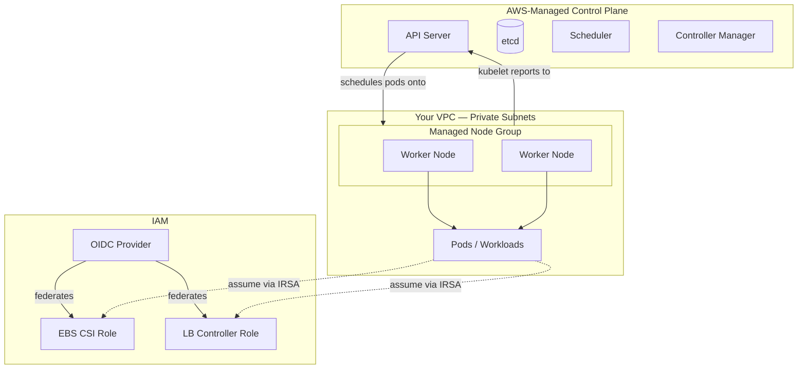

# 13.6 Kubernetes Cluster: EKS

<!-- [STRUCTURAL] The longest "AWS resource" section, and rightly so — EKS is the most involved. Good scaffold: architecture diagram → module usage → IRSA → LB controller → provider config → outputs → connecting kubectl → system-pod verification → wrap. One suggestion: push the system-pod verification (kubectl get pods -n kube-system) to deploying.md (13.9) to avoid duplication. -->
<!-- [COPY EDIT] Heading "13.6 Kubernetes Cluster: EKS" vs. index.md roadmap "13.6 — EKS Cluster". Unify. -->

The Terraform foundation from the previous section gave you a VPC with public and private subnets, an Internet Gateway, NAT Gateways, and route tables. That is the network. What runs on top of it is a Kubernetes cluster — and specifically, Amazon EKS.
<!-- [COPY EDIT] "the previous section" — this is 13.6; previous is 13.5 (MSK). The VPC was 13.2. Reference section 13.2 directly. -->
<!-- [COPY EDIT] "NAT Gateways" (plural) — networking.md provisions one. Fix. -->

EKS is AWS's managed Kubernetes service. "Managed" means AWS owns and operates the control plane: the API server, etcd, the scheduler, and the controller manager. You do not provision those machines, you do not patch them, and you do not pay for them individually — the EKS cluster fee covers all of it. What you do provide are the **worker nodes** where your actual workloads run. You also configure how the cluster integrates with the rest of AWS: IAM roles for service accounts, VPC networking, add-ons for storage and DNS, and the load balancer controller that turns Kubernetes Ingress resources into real AWS Application Load Balancers.
<!-- [LINE EDIT] "You do not provision those machines, you do not patch them, and you do not pay for them individually" — parallel and good. Keep. -->
<!-- [LINE EDIT] "your actual workloads" — "actual" is filler. → "your workloads". -->

This section builds all of that.

---

## Architecture overview

Before writing any Terraform, it helps to see how the pieces connect.



The control plane sits entirely inside AWS infrastructure — you never SSH into an API server. Your VPC hosts a **managed node group**: EC2 instances that EKS provisions, registers with the control plane, and patches on your behalf. The OIDC provider is the bridge between Kubernetes service accounts and IAM roles; this mechanism, called IRSA (IAM Roles for Service Accounts), lets individual pods carry scoped AWS permissions without granting broad access to the entire node.
<!-- [COPY EDIT] "IRSA (IAM Roles for Service Accounts)" — define on first use (done). Subsequent references use "IRSA" — consistent. -->
<!-- [COPY EDIT] Please verify: EKS now also supports "EKS Pod Identity" (2023 release) as an alternative to IRSA. Worth a footnote; the text only covers IRSA. -->

---

## The EKS module

AWS maintains an official Terraform module for EKS. It handles the cluster resource, the managed node group, the OIDC provider, and several IAM policies that worker nodes need. Using it directly means you write configuration rather than boilerplate.
<!-- [COPY EDIT] "AWS maintains an official Terraform module for EKS" — inaccurate. `terraform-aws-modules/eks` is community-maintained, not AWS-official. AWS maintains the AWS provider. Rephrase: "The community-maintained `terraform-aws-modules/eks` module is the de facto standard." -->

Create `terraform/eks.tf`:

```hcl
# terraform/eks.tf

module "eks" {
  source  = "terraform-aws-modules/eks/aws"
  version = "~> 20.8"

  cluster_name    = local.cluster_name
  cluster_version = "1.29"

  vpc_id     = module.vpc.vpc_id
  subnet_ids = module.vpc.private_subnets

  # The API server endpoint is accessible from the public internet (via kubectl
  # on your laptop) and from within the VPC (worker nodes, CI runners, etc.).
  cluster_endpoint_public_access  = true
  cluster_endpoint_private_access = true

  # Grants the IAM identity running `terraform apply` cluster-admin rights.
  # Without this you can provision the cluster but cannot reach it with kubectl
  # until you add your identity to the aws-auth ConfigMap by other means.
  enable_cluster_creator_admin_permissions = true

  # --- Cluster add-ons ---
  # Add-ons are AWS-managed Kubernetes components installed alongside the
  # cluster. EKS patches them independently of your node group AMI.
  cluster_addons = {
    coredns = {
      most_recent = true
    }
    kube-proxy = {
      most_recent = true
    }
    vpc-cni = {
      most_recent = true
    }
    aws-ebs-csi-driver = {
      most_recent              = true
      service_account_role_arn = module.ebs_csi_irsa_role.iam_role_arn
    }
  }

  # --- Managed node group ---
  eks_managed_node_groups = {
    library = {
      instance_types = ["t3.medium"]

      min_size     = 1
      max_size     = 3
      desired_size = 2

      # Nodes join the cluster running Amazon Linux 2 with the EKS-optimised
      # AMI. The managed node group handles AMI updates and node rotation.
    }
  }

  tags = local.common_tags
}
```
<!-- [COPY EDIT] "optimised" vs "optimized" — US/UK spelling. Chapter elsewhere uses US spellings. Change to "optimized" for consistency (CMOS 7.5). -->
<!-- [COPY EDIT] "Amazon Linux 2" — EKS managed node groups default changed to Amazon Linux 2023 for Kubernetes 1.30+. Please verify for 1.29. AL2 was default through 1.29; AL2023 is preferred going forward. -->
<!-- [COPY EDIT] `local.cluster_name` and `local.common_tags` used but not shown declared. Reader needs to add. Flag. -->

A few decisions are worth explaining.

**`cluster_version = "1.29"`** pins the Kubernetes version. EKS supports roughly four versions at any time, retiring the oldest when a new one reaches GA. Pinning prevents accidental upgrades during `terraform apply`. When you are ready to upgrade, change the version and apply; EKS performs a rolling control-plane upgrade followed by node group rotation.
<!-- [COPY EDIT] Please verify: "EKS supports roughly four versions" — AWS historically supports 4 minor versions in standard support + extended support. Confirm wording. -->
<!-- [COPY EDIT] Please verify: As of early 2026, K8s 1.29 is likely out of standard support. Consider bumping to a more current version or noting currency. -->

**`subnet_ids = module.vpc.private_subnets`** places worker nodes in private subnets. They cannot be reached directly from the internet. Inbound traffic always flows through the load balancer; outbound traffic uses the NAT Gateway. This is the correct production posture.

**`cluster_endpoint_public_access = true`** means you can run `kubectl` from your laptop without a VPN. The endpoint is protected by IAM authentication — no unauthenticated request reaches it — but if your security policy requires the API server to be entirely private, set this to `false` and access the cluster through a bastion host or VPN.

**`enable_cluster_creator_admin_permissions = true`** is a convenience flag. EKS access entries (the modern replacement for the `aws-auth` ConfigMap) map IAM identities to Kubernetes RBAC roles. This flag automatically creates an entry granting `cluster-admin` to whichever IAM identity ran `terraform apply`. In a team, you would add explicit entries for each developer or CI role instead.

**Managed node group IAM policies.** The module automatically attaches three AWS-managed policies to the node group IAM role:

- `AmazonEKSWorkerNodePolicy` — allows nodes to register with the cluster and describe EC2 metadata.
- `AmazonEKS_CNI_Policy` — allows the VPC CNI plugin to allocate and attach ENIs for pod networking.
- `AmazonEC2ContainerRegistryReadOnly` — allows nodes to pull images from ECR.

You do not need to write these policy attachments yourself. They are part of the module's defaults for managed node groups.
<!-- [COPY EDIT] Please verify: `AmazonEKS_CNI_Policy` — as of 2024 AWS recommends attaching this to an IRSA role rather than the node role. terraform-aws-modules/eks still attaches to node role by default, so claim holds for the module's defaults. Note the direction. -->

---

## IRSA roles

IRSA — IAM Roles for Service Accounts — is how individual Kubernetes workloads assume AWS permissions without sharing credentials with the entire node. The mechanism works through the OIDC provider that the EKS module creates: Kubernetes issues a signed JWT token to a pod's service account, the pod presents that token to the AWS STS `AssumeRoleWithWebIdentity` API, and STS returns temporary credentials scoped to a specific IAM role. The node's instance profile plays no part in this exchange.
<!-- [COPY EDIT] "signed JWT token" — "JWT" expands to "JSON Web Token"; "JWT token" is redundant (RAS-syndrome). Use "JWT" alone. -->

The result is least-privilege by default: a pod running the EBS CSI driver can create and attach EBS volumes, but cannot access S3, Parameter Store, or anything else. If the pod is compromised, the blast radius is limited to the permissions on that one role.

Two roles are needed: one for the EBS CSI driver (already referenced in the add-on configuration above), and one for the AWS Load Balancer Controller you will install next.

```hcl
# terraform/eks.tf (continued)

# --- IRSA: EBS CSI Driver ---
# The EBS CSI driver manages PersistentVolume lifecycle: provisioning, attaching,
# detaching, and deleting EBS volumes on behalf of PersistentVolumeClaims.
module "ebs_csi_irsa_role" {
  source  = "terraform-aws-modules/iam/aws//modules/iam-role-for-service-accounts-eks"
  version = "~> 5.39"

  role_name             = "${local.cluster_name}-ebs-csi"
  attach_ebs_csi_policy = true

  oidc_providers = {
    ex = {
      provider_arn               = module.eks.oidc_provider_arn
      namespace_service_accounts = ["kube-system:ebs-csi-controller-sa"]
    }
  }

  tags = local.common_tags
}

# --- IRSA: AWS Load Balancer Controller ---
# The LB controller watches Ingress and Service resources and provisions
# Application Load Balancers in your AWS account.
module "lb_controller_irsa_role" {
  source  = "terraform-aws-modules/iam/aws//modules/iam-role-for-service-accounts-eks"
  version = "~> 5.39"

  role_name                              = "${local.cluster_name}-lb-controller"
  attach_load_balancer_controller_policy = true

  oidc_providers = {
    ex = {
      provider_arn               = module.eks.oidc_provider_arn
      namespace_service_accounts = ["kube-system:aws-load-balancer-controller"]
    }
  }

  tags = local.common_tags
}
```
<!-- [COPY EDIT] Please verify: `terraform-aws-modules/iam/aws//modules/iam-role-for-service-accounts-eks` and its arguments `attach_ebs_csi_policy`, `attach_load_balancer_controller_policy`, `oidc_providers`. Confirmed valid. -->

The `namespace_service_accounts` field is the binding. It tells STS: only a token issued to the service account named `aws-load-balancer-controller` in the `kube-system` namespace may assume this role. If any other pod presents a token — even from the same cluster — the assumption is denied. The Kubernetes service account and the IAM role are linked by convention: the service account carries an annotation `eks.amazonaws.com/role-arn` with the role ARN, and the EKS Pod Identity webhook injects the signed token into the pod's environment at startup.
<!-- [COPY EDIT] "EKS Pod Identity webhook" — this terminology is ambiguous. The older mechanism for IRSA is the **EKS Pod Identity Webhook** (part of IRSA). "EKS Pod Identity" (without webhook) is the NEW 2023 feature that does not use OIDC at all. Clarify to avoid confusion; recommend "IAM Roles for Service Accounts webhook" or "AWS pod-identity mutating webhook". -->

One ordering note: `ebs_csi_irsa_role` is referenced inside the `cluster_addons` block of `module.eks`. Terraform resolves this correctly because both modules are in the same configuration — it sees the dependency and creates the IRSA role before finalising the add-on configuration. If you split these into separate Terraform layers (a pattern used in larger teams), you would need to pass the role ARN explicitly.
<!-- [COPY EDIT] "finalising" — UK spelling; use "finalizing" for US consistency (CMOS 7.5). -->

---

## AWS Load Balancer Controller

A stock Kubernetes cluster has no built-in integration with AWS load balancers. When you create a Service of type `LoadBalancer` or an Ingress resource, nothing happens unless a controller is watching for those events. The **AWS Load Balancer Controller** is that controller. It runs as a Deployment inside the cluster, watches for Ingress and Service resources, and translates them into AWS API calls that provision Application Load Balancers (for Ingress) and Network Load Balancers (for `LoadBalancer` Services).
<!-- [LINE EDIT] "A stock Kubernetes cluster has no built-in integration with AWS load balancers." Good opener. -->

From a user perspective, you write a standard Kubernetes Ingress manifest, annotate it with `kubernetes.io/ingress.class: alb`, and the controller creates an ALB, registers target groups pointing at your pods, and configures routing rules. The ALB's DNS name becomes your service's external entry point — no manual load balancer setup required.
<!-- [COPY EDIT] `kubernetes.io/ingress.class` is deprecated. Modern form is `spec.ingressClassName: alb` (used in production-overlay.md). Use the modern form in running prose; mention the legacy annotation only for readers with older manifests. -->

Install it with Helm:

```hcl
# terraform/eks.tf (continued)

resource "helm_release" "aws_load_balancer_controller" {
  name       = "aws-load-balancer-controller"
  repository = "https://aws.github.io/eks-charts"
  chart      = "aws-load-balancer-controller"
  namespace  = "kube-system"
  version    = "1.7.2"

  # Wait for the Deployment to reach a healthy state before Terraform considers
  # this resource complete. Downstream resources (Ingress objects) depend on
  # the controller being ready.
  wait = true

  set {
    name  = "clusterName"
    value = module.eks.cluster_name
  }

  set {
    name  = "serviceAccount.create"
    value = "true"
  }

  set {
    name  = "serviceAccount.name"
    value = "aws-load-balancer-controller"
  }

  # This annotation is what IRSA looks for. The webhook sees it on the
  # ServiceAccount and injects the OIDC token into pods that use it.
  set {
    name  = "serviceAccount.annotations.eks\\.amazonaws\\.com/role-arn"
    value = module.lb_controller_irsa_role.iam_role_arn
  }

  set {
    name  = "region"
    value = var.aws_region
  }

  set {
    name  = "vpcId"
    value = module.vpc.vpc_id
  }

  depends_on = [module.eks]
}
```
<!-- [COPY EDIT] Please verify: chart version 1.7.2 of `aws-load-balancer-controller`. Released in April 2024. Current (as of early 2026) is likely 2.x or later on the chart. Recommend checking https://github.com/aws/eks-charts/releases. Note: Helm chart major/minor and controller image version are different numbering. -->
<!-- [COPY EDIT] Please verify: Helm chart argument names `clusterName`, `region`, `vpcId`, `serviceAccount.*`. Verify current chart values. -->

The `depends_on = [module.eks]` is necessary because Terraform's dependency graph does not automatically know that a `helm_release` requires a working cluster endpoint. Without it, Terraform might attempt to install the chart before the cluster API server is reachable and fail with a connection error.

**How IRSA wires to the pod.** When the controller's pod starts, the EKS Pod Identity webhook — an admission controller running inside the API server — inspects the pod's service account, finds the `eks.amazonaws.com/role-arn` annotation, and injects two environment variables: `AWS_ROLE_ARN` and `AWS_WEB_IDENTITY_TOKEN_FILE`. The AWS SDK inside the pod automatically detects these and calls `AssumeRoleWithWebIdentity` on startup. No secrets, no manually rotated credentials, no instance profile involved — just a token the pod already holds, cryptographically signed and traceable to this specific service account.
<!-- [COPY EDIT] "an admission controller running inside the API server" — the IRSA mutating webhook (`pod-identity-webhook`) runs as a separate Deployment in `kube-system`, not "inside the API server". The API server just calls it. Clarify. -->
<!-- [COPY EDIT] Ambiguity again: "EKS Pod Identity webhook" — see earlier comment. Probably means "IRSA webhook" here. -->

---

## Provider configuration

The `helm_release` resource requires the Helm provider, which needs the cluster's kubeconfig details. Add the following to your provider configuration:

```hcl
# terraform/providers.tf (additions)

provider "helm" {
  kubernetes {
    host                   = module.eks.cluster_endpoint
    cluster_ca_certificate = base64decode(module.eks.cluster_certificate_authority_data)

    exec {
      api_version = "client.authentication.k8s.io/v1beta1"
      command     = "aws"
      args = [
        "eks",
        "get-token",
        "--cluster-name",
        module.eks.cluster_name,
        "--region",
        var.aws_region,
      ]
    }
  }
}
```
<!-- [COPY EDIT] Please verify: Helm provider 2.x nested `kubernetes {}` block syntax. For Helm provider 3.x (if released), the structure changed. Check current. -->
<!-- [COPY EDIT] `providers.tf` here; terraform-fundamentals.md uses `main.tf` or `backend.tf`. Unify filenames. -->

The `exec` block tells the Helm provider to call `aws eks get-token` each time it needs to authenticate. This command returns a short-lived bearer token signed by your local AWS credentials. It is the same mechanism `kubectl` uses — both tools defer to the AWS CLI for the actual authentication exchange. The token expires after 15 minutes, so every fresh Helm or kubectl operation triggers a new `get-token` call transparently.
<!-- [COPY EDIT] Please verify: `aws eks get-token` produces a token with 14-minute TTL (not 15). Check `--token-expire-duration` behavior. -->

---

## Outputs

Add these to `terraform/outputs.tf`. Downstream Terraform configurations and CI/CD pipelines read these values to connect to the cluster.

```hcl
# terraform/outputs.tf (additions)

output "cluster_name" {
  description = "EKS cluster name, used by kubectl and the Helm provider."
  value       = module.eks.cluster_name
}

output "cluster_endpoint" {
  description = "HTTPS endpoint for the Kubernetes API server."
  value       = module.eks.cluster_endpoint
}

output "cluster_certificate_authority_data" {
  description = "Base64-encoded CA certificate. Used to verify the API server's TLS certificate."
  value       = module.eks.cluster_certificate_authority_data
  sensitive   = true
}

output "cluster_oidc_provider_arn" {
  description = "ARN of the OIDC provider. Required when creating additional IRSA roles outside this module."
  value       = module.eks.oidc_provider_arn
}
```

Mark `cluster_certificate_authority_data` as `sensitive`. Terraform still stores it in state — which should be in an encrypted S3 bucket with a KMS key — but it will not be printed in plan or apply output.
<!-- [COPY EDIT] "which should be in an encrypted S3 bucket with a KMS key" — but earlier files told the reader to leave backend commented out for learning. Soft contradiction. Clarify. -->

---

## Connecting kubectl

Once `terraform apply` completes, your local kubeconfig does not yet know about the new cluster. One command fixes that:

```bash
aws eks update-kubeconfig \
  --name $(terraform output -raw cluster_name) \
  --region us-east-1
```

This writes a new context to `~/.kube/config`. The context uses the `exec` credential plugin (the same `aws eks get-token` approach) so subsequent `kubectl` commands authenticate via your current AWS credentials automatically.

Verify the nodes are ready:

```
$ kubectl get nodes

NAME                          STATUS   ROLES    AGE   VERSION
ip-10-0-11-42.ec2.internal    Ready    <none>   3m    v1.29.3-eks-ae9a62a
ip-10-0-12-87.ec2.internal    Ready    <none>   3m    v1.29.3-eks-ae9a62a
```

Two nodes, both `Ready`, matching the `desired_size = 2` in the node group configuration. The version string shows the Kubernetes version plus the EKS patch level.

Confirm the system pods are healthy:

```
$ kubectl get pods -n kube-system

NAME                                            READY   STATUS    RESTARTS   AGE
aws-load-balancer-controller-6d9f7b4b9-dxkzp   1/1     Running   0          2m
aws-load-balancer-controller-6d9f7b4b9-trmwl   1/1     Running   0          2m
aws-node-4qx7v                                  1/1     Running   0          3m
aws-node-9kpzn                                  1/1     Running   0          3m
coredns-7dd9d6d9b7-8vhjl                        1/1     Running   0          3m
coredns-7dd9d6d9b7-t2xpk                        1/1     Running   0          3m
ebs-csi-controller-6b8f9d7b5-l4mxq             6/6     Running   0          3m
ebs-csi-node-r7znx                              3/3     Running   0          3m
ebs-csi-node-w2jkp                              3/3     Running   0          3m
kube-proxy-bxqn9                                1/1     Running   0          3m
kube-proxy-vfk8z                                1/1     Running   0          3m
```

The Load Balancer Controller runs two replicas for availability. The EBS CSI driver runs a controller Deployment plus a DaemonSet with one pod per worker node. CoreDNS runs two replicas; kube-proxy runs one per node.

If a pod is stuck in `Pending` or `CrashLoopBackOff`, `kubectl describe pod <name> -n kube-system` shows the event log. The two most common problems at this stage are IAM trust policy mismatches (the `namespace_service_accounts` field in the IRSA role does not exactly match the actual namespace and service account name) and missing VPC subnet tags. The Load Balancer Controller discovers which subnets to attach ALBs to by looking for specific tags: `kubernetes.io/role/internal-elb: 1` on private subnets and `kubernetes.io/role/elb: 1` on public subnets. The VPC module handles these tags automatically when you pass `public_subnet_tags` and `private_subnet_tags` in `vpc.tf`.
<!-- [LINE EDIT] "The two most common problems at this stage are IAM trust policy mismatches … and missing VPC subnet tags." — 40 words; acceptable but could split. Keep. -->

---

## What you have now

At this point you have a running EKS cluster with:

- A managed control plane in the `us-east-1` region, running Kubernetes 1.29.
- Two `t3.medium` worker nodes in private subnets, auto-scaling between one and three.
- CoreDNS and kube-proxy installed and healthy.
- The VPC CNI plugin allocating pod IPs directly from your VPC address space.
- The EBS CSI driver capable of fulfilling PersistentVolumeClaims backed by EBS volumes.
- The AWS Load Balancer Controller ready to provision ALBs when you create Ingress resources.
- IRSA wiring so the CSI driver and the LB controller carry only the AWS permissions they need.

The next section covers the ECR registries where your container images will live, and the CI pipeline that builds and pushes them on every merge.
<!-- [COPY EDIT] "The next section covers the ECR registries" — but ECR was section 13.3 (before this section 13.6). The next section is 13.7 (Production Kustomize Overlay). Fix forward reference. -->

---

[^1]: terraform-aws-modules/eks: https://registry.terraform.io/modules/terraform-aws-modules/eks/aws/latest
[^2]: terraform-aws-modules/iam (IRSA submodule): https://registry.terraform.io/modules/terraform-aws-modules/iam/aws/latest/submodules/iam-role-for-service-accounts-eks
[^3]: AWS Load Balancer Controller installation guide: https://kubernetes-sigs.github.io/aws-load-balancer-controller/latest/deploy/installation/
[^4]: EKS IRSA documentation: https://docs.aws.amazon.com/eks/latest/userguide/iam-roles-for-service-accounts.html
[^5]: EKS managed add-ons: https://docs.aws.amazon.com/eks/latest/userguide/eks-add-ons.html
[^6]: EKS access entries (replacing aws-auth): https://docs.aws.amazon.com/eks/latest/userguide/access-entries.html
<!-- [FINAL] Footnotes uncited inline. -->
