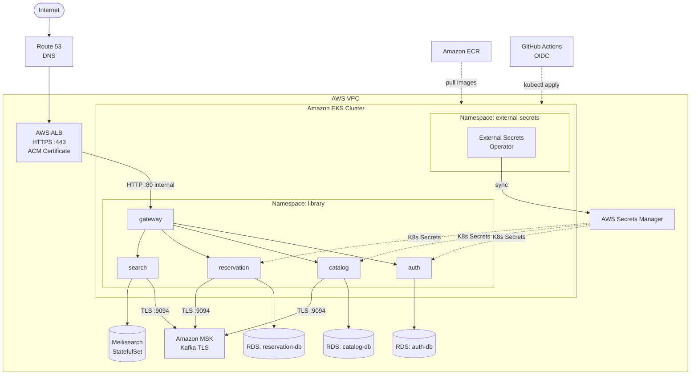

<!-- [STRUCTURAL] Opening chapter recap is strong: concrete, names the three gaps, and sets scope by telling readers what will NOT change (app code, Dockerfiles, Earthfiles). Good bridge from Ch 13. -->
# Chapter 14: Production Hardening

<!-- [STRUCTURAL] This opening paragraph is a single long block (~140 words). Consider a paragraph break after "from a laptop." to give the reader a beat before the pivot to "But 'reachable' and 'production-ready'...". -->
<!-- [LINE EDIT] "That is a genuine production deployment — the application is reachable, the data survives pod restarts, and nobody has to run `kubectl apply` from a laptop." → keep as is (rhythm is deliberate). -->
<!-- [COPY EDIT] "main" — backticks on branch name are consistent with the rest of the book. OK. -->
Chapter 13 deployed the library system to real infrastructure: an EKS cluster running five services, three RDS instances holding persistent state, an MSK cluster brokering Kafka events, and a GitHub Actions pipeline shipping code on every push to `main`. That is a genuine production deployment — the application is reachable, the data survives pod restarts, and nobody has to run `kubectl apply` from a laptop. But "reachable" and "production-ready" are not the same thing. Three gaps remained when Chapter 13 ended, each one deferred in the name of getting the system running before addressing hardening. This chapter closes all three. None of them require changes to application code, Dockerfiles, or Earthfiles — everything that needs to change lives in Terraform and the production Kustomize overlay.

---

## The three gaps

<!-- [COPY EDIT] Table header "Gap | Chapter 13 state | Chapter 14 target" — consider Title Case for "Chapter 13 State" / "Chapter 14 Target" for table-header consistency. CMOS 8.158 allows either, but apply consistently across the chapter. -->
<!-- [COPY EDIT] "DNS + TLS" — first use of DNS and TLS in this chapter, both defined on first real use in prose below. OK. -->
| Gap | Chapter 13 state | Chapter 14 target |
|-----|-----------------|-------------------|
| DNS + TLS | HTTP via ALB hostname, no custom domain | HTTPS with a custom domain via Route 53 + ACM |
| Secrets | Placeholder values in the production overlay's `secretGenerator` | External Secrets Operator syncing live values from AWS Secrets Manager |
| Kafka encryption | Plaintext connections on port 9092 | TLS connections on port 9094 |

<!-- [LINE EDIT] "They are also independent of each other — you can apply them in any order, or apply just one if that is what your situation calls for." → "They are also independent — apply them in any order, or apply just one." (tightens ~30 → 17 words). -->
Each row is a separate concern with its own tools and its own section in this chapter. They are also independent of each other — you can apply them in any order, or apply just one if that is what your situation calls for. The sections below treat them sequentially because that matches the natural dependency order when you are also setting up DNS for the first time.

---

## Why these gaps matter

<!-- [LINE EDIT] "It is tempting to think of these as polish — things you would fix before a real public launch but can ignore while learning." → "It is tempting to think of these as polish: things you would fix before a public launch but can ignore while learning." (drops "real", simpler punctuation). -->
<!-- [COPY EDIT] "audit failure in any environment subject to compliance frameworks" — consider naming at least one framework here or footnoting, since "compliance frameworks" is vague. Possibly a STRUCTURAL note. -->
It is tempting to think of these as polish — things you would fix before a real public launch but can ignore while learning. That framing undersells the risk. Each gap is an audit failure in any environment subject to compliance frameworks, and the risks are concrete even if you are running a personal project.

<!-- [STRUCTURAL] This paragraph is 90+ words and covers two ideas (the TLS threat model + the browser/OAuth behavior). Consider splitting after "public-facing leg must be encrypted." -->
<!-- [LINE EDIT] "Serving HTTP without TLS means every request between the browser and your ALB travels in plaintext." → keep; opening is strong. -->
<!-- [COPY EDIT] "HTTP" and "TLS" — both defined implicitly elsewhere; first TLS definition in prose belongs here. Consider expanding on first use: "TLS (Transport Layer Security)". (CMOS 10.3 on abbreviations.) -->
<!-- [COPY EDIT] "OAuth2 providers including Google" → "OAuth 2.0 providers, including Google" (serial comma after "Google"? no — one-item list; but "OAuth 2.0" with the version per RFC 6749). Query: verify book uses OAuth2 vs OAuth 2.0 style consistently across chapters. -->
<!-- [COPY EDIT] Please verify: OAuth2 providers (including Google) actually refuse HTTP redirect URIs at the protocol level, vs. strongly discourage — Google's docs distinguish production vs. testing; localhost HTTP is permitted. Consider softening to "most OAuth2 providers, including Google, refuse or restrict HTTP redirect URIs outside of localhost." -->
Serving HTTP without TLS means every request between the browser and your ALB travels in plaintext. That includes session tokens, API responses, and any user data in query strings or response bodies. The ALB terminates TLS at the edge in Chapter 14's target state — traffic inside the VPC between the ALB and the pods can remain HTTP, which is a common and acceptable pattern — but the public-facing leg must be encrypted. Modern browsers actively warn users about non-HTTPS sites; more practically, OAuth2 providers including Google will refuse to complete a login flow if the redirect URI is HTTP.

<!-- [LINE EDIT] "Pasting database passwords manually into a Kustomize `secretGenerator` creates several problems at once." → "Pasting database passwords into a Kustomize `secretGenerator` creates several problems." (drops "manually" — implied — and "at once" — filler). -->
<!-- [LINE EDIT] Sentence starting "The secrets are almost certainly committed to git..." is 35 words but fine. "Either accidentally or because someone thinks 'I'll fix it later.'" — keep, voice is good. -->
<!-- [COPY EDIT] "git" — lowercase when referring to the tool; capitalized "Git" when starting a sentence. CMOS 7.8. OK as used. -->
<!-- [COPY EDIT] "K8s Secret object that was ever created" — "K8s" is colloquial; earlier paragraphs use "Kubernetes Secret" in full. Prefer "Kubernetes Secret object" for consistency. -->
Pasting database passwords manually into a Kustomize `secretGenerator` creates several problems at once. The secrets are almost certainly committed to git at some point — either accidentally or because someone thinks "I'll fix it later." Even if you avoid git, the values exist in someone's terminal history, in CI logs if you print them for debugging, and in every K8s Secret object that was ever created with the wrong value and then deleted. Proper secrets management means the application retrieves credentials from a single authoritative source — AWS Secrets Manager in this case — and the Kubernetes Secret is populated automatically and rotated without human intervention.

<!-- [COPY EDIT] "VPCs are not the internet" — "internet" lowercase per CMOS 8.190. OK as written. -->
<!-- [LINE EDIT] "and an attacker who has not already breached your network boundary cannot read that traffic" → "and an attacker who hasn't breached your network boundary cannot read it" (tighter; reduces from 19 to 14 words; keeps same information). -->
<!-- [COPY EDIT] "that is a weaker guarantee than it sounds" — conversational but acceptable for tutor tone. Keep. -->
<!-- [COPY EDIT] "enabling it costs nothing and closes the exposure entirely" — precise. OK. -->
Kafka's plaintext listener (port 9092) transmits all broker traffic unencrypted inside the VPC. VPCs are not the internet, and an attacker who has not already breached your network boundary cannot read that traffic — but that is a weaker guarantee than it sounds. Lateral movement from a compromised pod, misconfigured security groups, or VPC peering arrangements can all expose plaintext traffic to unintended readers. MSK supports TLS-only listener configuration; enabling it costs nothing and closes the exposure entirely.

---

## What stays the same

<!-- [STRUCTURAL] Good "what stays the same" section. Reinforces the overlay pattern and reduces reader anxiety about broad re-architecture. Keep. -->
<!-- [LINE EDIT] "The Kustomize layering from Chapter 12 and the CI/CD pipeline from Chapter 13 are not touched." → "The Kustomize layering from Chapter 12 and the CI/CD pipeline from Chapter 13 are untouched." (one word; same meaning). -->
The Kustomize layering from Chapter 12 and the CI/CD pipeline from Chapter 13 are not touched. The base manifests under `k8s/base/` remain unchanged — a deliberate constraint that demonstrates the value of the overlay pattern. Application services do not need to know anything about where TLS terminates, how secrets reach the pod's environment, or what port the Kafka broker is listening on. They connect to hostnames and read environment variables; the infrastructure layer handles everything else.

<!-- [COPY EDIT] "`+lint`, `+test`, `+build`, `+integration-test`" — Earthfile target syntax. OK. -->
<!-- [LINE EDIT] "run exactly as they did in Chapter 13" → "run as they did in Chapter 13" (drops "exactly" — qualifier). -->
The Earthfile CI targets — `+lint`, `+test`, `+build`, `+integration-test` — run exactly as they did in Chapter 13. The GitHub Actions pipeline that calls them is unchanged. The only files that change in this chapter are:

- Terraform files under `terraform/` — for the Route 53 hosted zone, ACM certificate, and MSK listener configuration
- The production Kustomize overlay under `k8s/overlays/production/` — for the External Secrets Operator configuration and the updated Kafka broker address
- A new Terraform module for the External Secrets Operator IAM role and its associated Kubernetes resources

<!-- [LINE EDIT] "If you have been following the 'what changes and what stays the same' framing from earlier chapters, the pattern holds here too." → OK; callback to recurring motif. Keep. -->
If you have been following the "what changes and what stays the same" framing from earlier chapters, the pattern holds here too.

---

## Cost impact

All three changes are either free or negligible.

<!-- [COPY EDIT] "$0.50" — CMOS 9.21 prefers "$0.50" written this way. OK. -->
<!-- [COPY EDIT] Table second column header "Monthly cost" → consider "Monthly Cost" for Title Case parity with other tables, or adopt sentence case throughout. Pick one. -->
| Addition | Monthly cost |
|----------|-------------|
| Route 53 hosted zone | $0.50 |
| ACM certificate | Free |
| MSK TLS listener | No additional cost |
| External Secrets Operator | No additional cost (open-source operator running on existing nodes) |

<!-- [COPY EDIT] "fifty cents per month" — CMOS 9.20 says spell out zero through one hundred in prose; "fifty cents" is correct. "one billion queries" — also spelled out. Good. But "regardless of query volume up to one billion queries" is awkward — consider "regardless of query volume (up to one billion queries per month)." -->
<!-- [COPY EDIT] Please verify: Route 53 hosted zone pricing remains $0.50/month and first billion queries included. As of AWS pricing pages, it is $0.50/month per hosted zone and $0.40 per million standard queries (not free up to a billion). Revisit claim. -->
<!-- [LINE EDIT] "The only new line item is the Route 53 hosted zone, which is billed at fifty cents per month regardless of query volume up to one billion queries." → "The Route 53 hosted zone is the only new line item: $0.50 per month, which includes standard query volumes typical of this project." (acknowledges queries without over-claiming). -->
The only new line item is the Route 53 hosted zone, which is billed at fifty cents per month regardless of query volume up to one billion queries. ACM certificates for domains managed in Route 53 are issued and renewed automatically at no charge. MSK supports TLS as a configuration flag on the existing brokers — there is no separate TLS broker tier. External Secrets Operator runs as a Deployment in your EKS cluster, consuming a small amount of CPU and memory on nodes you are already paying for.

<!-- [COPY EDIT] "GoDaddy, Namecheap, Cloudflare" — serial comma (CMOS 6.19) needed before "Cloudflare". Change to "GoDaddy, Namecheap, or Cloudflare". -->
<!-- [COPY EDIT] "NS delegation" — abbrev NS defined? DNS refresher in dns.md uses NS/SOA, but first use here. Consider "name server (NS) delegation". -->
<!-- [LINE EDIT] "The sections below assume you are creating a new hosted zone; the delegation path is noted where it matters." — clear, keep. -->
If you already own a domain and it is managed elsewhere — GoDaddy, Namecheap, Cloudflare — you have two options: transfer the domain to Route 53 (a one-time process that preserves your existing records) or keep the domain where it is and create an NS delegation for a subdomain. The sections below assume you are creating a new hosted zone; the delegation path is noted where it matters.

---

## Target architecture

<!-- [STRUCTURAL] Mermaid diagram is the right place at this point — reader now knows the three gaps, the cost, and the scope. Diagram visually anchors those in the architecture. Keep. -->
The diagram below shows the system after all three changes are applied. Compare it to the Chapter 13 diagram: the public-facing edge now terminates HTTPS, the pod environment variables arrive via External Secrets, and the Kafka connections use the TLS listener.

<!-- [LINE EDIT] "Everything else — the service topology, the RDS connections, the Meilisearch StatefulSet, the ECR image pulls, the OIDC-authenticated deployments — is carried forward from Chapter 13 without modification." → Five parenthetical items feel listy; fine as is, but consider "carries forward from Chapter 13 unchanged" to drop redundancy with "without modification". -->
<!-- [COPY EDIT] "OIDC-authenticated" — hyphenated compound modifier before "deployments" (CMOS 7.81). OK. -->
The changes touch three edges in this diagram: the public entry point gains TLS termination at the ALB, the secret values gain a managed sync path through External Secrets Operator, and the Kafka edges switch from port 9092 to port 9094. Everything else — the service topology, the RDS connections, the Meilisearch StatefulSet, the ECR image pulls, the OIDC-authenticated deployments — is carried forward from Chapter 13 without modification.

---

## Chapter roadmap

<!-- [STRUCTURAL] Five-bullet roadmap mirrors the section files. Good navigation aid. Keep. -->
<!-- [COPY EDIT] Subsection numbering: "14.1", "14.2", "14.3", "14.4", "14.5" — consistent. Good. -->
<!-- [COPY EDIT] "Secrets Management with External Secrets Operator" — title case. Consistent with other subsection headings. OK. -->
**14.1 — DNS with Route 53** creates a hosted zone for your domain and adds the A-record alias that points your domain's apex (or a subdomain) at the ALB. You will use Terraform's `aws_route53_zone` and `aws_route53_record` resources. By the end of this section, the application is reachable at a human-readable URL — still over HTTP, but at the right address.

<!-- [LINE EDIT] "provisions an ACM certificate for your domain and attaches it to the ALB" → keep; concise. -->
**14.2 — TLS with ACM** provisions an ACM certificate for your domain and attaches it to the ALB. ACM handles certificate issuance via DNS validation — it writes a CNAME record to your hosted zone and polls for it, which Terraform orchestrates in a single `apply`. You will update the Ingress annotations in the production overlay to reference the certificate ARN and redirect HTTP to HTTPS. After this section, the application is reachable at `https://yourdomain.com`.

**14.3 — Secrets Management with External Secrets Operator** installs the External Secrets Operator into the cluster via Helm, creates the IAM role and policy that allow it to read from Secrets Manager, and writes the `ExternalSecret` and `SecretStore` resources that define which secrets to sync and how often. You will also write a small Terraform module that creates the Secrets Manager entries for each service's database credentials, replacing the placeholder values in the `secretGenerator`.

<!-- [COPY EDIT] "`KAFKA_BROKERS`" — env var, backticks. Good. -->
<!-- [LINE EDIT] "The application-level Kafka client configuration requires no changes — the Go Kafka library picks up the TLS requirement from the broker address scheme." → "The application-level Kafka client configuration requires no changes: the Go Kafka library picks up TLS from the broker address scheme." (dashes → colon; mild). -->
**14.4 — Kafka Encryption (MSK TLS)** enables the TLS listener on the MSK cluster and disables the plaintext listener, updates the security group rules to allow port 9094 instead of 9092, and patches the `KAFKA_BROKERS` environment variable in the production overlay to use the TLS bootstrap server addresses. The application-level Kafka client configuration requires no changes — the Go Kafka library picks up the TLS requirement from the broker address scheme.

<!-- [FINAL] "14.5 — Applying the Changes walks through the full `terraform apply` and `kubectl apply` sequence" — good. -->
<!-- [COPY EDIT] "you will also review the AWS Security Hub findings" — product name "AWS Security Hub" correct. OK. -->
<!-- [COPY EDIT] Please verify: Ch. 13 actually mentions enabling AWS Security Hub (the "if you enabled it in Chapter 13" phrasing assumes a prior-chapter action). If Ch. 13 does not set up Security Hub, rewrite to avoid the conditional. -->
**14.5 — Applying the Changes** walks through the full `terraform apply` and `kubectl apply` sequence, verifies each gap is closed, and confirms the integration tests from Chapter 12 still pass against the hardened cluster. You will also review the AWS Security Hub findings — if you enabled it in Chapter 13 — to confirm that the three controls that were previously failing now show as passed.

---

<!-- [STRUCTURAL] Closing paragraph lands the stakes ("baseline any production deployment expects") without overstating ("these are not exotic"). Keep. -->
<!-- [LINE EDIT] "These are not exotic hardening measures — they are the baseline that any production system deployed to a regulated environment is expected to meet, and they are the baseline that a careful engineer expects even in environments that are not formally regulated." — 48 words, borderline. Consider: "These are not exotic hardening measures. They are the baseline that any production system in a regulated environment must meet — and that a careful engineer expects everywhere else too." (30 words, same meaning). -->
By the end of this chapter, the library system will pass a basic security review: encrypted traffic on every public-facing edge, secrets sourced from a managed store rather than committed configuration, and encrypted broker connections inside the cluster. These are not exotic hardening measures — they are the baseline that any production system deployed to a regulated environment is expected to meet, and they are the baseline that a careful engineer expects even in environments that are not formally regulated. Getting comfortable applying them in a learning project means they will not be unfamiliar when the stakes are higher.

<!-- [COPY EDIT] "re-apply" — hyphenated per CMOS 7.89 (prefix "re-" with hyphen when base word starts with a vowel or for clarity); "reapply" is also accepted. Consistent use across chapter matters. Grep shows "re-apply" and "reapply" both used — unify. -->
<!-- [LINE EDIT] "Before moving to section 14.1, confirm that your Chapter 13 cluster is still running and healthy" → "Before section 14.1, confirm your Chapter 13 cluster is running and healthy" (shorter; "moving to" and "still" are filler). -->
Before moving to section 14.1, confirm that your Chapter 13 cluster is still running and healthy: `kubectl get pods -n library` should show all pods in the `Running` state. If you have run `terraform destroy` since Chapter 13, re-apply the Chapter 13 Terraform before continuing — the changes in this chapter build on top of the existing infrastructure rather than replacing it.

---

[^1]: AWS Route 53 Documentation: https://docs.aws.amazon.com/Route53/latest/DeveloperGuide/Welcome.html
[^2]: AWS Certificate Manager Documentation: https://docs.aws.amazon.com/acm/latest/userguide/acm-overview.html
[^3]: External Secrets Operator Documentation: https://external-secrets.io/latest/
[^4]: AWS Secrets Manager Documentation: https://docs.aws.amazon.com/secretsmanager/latest/userguide/intro.html
[^5]: Amazon MSK TLS Encryption: https://docs.aws.amazon.com/msk/latest/developerguide/msk-encryption.html
[^6]: AWS Load Balancer Controller — TLS: https://kubernetes-sigs.github.io/aws-load-balancer-controller/latest/guide/ingress/annotations/#ssl
[^7]: Route 53 Pricing: https://aws.amazon.com/route53/pricing/
